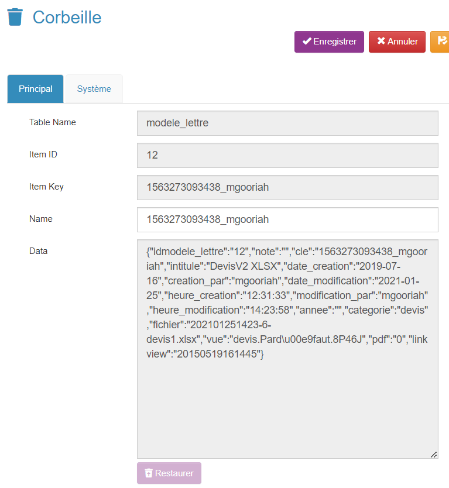
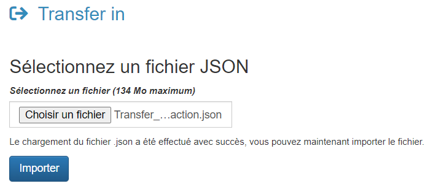

# Admin

## API Rest

L'API REST GoPaaS permet aux applications GoPaaS de communiquer entre elles.

* Conditions sur les vues pour filtrer les données de transit
* Gestion des destinations
* Mappage via JSON
* Jeton d'identification
* Echange de données type texte, image ou fichier
* Déclenchement via automatisme

## Audit trail

L'audit trail permet de visualiser les modifications qui ont été faites dans les fiches de l'application.

Le suivi de ces modifications est à activer dans les champs d'une table en cochant "Audit Trail" de l'onglet "Autre".

Il existe deux solutions pour accéder à l'audit trail :

* Depuis la fiche que vous souhaitez auditer, cliquer sur le menu Outil > Audit-Trail
* Depuis la barre de navigation > Admin > Audit trail. Dans ce cas vous arriverez sur une vue avec toutes les modifications de toutes les fiches classées par table.

> _Ne pas oublier d'activer l'audit trail dans les champs d'une table en cochant "Audit Trail" dans l'onglet Principal._

| **Champ**       | Description           |
|-----------------|-------------------------------------------------------------|
| **Table**       | C'est la table reliée à cette fiche Audit trail.           |
| **Date**        | Date de la modification.                                   |
| **Utilisateur** | L'utilisateur qui a effectué la modification.              |
| **Fiche**       | La fiche qui est auditée.                                  |
| **Heure**       | Heure de modification                                      |
| **Etat avant**  | État de la fiche avant la modification.                   |
| **Etat après**  | État de la fiche après modification.                      |

## Configuration

La fiche de configuration permet de personnaliser le style de l'application en y adaptant les couleurs et l'image de l'entreprise.

​​​​​​​On retrouve également les coordonnées de l'entreprise et les éléments comptables.

La fonction de configuration se compose de plusieurs onglets qui renferment des sections, l'accès se fait uniquement depuis la barre de navigation > Admin > Configuration.

### Onglet Principal

#### Section Société

Renseigner les informations relatives à la société, les coordonnées et le RIB.

#### Section Application

| Champ | Description |
|------------------------|---------------------------------------------------------------------------------------------------------------------------|
| **Durée d'inactivité** | Permet de définir la durée maximale d'inactivité durant laquelle la session est ouverte. (Valeur à définir en secondes) |
| **Activer gestion du token** | Un Token peut être utilisé pour authentifier les utilisateurs dans des applications externes ou via une API. |
| **Activer corbeille** | Permet d’activer la corbeille sur votre application, les fiches envoyées dans la corbeille se retrouvent dans le menu Admin > Corbeille |
| **Activer historique** | Vous permet d’activer l’historique de navigation |

#### Autres sections
| **Champ**            | Description                                                                                        |
|----------------------|----------------------------------------------------------------------------------------------------|
| **Serveur SMTP**    | Vous permet de paramétrer un serveur SMTP qui sera utilisé pour l’envoi des emails depuis GoPaaS. |
| **Docusign**        | Authentification sur l’API Docusign                                                               |
| **Yousign**         | Authentification sur l’API Yousign                                                                |
| **SSO (Single Sign-On)** | Permet d'accéder à GoPaaS avec l’authentification Google                                       |
| **Google API Key**  | Clé API Google MAP                                                                                |

### Onglet Style

* La section **Style général **permet de modifier le style de l'application, changer les couleurs, ajouter un favicon et modifier le titre de l'application.
* La section **Page de login **permet de modifier le style sur la page de connexion à l'application.
* La section **Bouton connexion **correspond à la personnalisation du bouton présent sur la page de connexion.

Il est possible de paramétrer la couleur des boutons :

| **Type de bouton**         | **Style**                                                                                     |
|-----------------------------|-----------------------------------------------------------------------------------------------|
| **Bouton par défaut**      |  ou encore                        |
| **Bouton principal**       | Bouton de type                                                  |
| **Bouton info**            | Bouton de type                                                 |
| **Bouton Succès**          | Bouton de type                                                  |
| **Bouton danger**          | Bouton de type                                                 |
| **Bouton avertissement**   | Bouton de type                                                 |

Il est également possible de personnaliser les couleurs de la vue Pivot (Tableau croisé dynamique) via la section** Couleur vue pivot.**

> Pour le paramétrage des couleurs, veuillez renseigner une valeur au format : **#FFFFFF**.
### Onglet Script

Ajouter un script à cet emplacement pour des paramétrages spécifiques comme :

* Redimensionnement des photos
* Paramétrage du mode offline
* Ou autre fonction personnalisé qui pourra être appelé de toutes l'application

### Onglet Archivage emails

Vous permet de paramétrer l’archivage email dans GoPaaS

| **Champ**                 | Description
|---------------------------|--------------------------------------------------------------------------------------------|
| **Table**                 | Table où archiver les emails                                                                |
| **Date**                  | Champ sur lequel enregistrer la date                                                        |
| **Expéditeur**            | Champ sur lequel connecter l’expéditeur (retrouve le contact avec l'émail)                 |
| **Destinataires(s)**      | Champ sur lequel enregistrer le ou les destinataires                                         |
| **Sujet**                 | Champ sur lequel enregistrer le sujet                                                        |
| **Corps du message**      | Champ sur lequel enregistrer le message                                                      |
| **Pièce(s) jointe(s)**   | Champ sur lequel enregistrer les PJ (génère un zip si plusieurs PJ)                         |
| **Identifiant de l'email**| Champ d’identification unique de l’email                                                     |

## Dictionnaire

Vous pouvez importer un dictionnaire afin de bénéficier de l'application dans votre langue. Vous pouvez également créer des chaînes de caractères manuellement.

Pour importer un dictionnaire utilisez le module d'import, pour créer des chaînes de caractères cliquez sur Admin depuis la barre de navigation puis Dictionnaire.

Pour le faire manuellement cliquer sur Ajouter :

Plusieurs champs sont à renseigner pour enregistrer la traduction d'un caractère :

| **Champ** | Description                                   |
|-------------------------|-------------------------------------------------------------------------------------------|
| **Texte de référence** | Il correspond au nom du champ dans la base de données.                                   |
| **Type**                | Pour l'application, sélectionner systématiquement "application".                           |
|                         | Inscrire ensuite la traduction du texte de référence dans les autres langues pour valider la traduction. |

## Extension

Sur cette vue vous pouvez créer vos extensions GoPaaS

### Onglet principal

Saisir le nom de votre extension, une description et cocher la case pour l’activer

| **Onglet**    | **Champ**            |
|---------------|----------------------|
| **Script JS** | Code javascript     |
| **HTML**      | Code HTML           |
| **CSS**       | Feuille de style    |
| **PHP**       | Cet onglet n’est pas actif |

> il faudra vous déconnecter et vous reconnecter de GoPaaS pour que l’extension soit chargée

### 

## Groupes

Le menu groupe permet de gérer les groupes d'utilisateurs, par défaut il existe 4 groupes : ADMIN, COMMERCIAL, TECHNIQUE et COMPTA.

La notion de groupe est indispensable au paramétrage des permissions, ces différents groupes n'ont pas les mêmes droits.

Le groupe sera alors associé à un ou plusieurs utilisateurs.

Pour créer un nouveau groupe cliquez sur **Ajouter**, puis renseigner le champ **Intitulé, **il correspond tout simplement au nom du groupe.

### Section Utilisateur

Permet de voir la liste des membres du groupe

### Section Permission

* *Module(s)* : Permet de donner l’accès aux modules, séparés par une virgule.
* *Accès rapide* : Rend disponible les `Accès rapide` dans la barre de navigation.
* *Dashboard* : Rend disponible les `Dashboard` dans la barre de navigation.
* *Référence* : Rend disponible le menu des `Références` dans la barre de navigation.
* *Ajout rapide* : Rend disponible l'`Ajout rapide` dans la barre d'outils.

## History (historique)

Vous pouvez ici retrouver la liste de toutes les fiches historiques de navigation sur l’application.

Vous retrouverez sur la fiche les informations suivante

| Champ          | Description                      |
|----------------|----------------------------------|
| **Date**       | Date de l’historique             |
| **Time**       | Heure de l’historique            |
| **Utilisateur**| Utilisateur concerné             |
| **Name**       | Nom de la fiche ou vue ouverte  |
| **Type**       | Item (fiche) ou view (vue)       |
| **Tablename**  | Table concernée                  |
| **Keyvalue**   | Clé de la fiche ou vue           |

## Corbeille

Vous retrouverez ici la liste de toutes les fiches supprimées et si nécessaire les restaurer

| Champ      | Description                   |
|-----------------|-----------------------------------|
| Table Name      | Nom de la table                   |
| Item ID         | ID de la fiche supprimé          |
| Item Key        | Clé de la fiche supprimé         |
| Data            | JSON contenant toute la fiche    |
| Bouton Restaurer | Bouton permettant de restaurer la fiche |

## Permissions

Le menu des Permissions permet de définir les droits sur les tables en fonction d'un groupe d'utilisateurs.

​​​​​​Il est accessible depuis la barre de navigation >
 > 

| **Champ**                  | **Valeur**                                                                                       |
|----------------------------|-------------------------------------------------------------------------------------------------|
| **Table**                  | Choix de la table pour les permissions                                                           |
| **Type**                   | En fonction du type de permission (User ou Group)                                                 |
| **Champ à utiliser**       | Champ permettant de réaliser la permission.                                                       |
| **Partage**                | En fonction de la portabilité du partage.                                                         |
| **Creation**               | Donner les droits pour la création de fiche.                                                      |
| **Lecture**                | Donner les droits en lecture sur toutes les fiches.                                               |
| **Lecture sélective**      | Donner les droits en lecture sur les fiches du groupe dont l'utilisateur fait partie.             |
| **Modification**           | Donner les droits pour la modification de fiche.                                                  |
| **Modification sélective** | Donner les droits en modification sur les fiches du groupe dont l'utilisateur fait partie.        |
| **Suppression**            | Donner les droits pour la suppression sur toutes les fiches.                                       |
| **Suppression sélective**  | Donner les droits en suppression sur les fiches du groupe dont l'utilisateur fait partie.         |
| **Import**                 | Donner les droits pour importer des fiches depuis un fichier csv.                                  |
| **Export**                 | Donner les droits pour exporter la vue au format csv.                                              |
| **Modification en masse**  | Donner les droits pour la mise à jour en masse des données (la vue doit être en multi-sélection).  |

## Sessions

Le menu **Sessions** permet d'afficher la liste des sessions utilisateurs des applications GoPaaS.

Dans la vue vous avez déjà accès à certaines informations comme l'heure, le statut ou encore la durée de connexion en secondes.

En effectuant un double clic sur une fiche, vous accédez à plus d'informations comme l'adresse IP de l'utilisateur, le nom de son navigateur ou encore le type d'OS utilisé.

## Utilisateur

Le menu Utilisateur permet d'afficher la liste des utilisateurs de l'application. L'administrateur peut créer ou modifier les profils des utilisateurs.

Modifiez la fiche d'un utilisateur en double cliquant dessus ou ajouter un nouvel utilisateur cliquez sur **Ajouter**

### Onglet principal

#### Section par défaut

Il est conseillé de renseigner un certain nombre de champ pour enregistrer la fiche :

| Champ                 | Valeur                                                                                          |
|-----------------------|------------------------------------------------------------------------------------------------|
| Nom                   | Nom de l'utilisateur.                                                                         |
| Prénom                | Prénom de l'utilisateur.                                                                      |
| Téléphone             | Numéro de téléphone.                                                                          |
| Email                 | Email de l'utilisateur.                                                                        |
| Login                 | Login de l'utilisateur, il sera utilisé à chaque connexion à l'application. Une fois créé, le Login ne peut pas être modifié. |
| Profil                | Choisir le profil de l'utilisateur (Admin, User, Guest).                                       |
| Groupe                | Définir le groupe de l'utilisateur en cliquant sur la loupe.                                   |
| Réduire menu navigation | Cocher l'option permet de minimiser la barre de navigation à l'ouverture de l'application.    |
| Image profil          | Image ou photo de profil.                                                                      |
| Actif                 | Cocher pour rendre actif l’utilisateur.                                                        |
| Initiales             | Renseigner les initiales.                                                                      |
| Signature             | En renseignant la signature de l'utilisateur, elle sera reprise lors des envois d'email depuis GoPaaS. |
| Langue                | Choix de la langue sur GoPaaS.                                                                 |
| Masquer               | Ne pas rendre visible dans la vue : “Connexion sans user masqué”.                               |
| Thème                 | Choix du thème GoPaaS.                                                                         |

#### Section Google authenticator

| Champ                 | Valeur                                                                                          |
|---------------|----------------------------------------------------------------------------------------------------------------------------------------------------------------------------------------------------------------------|
| Activer       | Activer Google Authenticator pour améliorer la sécurité au sein de l'application avec la validation en 2 étapes. Cocher l'option Activer puis cliquer sur  |
| Code Secret   | Et ensuite le renseigner ou de scanner le Qr code via l'application mobile (Google authenticator) installée sur votre smartphone.    |

#### Section API KEY
| Champ                 | Valeur                                                                                          |
|-----------------------|--------------------------------------------------------------------------------------------------------|
| Bearer token          | Générer votre token                                                                                   |
| IP Authorized Address | Lister les IP autorisées à utiliser le token (fortement recommandé)                                    |

#### Section OAuth2.0
| Champs | Valeur                 |
|--------|---------------------|
| `Grant Type`  | `Client Credentials`  |
| `Client ID`  | Le Client ID est un identifiant public unique attribué à une application cliente lors de son enregistrement auprès du serveur d'autorisation de GoPaaS dans le cadre du protocole OAuth 2.0  |
| `Client Secret`  | Le Client Secret est une chaîne de caractères secrète utilisée dans le protocole OAuth 2.0, servant à authentifier l'identité d'une application cliente auprès du serveur d'autorisation, en complément de l'identifiant de client (Client ID). |
| `Expires in`  | La durée d'expiration du token (Expire In), qui indique à l'application combien de temps le token sera valide.  |

#### Section SSO (Single Sign-On)

| Champ    | Valeur                                  |
|----------|----------------------------------------------|
| Username | Votre email google pour la connexion via SSO |

### Onglet Email sortant

Vue des emails que vous avez envoyé depuis GoPaaS

### Onglet Session

Vue de l’historiques de vos sessions GoPaaS

### Onglet Webmail

Vous pouvez ici ajouter un compte mail qui sera disponible dans la barre de navigation > Admin > Webmail

 

| Champ    | Valeur                      |
|-----------------|-------------------------------------------------------------------------|
| Utilisateur     | Utilisateur qui accède à ce webmail                                      |
| Hote            | Adresse du serveur d’email                                              |
| Identifiant     | Identifiant email                                                        |
| Mot de passe    | Mot de passe email                                                       |
| Port            | Port de connexion au serveur d’email                                     |
| Folder          | Dossier où télécharger les emails, par défaut : INBOX                    |
| Flags IMAP      | Flags IMAP, laisser la valeur par défaut                                |

## Transfer out

La fiche **transfer out** permet de sauvegarder différents éléments d’une application au format Json pour ensuite l’importer dans une autre application

Liste des transferts possible : Tables et vues, Dashboards, Rules (automatismes), Modèles import, Workflows, Extensions, Api Rest et Assistant

Pour Table et vues il y a plusieurs options possibles :

| Champ    | Valeur                      |
|---------------------------|---------------------------------------------------|
| Sélectionner une table    | Choix de la table à exporter                      |
| Designer                  | Exporte toute la partie FormDesigner             |
| Scripts                   | Exporte les champs script JS, class JS et script PHP |
| Permissions               | Exporte les permissions                           |
| Toutes les vues          | Exporte toutes les vues                          |
| Sélectionnez une ou plusieurs vues | Permet de choisir les vues à exporter       |

## Transfer In

Permet d’importer des éléments d’une autre application

| Champ    | Valeur                      |
|---------------------------|---------------------------------------------------|
| Choisir un fichier | Sélectionner un JSON à importer |
| Bouton Importer   | Lance l’import                 |

> Pour l’import d’une table il faudra se rendre dans le Check application pour créer la table et les champs*
