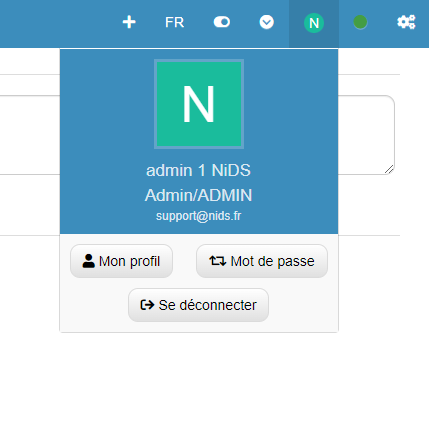
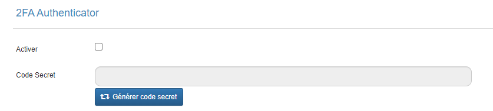
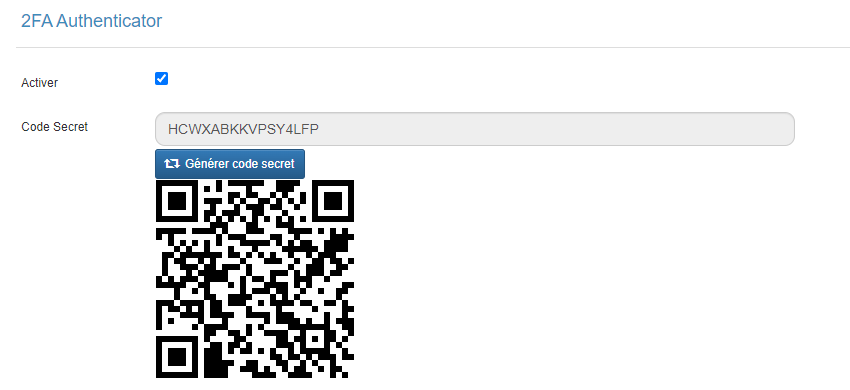

# Guide d'Utilisation de 2FA Authenticator pour GoPaaS

## Définition
La 2FA Authenticator (Authentification à Deux Facteurs) est une application mobile qui génère des codes de vérification temporaires, utilisés en complément du mot de passe pour renforcer la sécurité des accès aux applications GoPaaS.

### Avantages

- Protège contre les accès non autorisés même en cas de violation du mot de passe.
- Ajoute une couche supplémentaire de protection.

## Pré-requis

- Disposer d'une licence GoPaaS.
- Installer une application d'authentification sur votre mobile ou PC.

NB : Dans notre exemple nous utiliserons les applications Google Authenticator et Microsoft Authenticator.

### Téléchargement

#### Google Authenticator

| Plateforme | Télécharger                           |
|------------|---------------------------------------|
| iOS        | [Google Authenticator on App Store](https://apps.apple.com/fr/app/google-authenticator/id388497605) |
| Android    | [Google Authenticator on Google Play Store](https://play.google.com/store/apps/details?id=com.google.android.apps.authenticator2&hl=fr&pli=1) |

#### Microsoft Authenticator

| Plateforme | Télécharger                           |
|------------|---------------------------------------|
| iOS        | [Microsoft Authenticator on App Store](https://apps.apple.com/fr/app/microsoft-authenticator/id983156458) |
| Android    | [Microsoft Authenticator on Google Play Store](https://play.google.com/store/apps/details?id=com.azure.authenticator&hl=fr) |

## Configuration avec Google Authenticator

1. Après avoir installé l'application "Google Authenticator", connectez-vous à votre compte Google.
2. Rendez-vous sur votre profil GoPaaS et accédez à la section "2FA Authenticator".

3. Activez cette fonctionnalité et cliquez sur "Générer code secret" pour obtenir un QR Code.
4. Ouvrez Google Authenticator, appuyez sur le "+" en bas à droite, puis sélectionnez "Scanner un code QR".
5. Scannez le code QR affiché sur GoPaaS pour obtenir un code unique qui se régénère toutes les 30 secondes.

6. Enregistrez votre fiche utilisateur.

## Configuration avec Microsoft Authenticator

1. Après avoir installé l'application "Microsoft Authenticator", connectez-vous à votre compte Microsoft.
2. Rendez-vous sur votre profil GoPaaS et accédez à la section "2FA Authenticator".

3. Activez cette fonctionnalité et cliquez sur "Générer code secret" pour obtenir un QR Code.
4. Ouvrez Microsoft Authenticator, appuyez sur le "+" en haut à droite, puis choisissez "Autre (Google, Facebook, etc.)".
5. Scannez le code QR affiché sur GoPaaS pour obtenir un code unique qui se régénère toutes les 30 secondes.

6. Enregistrez votre fiche utilisateur.