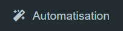
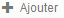
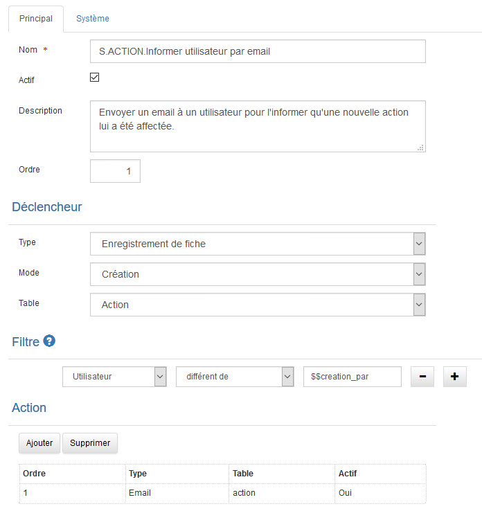
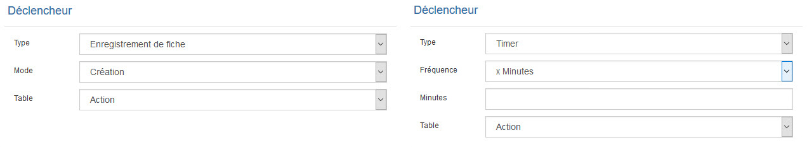
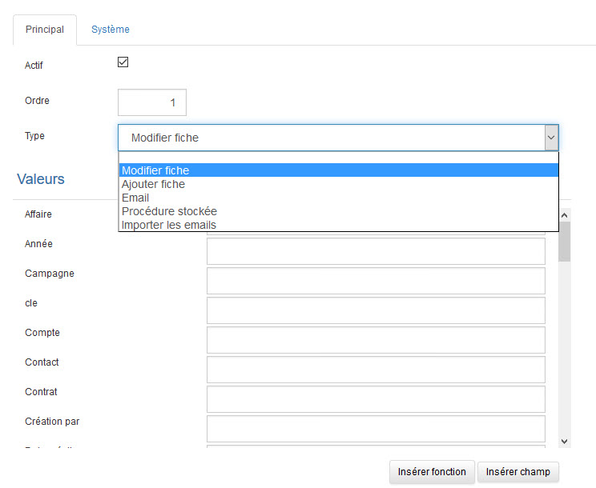
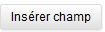

<!-- You have some errors, warnings, or alerts. If you are using reckless mode, turn it off to see inline alerts.
* ERRORs: 0
* WARNINGs: 0
* ALERTS: 8 -->

# Automatisation

## Introduction

L’automatisation est l’une des fonctionnalités les plus utiles de GoPaaS.

Elle fonctionne un peu comme un assistant.

 

Les automatisations indiqueront à GoPaaS comment accomplir des tâches répétitives ou routinières, comme l’envoi d’un mail tous les jours à 9 heures avec les tâches de la journée, ou encore des tâches plus complexes, comme envoyer un mail à un commercial en charge d’un compte, pour lequel un technicien a signalé un incident important voire critique.

Grâce aux automatisations, GoPaaS peut vous rappeler vos appels téléphoniques, vos rendez-vous imminents et/ou créer des fiches, en fonction de critères que vous aurez vous-même pré-définis.

Les automatisations vous permettent de totalement robotiser des tâches répétitives, de ne pas négliger certains détails, ou de vous fournir des informations au moment opportun, sans que vous ayez à les demander.

Pour créer une nouvelle automatisation rendez vous dans le menu personnalisation

> cliquer sur.

## Déclencheur et conditions

### Mode de fonctionnement des automatismes

Un automatisme est une série d’instructions que GoPaaS exécute automatiquement lorsque survient un événement particulier. Pour créer un automatisme il faut définir un déclencheur, le nombre de conditions et d’actions consécutives sont illimitées.

### Déclencheur

Evénement à partir duquel l’automatisme exécute son action. Enregistrer une fiche ou Timer.

### Action

Un automatisme, une fois activé, peut accomplir un nombre illimité d’opérations consécutives : par exemple éditer une fiche ou envoyer un courrier électronique. Ces opérations s’appellent des actions. Les automatismes les plus simples se composent d’un déclencheur et d’une action unique. Voici quelques exemples d’automatismes simples :

- A la création d’une fiche, un mail est envoyé pour avertir un responsable.

- A la création d’une facture ou un devis une fiche historique est créée automatiquement.

### Condition

Les Conditions permettent de préciser davantage les circonstances dans lesquelles vos automatismes s'exécutent. Lorsqu’un déclencheur active un automatisme, l’action ou les actions ne seront exécutées que si les conditions, dans la mesure où elles existent, sont satisfaites. Les conditions vous permettent de limiter l’exécution selon vos besoins.

Les automatismes soumis à des conditions sont un peu plus complexes, mais ils offrent plus de souplesse. A titre d’exemple :

- Un automatisme qui se déclenche une fois par jour à 9 heures du matin et vous envoie un rappel par email pour les actions non traitées. La condition vérifie s’il y a des actions avec le statut « Pas commencée ». S’il n’y en a pas, l’automatisme ne s’exécute pas.

- Un automatisme qui se déclenche à chaque ajout d’une note de frais et crée une action si les dépenses totales de la semaine dépassent un certain montant. La condition vérifie le montant total des dépenses de la semaine.

### Transmission des données aux actions

Certaines actions, comme "Modifier fiche" utilisent des données qui leur sont transmises par le déclencheur ou les conditions et que l’on appelle les valeurs issues du déclencheur ou de la condition.

Voici un exemple de tels automatismes :

- Un automatisme qui se déclenche lorsque vous sauvegardez une tâche qui n'a été confiée à aucun Collaborateur. L’automatisme modifie la fiche et vous assigne la tâche. Les données sont donc fournies par le déclencheur (la tâche) à l’action qui peut ainsi agir sur elles.

## Création d’une automatisation

<table>
  <tr>
   <td>Champ
   </td>
   <td>Valeur
   </td>
  </tr>
  <tr>
   <td>Nom
   </td>
   <td>Le nom de l'automatisme.
   </td>
  </tr>
  <tr>
   <td>Actif
   </td>
   <td>Pour activer ou pas cette fiche.
   </td>
  </tr>
  <tr>
   <td>Description
   </td>
   <td>Champ de saisie pour un descriptif rapide.
   </td>
  </tr>
  <tr>
   <td>Ordre
   </td>
   <td>C'est l'ordre dans lequel les automatismes vont s'exécuter.
   </td>
  </tr>
  <tr>
   <td>Déclencheur
   </td>
   <td>Cette partie va définir comment va se déclencher l'automatisme.
   </td>
  </tr>
  <tr>
   <td>Type
   </td>
   <td>

<ul>

<li>Enregistrement de fiche : Va se déclencher à l'enregistrement de la fiche dans la table sélectionnée dans le champ "Table".

<li> Timer : Va se déclencher en fonction d'une fréquence : minutes, heures, jour ou mois.
</li>
</ul>
   </td>
  </tr>
  <tr>
   <td>Table
   </td>
   <td>Choix de la table sur laquelle nous allons établir l'automatisation.
   </td>
  </tr>
  <tr>
   <td>Filtre
   </td>
   <td>Permet de mettre des conditions avant d'exécuter l'automatisation.
   </td>
  </tr>
  <tr>
   <td>Action
   </td>
   <td>C'est l'action que l'on va déclencher :
<ul>

<li>Modifier fiche, Ajouter fiche, Email, Procédure stockée ou Importer les mails
</li>
</ul>
   </td>
  </tr>
</table>

## Les actions

Il y a 5 types d'actions possibles sur GoPaaS.

<table>
  <tr>
   <td>Champs
   </td>
   <td>Détails
   </td>
  </tr>
  <tr>
   <td>Modifier fiche
   </td>
   <td>Modifier la fiche spécifiée dans le déclencheur.
   </td>
  </tr>
  <tr>
   <td>Ajouter fiche
   </td>
   <td>Ajoute une nouvelle fiche dans une table que l'on sélectionne.
   </td>
  </tr>
  <tr>
   <td>Email
   </td>
   <td>Génère l'envoi d'un email.

Sur les types Modifié fiche, Ajouter fiche et Email un bouton en bas de l'écran

 permet d'insérer les champs de la table déclencheur.
   </td>
  </tr>
  <tr>
   <td>Procédure stockée
   </td>
   <td>Fait un appel de procédure stockée (c'est un script MySQL)
   </td>
  </tr>
  <tr>
   <td>Importer les mails
   </td>
   <td>Télécharge les mails depuis un compte email pop et créer une fiche dans la table que l'on a sélectionnée.

Sur le type Importer les mails, le bouton

 permet d'insérer les valeurs reçues de l'email dans la nouvelle fiche.
   </td>
  </tr>
</table>

​​​​​​​
