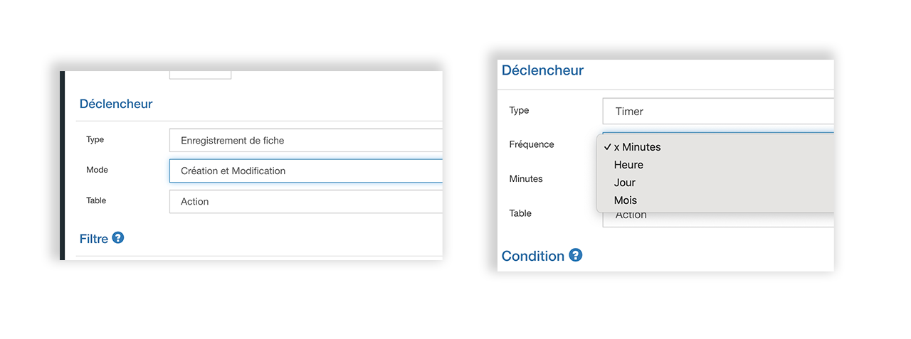
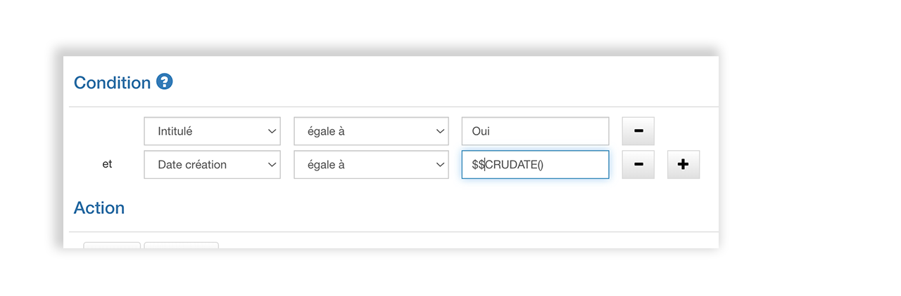

# Automatisation

## Introduction

L’automatisation est l’une des fonctionnalités les plus utiles de GoPaaS.

Elle fonctionne un peu comme un assistant.

 

Les automatisations indiqueront à GoPaaS comment accomplir des tâches répétitives ou routinières, comme l’envoi d’un mail tous les jours à 9 heures avec les tâches de la journée, ou encore des tâches plus complexes, comme envoyer un mail à un commercial en charge d’un compte, pour lequel un technicien a signalé un incident important voire critique.

Grâce aux automatisations, GoPaaS peut vous rappeler vos relances téléphoniques, vos rendez-vous imminents et/ou créer des fiches, en fonction de critères que vous aurez vous-même pré-définis.

Les automatisations vous permettent de totalement robotiser des tâches répétitives, de ne pas négliger certains détails, ou de vous fournir des informations au moment opportun, sans que vous ayez à les demander.

Pour créer une nouvelle automatisation, rendez-vous dans la barre de personnalisation en haut à droite de l’écran > Automatisation puis cliquer sur ajouter pour créer une nouvelle automatisation.

| **Intitulé**                | **Description**                  |
|------------------------|---------------------------------------------|
| Nom               | Nom de l'automatisation                                 |
| Actif                  | Activer ou désactiver l’automatisation      |
| Description            | Description détaillée de l’automatisation   |
| Ordre                  | Ordre de l’automatisation dans la vue par défaut |

## Mode de fonctionnement des automatisations

Un automatisation est une série d’instructions que GoPaaS exécute automatiquement lorsque survient un événement particulier. Pour créer une automatisation il faut définir un déclencheur, le nombre de conditions et d’actions consécutives sont illimitées.

### Déclencheur

Evénement à partir duquel l’automatisation sera exécutée. Il existe deux types de déclencheurs : 

* Enregistrement d’une fiche
* Timer

#### Enregistrement d’une fiche

L'automatisation se déclenche lors de l'enregistrement de la fiche. Plusieurs paramètres doivent être pris en considération.

| Intitulé | Description                                                  |
|----------|--------------------------------------------------------------|
| Mode     | Enregistrement et modification                                |
|          | Enregistrement                                                |
|          | Modification                                                  |
| Table    | Sélection de la table concernée par l’automatisation          |

#### Timer

L'automatisation se déclenche avec une configuration temporelle. Plusieurs autres paramètres doivent être pris en considération.

| Intitulé   | Description                                                                   | Explication                                                                   |
|------------|-------------------------------------------------------------------------------|-------------------------------------------------------------------------------|
| Fréquence  | x minutes                                                                     | Spécifier le temps en minutes entre chaque déclenchement                      |
|            | Heure                                                                         | Spécifier l'intervalle régulier entre chaque déclenchement. Par exemple : 15, l'automatisation se déclenchera chaque heure à la 15ème minute |
|            | Jour                                                                          | Spécifier le(s) jour(s) de la semaine et l’heure de déclenchement            |
|            | Mois                                                                          | Spécifier le jour du mois et l’heure de déclenchement                        |
| Table      | Sélection de la table concernée par l’automatisation                           |                                                                               |

### Conditions

Cette section permet de définir les conditions à respecter pour que l’automatisation déclenche une série d'actions.

Cliquer sur icone  pour ajouter une condition puis renseigner : 

* Un champ dans la liste déroulante
* Un opérateur
* La valeur recherchée

Répéter l’opération pour cumuler d’autres conditions.

Plusieurs conditions peuvent être cumulées pour une seule automatisation.

### Actions

Cette dernière section permet d’ajouter les actions à exécuter lorsque les conditions sont respectées.

Au total de sept actions sont disponibles dans GoPaaS.

| Nom de l'action   | Description                                          |
|-------------------|------------------------------------------------------|
| Modifier fiche    | Modifier la fiche spécifiée dans le déclencheur.    |
| Ajouter fiche     | Ajoute une nouvelle fiche dans une table que l'on sélectionne. |
| Email             | Envoyer un email personnalisé                        |
| Script serveur    | Exécuter un script PHP côté serveur (back-end).     |
| CURL              | Exécuter une requête cURL                            |
| Cron mail         | Exécuter une tâche cronmail                         |
| Importer les emails | Exécuter une tâche d’import d’email               |

A l’image des conditions, plusieurs actions peuvent être cumulées dans une seule automatisation.

​​​​​​​
