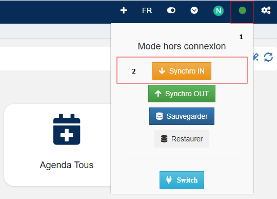

# Guide mode hors connexion

Le tableau ci-dessous présente les données des différentes vues qui seront embarquées dans le mode offline de l'application.

| Nom de la vue             | Nom de la table         | Conditions            |
|---------------------------|-------------------------|-----------------------|
| OFFLINE - Action          | actions                 | Actions liées à un produit ou un bon de commande pour l'utilisateur connecté, où la date du produit ou du bon de commande est supérieure aux 13 derniers mois.                       |
| Par défaut                | activite                |                       |
| OFFLINE - Affaire         | affaire                 | Les affaires de l'utilisateur connecté.                      |
| OFFLINE - article         | article                 | Liste des articles.                       |
| OFFLINE - BDC             | bon_de_commande         | Les bons de commande associés à l'utilisateur connecté et dont la date du document est dans les 13 derniers mois.                      |
| OFFLINE - BC Ligne        | bon_de_commande_ligne   | Les bons de commande associés à l'utilisateur connecté, dont la date du document est dans les 13 derniers mois.                       |
| Collaborateurs actifs     | collaborateur           | Les collaborateurs dont le statut est marqué comme actif.                      |
| OFFLINE - Communes        | communes                | Les sociétés dont la clé est non vide et qui ont des produits associés à l'utilisateur connecté, avec une date de départ dans les 13 derniers mois.                      |
| OFFLINE - Csf             | csf                     | Les enregistrements dont la date de création est dans les 13 derniers mois.                   |
| OFFLINE - Facture         | facture                 | Les factures associées à l'utilisateur connecté et dont la date du document est dans les 4 derniers mois.                      |
| OFFLINE - Facture ligne   | facture_ligne           | Les factures associées à l'utilisateur connecté, avec une date de document dans les 4 derniers mois.                       |
| OFFLINE - Interlocuteur   | interlocuteur           |  Les interlocuteurs dont la clé est non vide et qui ont des produits associés à l'utilisateur connecté, avec une date de départ dans les 13 derniers mois.                     |
| Par défaut                | opco                    |  Aucune condition.                     |
| OFFLINE - planning_pub    | planning_pub            | Les enregistrements dans la table planning_pub où la clé est précisément '1 001'.                    |
| OFFLINE - Prod            | prod                    | Les produits où l'utilisateur connecté est le collaborateur ou la personne en charge du suivi, et dont la date de départ est dans les 13 derniers mois.                        |
| OFFLINE - Produits        | produits                |   Les produits qui sont marqués comme actifs.                     |
| OFFLINE - Remise cascade  | remise_cascade          |   Aucune condition.                     |
| OFFLINE - Société         | societe                 |  Les sociétés où soit la clé n'est pas vide et il y a des produits associés à l'utilisateur connecté dans les 13 derniers mois, soit l'utilisateur connecté est spécifiquement suivi pour la communication radio.                     |
| Par défaut                | sous_traitant           |  Aucune condition.                     |
| Par défaut                | support                 |    Aucune condition.                      |
| Par défaut                | voix                    |    Aucune condition.                      |

## Activer le mode hors connexion 

Pour utiliser l'application en mode hors connexion lorsque vous n'avez plus de connexion internet, suivez les étapes ci-dessous :

1. Allez dans le menu **Statut de la connexion** en haut à droite de l'écran.
2. Cliquez sur le bouton **Synchro in**.

   

3. Confirmez en cliquant sur **Oui**.
4. Patientez pendant la création de la base de données locale.
5. Une fois terminé, cliquez sur **OK**.

> **Note :** Lorsque vous perdez la connexion internet, le statut de connexion en haut à droite deviendra rouge, indiquant que vous êtes en mode hors connexion.

### Consignes pour le mode hors connexion
- **Ne rafraîchissez pas votre navigateur** pour continuer à naviguer sans connexion.
- Les agendas et les filtres dans les vues **ne fonctionnent pas** en mode hors connexion.
- En mode hors connexion, vous pouvez **créer, modifier et supprimer des fiches**.

## Simulation du mode hors connexion

Pour simuler une utilisation en mode hors connexion :

1. Déconnectez-vous de votre point d'accès internet.
   - Le statut de connexion en haut à droite de l'écran passera en rouge.
2. Modifiez une fiche **Société**.
3. Enregistrez la fiche, puis rouvrez-la pour vérifier que les modifications ont bien été enregistrées.

## Reconnexion et synchronisation des données

Lorsque vous êtes prêt à vous reconnecter à Internet :

1. Reconnectez-vous à votre point d'accès internet.
2. Un message de synchronisation apparaîtra pour vous inviter à synchroniser les données locales avec le serveur.
3. Cliquez sur **Oui** et patientez pendant la synchronisation.
4. Une fois la synchronisation terminée, cliquez sur **OK**.

Votre application est maintenant **synchronisée** et reconnectée à Internet.

Vous pouvez ouvrir la fiche **Société** modifiée en mode hors connexion et vérifier que les données ont été mises à jour correctement.

---

## Configuration

Le tableau ci-dessous présente les données des différentes vues qui seront embarquées dans le mode offline de l'application.

| Nom de la vue             | Nom de la table         |
|---------------------------|-------------------------|
| OFFLINE - Action          | actions                 |
| Par défaut                | activite                |
| OFFLINE - Affaire         | affaire                 |
| OFFLINE - article         | article                 |
| OFFLINE - BDC             | bon_de_commande         |
| OFFLINE - BC Ligne        | bon_de_commande_ligne   |
| Collaborateurs actifs     | collaborateur           |
| OFFLINE - Communes        | communes                |
| OFFLINE - Csf             | csf                     |
| OFFLINE - Facture         | facture                 |
| OFFLINE - Facture ligne   | facture_ligne           |
| OFFLINE - Interlocuteur   | interlocuteur           |
| Par défaut                | opco                    |
| OFFLINE - planning_pub    | planning_pub            |
| OFFLINE - Prod            | prod                    |
| OFFLINE - Produits        | produits                |
| OFFLINE - Remise cascade  | remise_cascade          |
| OFFLINE - Société         | societe                 |
| Par défaut                | sous_traitant           |
| Par défaut                | support                 |
| Par défaut                | voix                    |