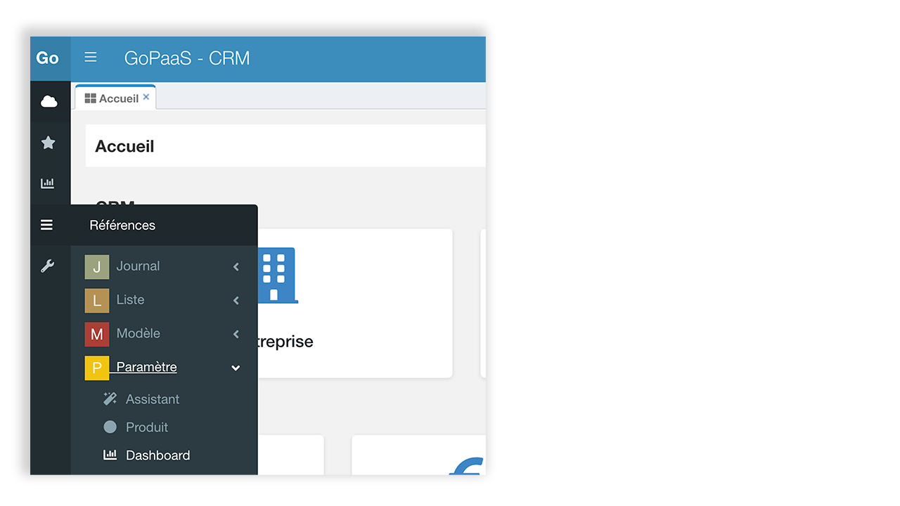

# Dashboard

## Description

Les Dashboard sont organisés en lignes de dashboard qui contiennent des vues personnalisées telles que des widgets et des graphiques.

La méthode pour créer un dashboard efficace consiste à créer des vues personnalisées (widget, graphique, icon ou encore webreport) et de les sélectionner dans les lignes de dashboard.

## Créer un dashboard

Pour créer un nouveau dashboard, rendez vous dans la barre de navigation > Références > Dashboard.

Cliquer sur le bouton `Ajouter`.

Ci-dessous, la description des champs de l’onglet principal.

| Champ                   | Valeur                                                                                          |
|-------------------------|-------------------------------------------------------------------------------------------------|
| **Intitulé**            | Nom du dashboard                                                                                |
| **Permission**          | Sélection des groupes d’utilisateurs autorisés à accéder au dashboard                            |
| **Regroupement**        | Regroupement du dashboard                                                                       |
| **Afficher au démarrage** | Cocher l’option pour activer l’option d’ouverture automatique à la connexion à l’application  |
| **Pour le(s) groupe(s)** | Sélection des groupes pour lesquels le dashboard s'affiche à la connexion.                        |
| **Afficher bouton Fullscreen** | Permet l’affichage du bouton plein écran sur le dashboard                                 |

Pour un fonctionnement optimal, il est conseillé de renseigner, au minimum, les champs intitulé et permission.

Une fois renseigné, cliquer sur le bouton `Appliquer` pour continuer.

### Ligne de dashboard

Dans la section détails, cliquer sur le bouton `Ajouter` pour créer une nouvelle ligne de dashboard.

Ci-dessous, la description des champs de l’onglet principal.

| Champ               | Valeur                                                                                          |
|---------------------|-------------------------------------------------------------------------------------------------|
| **Dashboard**       | Connexion vers le dashboard                                                                     |
| **Intitulé**        | Nom de la ligne de dashboard                                                                    |
| **Ordre**           | Ordre de la ligne de dashboard dans le dashboard                                                |
| **Options avancées**| Cocher l’option pour activer l’onglet HTML de la ligne de dashboard                             |
| **Description**     | Description de la ligne de dashboard                                                            |

Dans une ligne de dashboard, il est possible d’ajouter jusqu’à 6 vues personnalisées.

Pour ajouter une vue, choisir un emplacement (view1, view2, view3, etc) et sélectionner une vue en cliquant sur la loupe puis renseigner une largeur.

La largeur maximale est de “12”, la minimale est de “1”. 12 correspond à la largeur totale de l’écran.

La somme totale des largeurs de vue ne peut pas excéder “12”.

Cliquer sur le bouton `Enregistrer` pour conserver le paramétrage de la ligne de dashboard.

​​​​​
NB : Après avoir paramétré un dashboard, il est conseillé de rafraîchir la page et de vider le cache du navigateur.

## Dupliquer un dashboard

Afin de gagner du temps, il est possible de dupliquer un dashboard existant pour ensuite le modifier.

Depuis la fiche dashboard, menu outil > Dupliquer Dashboard

## Dashboard designer

L’administrateur GoPaaS dispose d’un droit supplémentaire lui permettant de paramétrer rapidement un dashboard en partant de l’interface utilisateur.

Sur un dashboard existant, cliquer sur l'icône  en haut à droite de l’écran.

Depuis cette interface, il est possible de : 

- Modifier la largeur du widget en glisser déposer

- Modifier le nom du widget

- Modifier la couleur du widget

- Supprimer un widget du dashboard

Cliquer sur l'icône  pour enregistrer les modifications.

