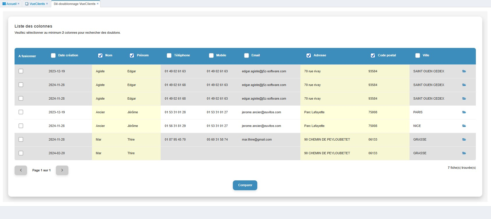
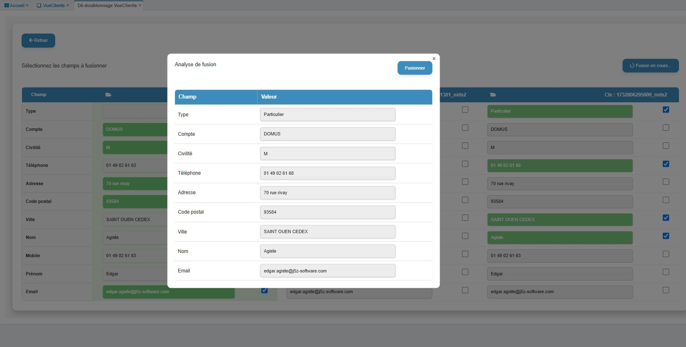

# Module de Dé-doublonnage

## Description

Ce module implémente une solution de dé-doublonnage pour les bases de données. Il permet de :
- Identifier des doublons dans les données en fonction des colonnes sélectionnées.
- Fusionner les doublons en choisissant les champs à conserver.
- Supprimer les doublons après fusion.

---

## Pré-requis

1. Télécharger le fichier 📁 [`dedoublonnage.zip`](https://drive.google.com/file/d/1aP6j0Z8IApqICPZtgH-upbPno30IhDsc/view?usp=sharing) et le décompresser.

2. **Menu → Admin → Transfer In**.

3. Importer le fichier **dedoublonnage.json**.

## Paramètres

| Paramètre      | Type     | Description                                                     |
|----------------|----------|-----------------------------------------------------------------|
| `viewName`     | string   | Nom de la vue utilisée pour afficher les données               |
| `viewKey`      | string   | Clé unique de la vue                                           |
| `tableName`    | string   | Nom de la table contenant les données                          |
| `pageSize`     | integer  | Nombre de lignes à afficher par page (option par défaut : 10)  |
| `currentPage`  | integer  | Page active lors de l'affichage des données                    |

---

## Exemple d'utilisation

Ajoutez le code suivant dans l'onglet **Script JS** de votre vue pour activer le module de dé-doublonnage :

```javascript
dedoublonnage({
    viewName: "Clients",        // Exemple : Vue contenant les données des clients
    viewKey: "client_key",      // Exemple : Clé associée à la vue
    tableName: "clients_table"  // Exemple : Nom de la table de clients
});
```

---

## Résultat attendu

Une interface permettant de :
1. **Sélectionner les colonnes pour trouver les doublons et dentifier les fiches dupliquées.**
    
2. **Fusionner les fiches en sélectionnant les champs à conserver et supprimer les doublons après fusion.**
    

---

## Notes complémentaires

- Vous pouvez personnaliser la taille des pages en modifiant la valeur de `pageSize` dans les options de la function.

> N'hésitez pas à ajuster les options et les paramètres pour répondre à vos besoins spécifiques.
