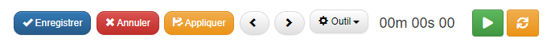

# Chrono

## Pré-requis

Installer l'extension "**Chrono**"

1. Télécharger le fichier [**chrono.zip**](https://drive.google.com/file/d/1vvuID_f0lwfi6cCvPqULf-iPSJaDVkgn/view) et le décompresser.

2.  **Menu → Admin → Transfer In**.

3. Importer le fichier JSON.

## Configuration

Pour afficher le chrono et intégerer l'extension, insérer le code suivant dans l'onglet "**Script JS**" de la table :

```javascript
$("#timer").val("00m 00s 00");
clearInterval(timerInterval);

Load_chrono(thisComponent);
```

## Exemple
```javascript
function onLoad_chrono() {
  var thisComponent = this;

  $("#timer").val("00m 00s 00");
  clearInterval(timerInterval);

  Load_chrono(thisComponent);

  return true;
}
```

## Résultat

