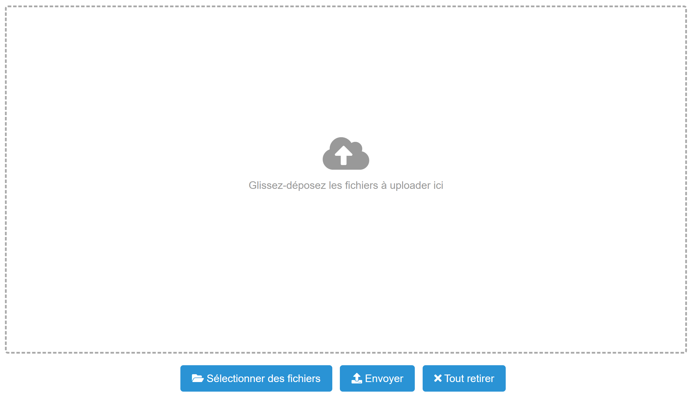

# Dropfile

## Pré-requis

Installer l'extension "**dropfile**"

1. Télécharger le fichier [**dropfile.zip**](https://drive.google.com/file/d/1aP6j0Z8IApqICPZtgH-upbPno30IhDsc/view?usp=sharing) et le décompresser.

2.  **Menu → Admin → Transfer In**.

3. Sélectionner le fichier “**dropfile.json**”.

## Paramètres

| Param | Type | Description |
|-------|------|-------------|
|tableName|	string|	Nom de la table
|fieldName|	string|	Nom du champ de type "Fichier" à utiliser
|fileName|	string|	Nom du champ de type "Texte" à utiliser pour enregistrer le nom du fichier
|imageSize|	object|	Redimensionnement maximum des images (longueur, largeur) en pixel (option)
|fieldConnection|	string|	Nom de la "connexion" à utiliser dans le cas d'une vue liée (option)
|trigItemName|	string|	Clé de la fiche parent dans le cas d'une vue liée (option)

## Exemple

Pour afficher le bouton "**Ajouter des fichiers**" et intégerer l'extension, insérer le code suivant dans l'onglet <br>"**Script JS**" de la vue liée :
```javascript
let thisComponent = this;
let itemComponent = Component.find("Item",this);

thisComponent.ui.find('#bs-example-navbar-collapse-1').append("<div><button id='btnDragNDrop' style='margin-top:8px' class='btn btn-primary'>Ajouter des fichiers</button></div>");

thisComponent.ui.find('#btnDragNDrop').on('click', function() {

    let object = {
        tableName : "file", 
        fileName : "nom_fichier", 
        fieldName : "fichier", 
        fieldConnection : "compte", 
        trigItemName : itemComponent.getValue("cle"),
        imageSize : {width : 1920, height : 1080}
    };

    let update = {type : "En attente"};

    dropfile(thisComponent, object, update);
});
```

## Résultat




> N'hésitez pas à ajuster ces informations en fonction de votre cas d'utilisation spécifique.*

> L'extension est modifiable, vous pouvez l'adapter à vos besoins.*