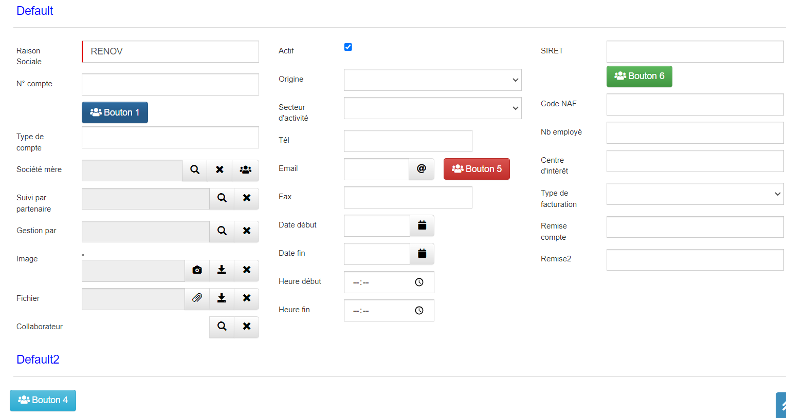
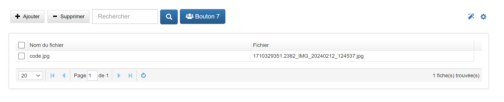

# itemAddButton

## Prérequis

Installer l'extension "**itemAddButton**"

1. Télécharger le fichier **itemAddButton.zip** et le décompresser.
2.  **Menu → Admin → Transfer In**.
3. Sélectionner le fichier “**itemAddButton.json**”.

## Paramètres

| Param | Type | Description |
|-------|------|-------------|
| id | string | id du bouton |
| position | string	| Position du bouton : "**right**", "**top**", "**bottom**", "**connection**", "**section**" et "**tools**"
| elementId	| string | id de l'élément parent du bouton |
| icon | string	| Icône font-awesome du bouton
|style | string	| Style du bouton : "**primary**", "**success**", "**danger**", "**warning**" et "**info**"
| label | string | Titre du bouton
| function | string | Fonction à exécuter sur le clic du bouton
| col |	int | Index de la class "**col-sm**" du conteneur parent de l'élément qui a pour id "**elementId**"

## Exemple

Pour ajouter des boutons sur des champs de la fiche et intégerer l'extension, insérer le code suivant dans l'onglet "**Script JS**" de la table :
```javascript
let thisComponent = this;
let buttons = [
  {id: "button_1", position: "top", elementId: "type_compte", icon: "fas fa-users", style: "primary", label: "Bouton 1", function: "nom_fonction1()", col : 9},
  {id: "button_2", position: "connection", elementId: "societe_mere", icon: "fas fa-users", function: "nom_fonction2()"},
  {id: "button_3", position: "tools", icon: "fas fa-users", style: "warning", label: "Bouton 3", function: "nom_fonction3()"},
  {id: "button_4", position: "section", elementId: "section_1339", icon: "fas fa-users", style: "info", label: "Bouton 4", function: "nom_fonction4()"},
  {id: "button_5", position: "right", elementId: "email", icon: "fas fa-users", style: "danger", label: "Bouton 5", function: "nom_fonction5()", col : 9},
  {id: "button_6", position: "bottom", elementId: "siret", icon: "fas fa-users", style: "success", label: "Bouton 6", function: "nom_fonction6()", col : 9}
];

itemAddButton(thisComponent, buttons);
```

Pour ajouter des boutons sur une vue liée, insérer le code suivant dans l'onglet "**Script JS**" de la vue liée :
```javascript
let thisComponent = this;
let buttons = [
  {id : "button_7", position : "view", elementId : "LinkCompteFile", style : "primary", icon : "fas fa-users", label : "Bouton 7"}
];

itemAddButton(thisComponent, buttons);
```

## Résultat





***Remarque :***
+ *N'hésitez pas à ajuster ces informations en fonction de votre cas d'utilisation spécifique.*
+ *L'extension est modifiable, vous pouvez l'adapter à vos besoins.*

