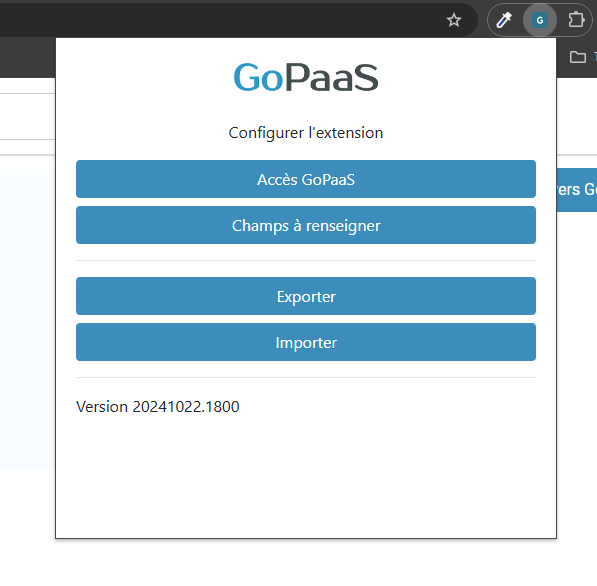
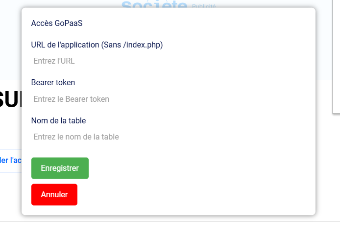
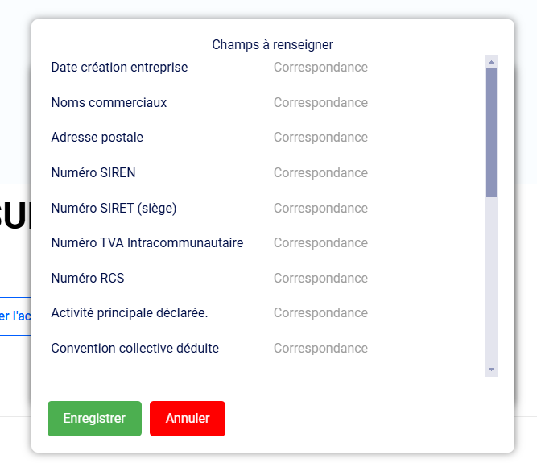
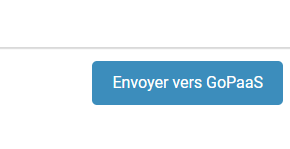

# Extension GoPaaS SOCIETE.COM

## Description
L'extension **GoPaaS SOCIETE.COM** permet de récupérer des informations sur une entreprise directement depuis [société.com](https://www.societe.com). 

Une fois installée et configurée, cette extension ajoute un bouton qui permet d'envoyer les données de la fiche de l'entreprise directement dans votre application **GoPaaS**. Cette extension ne fonctionne que lorsque vous êtes sur une URL au format `https://www.societe.com/societe/xxxxx.html`. Par exemple, depuis une page comme : [https://www.societe.com/societe/nids-consulting-482064706.html](https://www.societe.com/societe/nids-consulting-482064706.html).

L'extension est disponible sur le Chrome Web Store : [https://chromewebstore.google.com/](https://chromewebstore.google.com/)

## Configuration

Après avoir installé l'extension, rendez-vous sur le panneau de contrôle :
    
    
Puis suivez les étapes de configuration suivantes :

1. **Paramétrer les accès GoPaaS** :
   - Renseignez l'URL de votre instance GoPaaS.
   - Ajoutez votre Bearer Token.
   - Sélectionnez la table cible dans laquelle vous souhaitez stocker les informations récupérées.

   

2. **Réaliser le mapping des champs** :
   - Associez les champs correspondants dans GoPaaS.
   - Seuls les champs nécessaires peuvent être mappés ; vous n'êtes pas obligé de tous les mapper.

   

## Utilisation

1. Allez sur la page société.com de l'entreprise que vous souhaitez ajouter à GoPaaS.
2. Cliquez sur le bouton **Envoyer vers GoPaaS**.

    

3. Une confirmation vous sera demandée pour vérifier si vous souhaitez créer une fiche pour cette entreprise.
4. Si vous cliquez sur **Oui**, la fiche est créée, et vous êtes directement redirigé vers la fiche de votre application GoPaaS, qui s'ouvre dans un nouvel onglet.

## Exportation et Importation de la Configuration

Il est possible d'exporter la configuration de l'extension pour la réutiliser sur un autre poste. Cela permet aux collaborateurs d'avoir la même configuration sans avoir à la recréer manuellement. Pour cela :
- Allez dans les paramètres de l'extension.
- Exportez la configuration sous forme de fichier.
- Importez ensuite ce fichier de configuration sur un autre poste.