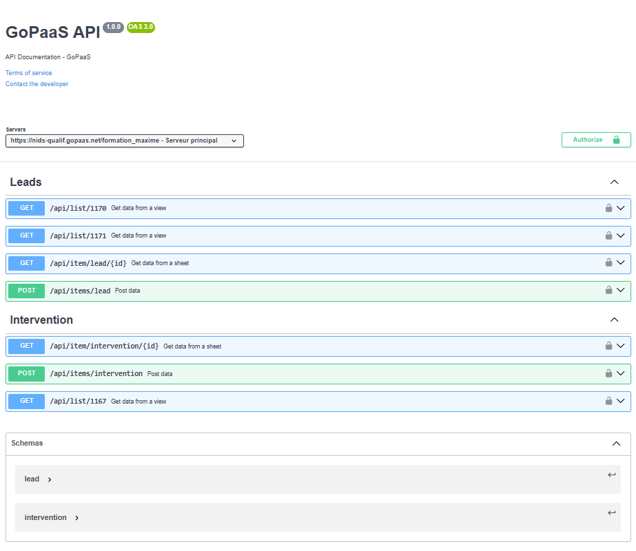

# Swagger

## Introduction
Cette documentation guide les utilisateurs sur la manière d'intégrer et d'utiliser Swagger pour concevoir, documenter, et tester leurs APIs de manière efficace. Swagger permet une interaction fluide avec les endpoints, facilitant la recherche d'informations telles que les méthodes HTTP, les paramètres requis, et les types de réponses attendues.

## Prérequis

1. Télécharger le fichier [**swagger.zip**]() et le décompresser

2. **Menu → Admin → Transfer In**

3. Sélectionner le fichier “**swagger.json**”.

4. **Menu → Admin → Configuration → Script**

```javascript
addSwagger();
```

## Note

Pour déclarer un champ à prendre en compte dans Swagger, cochez la case Swagger dans l’onglet système du champ, depuis le Form Designer.

## Utilisation

1. Sélectionnez une table, puis les ressources nécessaires (LIST, ITEM, et ITEMS).
2. Pour la ressource LIST, sélectionnez une ou plusieurs vues.
3. Une fois les paramètres de la ressource définis, cliquez sur la flèche pointant vers la droite pour ajouter votre configuration au tableau de droite.
4. Lorsque votre configuration est terminée, cliquez sur le bouton “Télécharger le fichier .yaml”.
5. Rendez-vous ensuite sur le site [Swagger Editor](https://editor.swagger.io/) et importez le fichier `GoPaaS_api.yaml`.

## Résultat

   