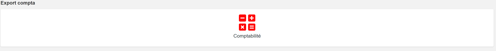

# viewExportCompta

## Prérequis

Importer le fichier "**viewExportCompta.json**":
1. Télécharger le fichier **viewExportCompta.zip** et le décompresser
2. **Menu → Admin → Transfer In**
3. Sélectionner le fichier “**viewExportCompta.json**”.

## Paramètres

|Param|	Type|	Description|
|-----|-----|--------------|
|viewKey|	string|	Cle de la vue
|fieldDate|	string|	Nom du champ date sur lequel le filtre de recherche s'applique
|fileName|	string|	Nom du fichier CSV généré
|symbol|	string|	Séparateur dans le fichier CSV
|column| tableau| Tableau d'objets contenant le débit et le crédit, qui sont des champs obligatoires, tandis que les autres champs sont optionnels.<br>*Note : Le paramètre "**fieldName**" peut prendre un tableau de trois champs différents au maximum à afficher*

## Exemple

Pour ajouter le widget au dashboard et intégrer l'extension, il faut se rendre dans les paramètres du dashboard, puis ouvrir la ligne de dashboard correspondante. <br>Ensuite, activez le mode "**Options avancées**" pour cette ligne et insérez le code suivant :

```javascript
<div class="row">       
    <div class="col-lg-12 col-md-12 col-sm-12 col-xs-12">
        <div class="gopaas-icon">
            <a href="#" id="exportCompta" class="gopaas-graph-more">
                <i class="fas fa-calculator-alt fa-5x" style="color: rgb(255, 0, 0);"></i><br>
                <h4 class="gopaas-graph-title trn">Comptabilité</h4>
            </a>
        </div>
    </div>    
</div>

<script>
$("#exportCompta").on("click", function(){
let data = {viewKey : "facture.Pardéfaut.BBFJ4", fieldDate : "date_document" , fileName : "exportCompta", split : ";", column : [             
    {name : "cle", fieldName : "cle"},
    {name : "Date", fieldName : "date_document"},
    {name : "Code journal", fieldName : "code_journal"},
    {name : "N° Compte", fieldName : ["num_compte_quadra", "compte_tva", "compte_travaux"]},
    {name : "N° Facture", fieldName : "numero_piece"},
    {name : "Intitulé", fieldName : "reference"},
    {name : "Débit", fieldName : "total_ttc"},
    {name : "Crédit", fieldName : "montant_tva"},
    {name : "Crédit", fieldName : "total_ht"}
]};
viewExportCompta(data);
});
</script>
```

## Résultat


