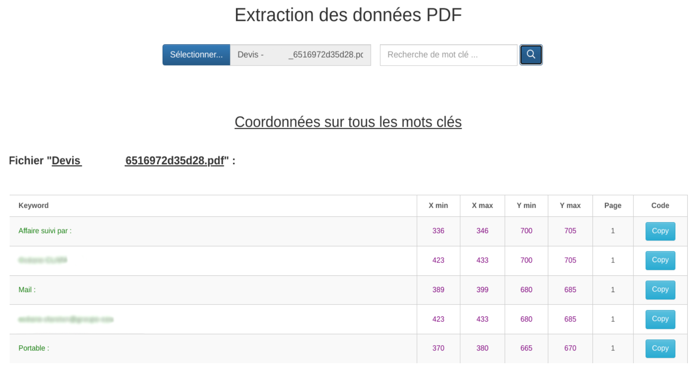

# viewExtractPDF

## Prérequis

Importer le fichier "**viewExtractPDF.json**":
1. Télécharger le fichier **viewExtractPDF.zip** et le décompresser.
2. **Menu → Admin → Transfer In**.
3. Sélectionner le fichier “**viewExtractPDF.json**”.

## Paramètres 

|Param|	Type|	Description|
|-----|-----|--------------|
|tableName|	string|	Nom de la table dans laquelle enregistrer les informations extraites
|pjFieldName|	string|	Nom du champ de type fichier
|fieldName|	string|	Noms du champ dans lequel stocker les informations extraites
|page|	float|	Numéro de la page ou se situe les informations
|coord| objet| Contient les coordonnées de l'élément recherché
|x_min|	float|	Valeur définissant la position horizontale minimale de l'élément recherché
|x_max|	float|	Valeur définissant la position horizontale maximale de l'élément recherché
|y_min|	float|	Valeur définissant la position verticale minimale de l'élément recherché
|y_max|	float|	Valeur définissant la position verticale maximale de l'élément recherché

## Mode debug

Le mode debug permet aux administrateurs de récupérer les valeurs de la position horizontale et verticale d'un élément contenu dans un fichier PDF en réalisant une recherche par mot-clé.
Pour passer en mode debug, le paramètre "**debug**" doit être renseigné à "**true**" :
```javascript
let debug = true;
viewExtractPDF(options, async function(data){}, debug);
```



## Exemple

Pour afficher le bouton "**ExtractPDF**" et intégerer l'extension, insérer le code suivant dans l'onglet "**Script JS**" de la vue :

```javascript
var viewbar = Component.find("Viewbar", this);
let debug = false;
viewbar.addTool("<span><i class='fas fa-file-pdf'></i>&nbspExtractPDF</span>", function(){

    let options = {
        tableName : "file", 
        pjFieldName : "fichier", 
        values : [
            {
                fieldName : "reference", 
                page : 1, 
                coord : {
                    x_min : 66, 
                    x_max : 76, 
                    y_min : 682, 
                    y_max : 687
                }
            },
            {
                fieldName : "adresse_sinistre", 
                page : 3, 
                coord : {
                    x_min : 147, 
                    x_max : 157, 
                    y_min : 659, 
                    y_max : 664
                    }
            }
        ]
    };
    
    viewExtractPDF(options, function(callback){
        console.log(callback);
    }, debug);
});
```

## Résultat

