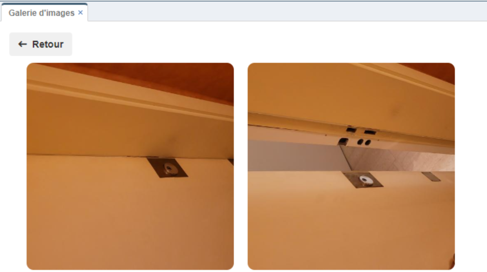

# viewImageGallery

## Prérequis

Installer l'extension "**viewImageGallery**"

1. Télécharger le fichier **viewImageGallery.zip** et le décompresser.
2.  **Menu → Admin → Transfer In**.
3. Sélectionner le fichier “**viewImageGallery.json**”.

## Paramètres

| Param | Type | Description |
|-------|------|-------------|
|tableName|	string|	Nom de la table
|viewName|	string|	Nom de la vue liée
|columnName| string|	Nom du champ contenant la photo

## Exemple

Pour afficher le bouton "**Afficher les photos dans la galerie**" et intégerer l'extension, insérer le code suivant dans l'onglet "**Script JS**" de la vue liée :
```javascript
thisComponent.ui.find(".glyphicon-search").after("<button id='btnShowGallery' type='button' role='button' class='btn btn-ajouter' style='margin-left:5px; background-color:#296294; color:white;' title='Afficher les photos dans la galerie'><i class='fas fa-images'></i>&nbsp;&nbsp;<span class='trn'>Afficher les photos dans la galerie</span></button>");
  
thisComponent.ui.find("#btnShowGallery").on("click", function() {

 var imageGallery_options = {
  tableName : "tableName", 
  viewName : "viewName", 
  columnName : "columnName"
 };

 viewImageGallery(itemComponent, imageGallery_options);
});
```

## Résultat



***Remarque :***
+ *Le champ contenant la photo doit être ajouter dans la vue liée.*
+ *Le champ contenant la photo peut être du type image ou fichier.*

