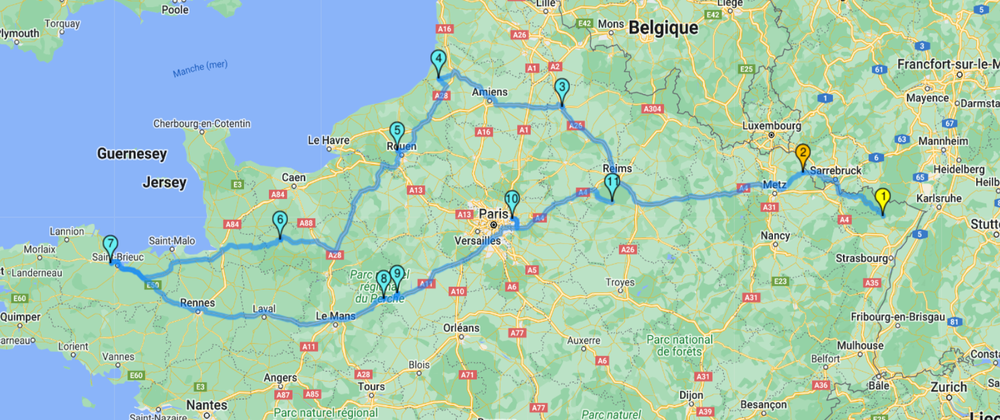

# viewMapDirection

## Prérequis 

Importer le fichier "**viewMapDirection.json**":

1. Télécharger le fichier **viewMapDirection.zip** et le décompresser.
2. **Menu → Admin → Transfer In**.
3. Sélectionner le fichier “**viewMapDirection.json**”.

## Paramètres

| Param | Type | Description |
|-------|------|-------------|
|destinations|	tableau|	Tableau contenant les différents points sous la forme : **adresse, cp, ville**
|fields|	tableau|	Tableau d'objets contenant divers paramètres : <br>**cle** *(cle de la fiche, obligatoire)*<br>**markerColor** *(couleur du point en hexadicimal, obligatoire)<br>**Titre** (titre de l'information, optionnel)<br> **Valeur** (valeur de l'information, optionnel)*<br><br>**Exemple** : "cle" : "20240301_nids", "markerColor" : "FF0000", "Entreprise" : "NiDS CONSULTING", "Contact" : "Francis" ...
|tableName|	string|	Nom de la table

## Exemple

Pour afficher le bouton "**Afficher sur une carte**" et intégerer l'extension, insérer le code suivant dans l'onglet "**Script JS**" de la vue et/ou de la vue liée :
```javascript
thisComponent.ui.find(".glyphicon-search").after("<button id='btnShowMap' type='button' role='button' class='btn btn-info' style='margin-left:5px; color:white;' title='Afficher sur une carte'><i class='fas fa-map-marker-alt'></i>&nbsp;<span class='trn'>Afficher sur une carte</span></button>");
  thisComponent.ui.find("#btnShowMap").on('click', async function(){
    destinations = [];
    fields = [];
    tableName = "actions";

    $.get('webservice/view/list-item.php', {
      "tableName": "actions",
      "viewName": "LinkVisiteActions",
      "filter_value": itemComponent.getValue("cle")
    }).done(function (items) {
      for(let i = 0; i < items.rows.length; i++){
        fields.push({"cle" : items.rows[i].cle, "markerColor" : items.rows[i].code_couleur, "Entreprise": items.rows[i].nom_entreprise, "Ville": items.rows[i].ville, "CP": items.rows[i].cp, "Contact": items.rows[i].prenom + ' ' + items.rows[i].nom + ' ' + items.rows[i].telephone, "RDV" : gopaas.date.toFr(items.rows[i].date_debut) + ' à ' + items.rows[i].heure_debut});
        var concat = items.rows[i].adresse + ", " + items.rows[i].ville + ", " + items.rows[i].cp;
        destinations.push(concat.toString());
      }

      viewMapDirection(destinations, fields, tableName);
    });
  });
```

## Résultat



***Remarque :***
+ *N'hésitez pas à ajuster ces informations en fonction de votre cas d'utilisation spécifique.*
+ *L'extension est modifiable, vous pouvez l'adapter à vos besoins.*
