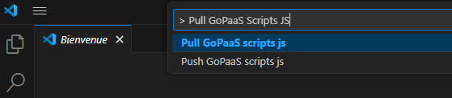
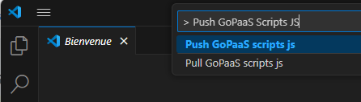

# GoPaaS Script Editor

**GoPaaS Script Editor** est une extension Visual Studio Code qui permet de synchroniser les scripts JavaScript d'une application GoPaaS (extensions, tables, etc.) entre le serveur et un environnement local.

## Installation

1. Installez l'extension **GoPaaS Script Editor** depuis le store des extensions de Visual Studio Code.
2. Créez un dossier avec le nom de votre application dans votre espace de travail local.
3. Dans ce dossier, ajoutez un fichier `config.json` contenant la configuration suivante :

```json
{
    "API_ENDPOINT": "https://{application-url}/",
    "BEARER_TOKEN": "{your-bearer-token}"
}
```

- **API_ENDPOINT** : URL de votre application GoPaaS.
- **BEARER_TOKEN** : Token d'authentification (Bearer) pour accéder à l'application GoPaaS.

## Utilisation de l'Extension

- **Pour récupérer les scripts en local** :
    - Dans la barre de commande de Visual Studio Code, tapez `> Pull GoPaaS Scripts JS` pour télécharger tous les fichiers JavaScript de votre application GoPaaS en local.

        

- **Pour envoyer vos modifications vers GoPaaS** :
    - Après avoir modifié un script, tapez `> Push GoPaaS Scripts JS` dans la barre de commande pour envoyer vos modifications vers l'application GoPaaS.

        

## Utiliser Git pour gérer les développements en équipe

Afin de travailler efficacement à plusieurs sur le même projet GoPaaS et éviter les conflits, il est recommandé d'utiliser un dépôt Git partagé. 
Voici la procédure de collaboration :

1. **L'administrateur du projet** :
   - Utilise l'extension pour récupérer le code de GoPaaS en local.
   - Initialise un dépôt Git local dans le dossier de l'application.
   - Pousse le code récupéré vers un dépôt Git distant (par exemple, GitHub).

2. **Les développeurs** :
   - Clonent le dépôt Git distant en local pour obtenir la dernière version du code.
   - Travaillent sur les scripts en local et effectuent leurs commits dans le dépôt Git.
   - **Ne poussent pas directement** leurs modifications vers GoPaaS, mais uniquement vers le dépôt Git.

3. **L'administrateur** :
   - Récupère les modifications du dépôt Git, résout les éventuels conflits, puis pousse l'ensemble des modifications vers GoPaaS.

### Exemples de Commandes Git

- **Initialiser un dépôt Git** (pour l'administrateur) :

    ```bash
    git init
    git add .
    git commit -m "Initial commit from GoPaaS"
    git remote add origin https://github.com/your-repo.git
    git push -u origin main
    ```

- **Récupérer les dernières modifications du dépôt Git** (pour les développeurs) :

    ```bash
    git pull origin main
    ```

- **Envoyer les modifications locales vers le dépôt Git** (pour les développeurs) :

    ```bash
    git add .
    git commit -m "Modifications locales"
    git push origin main
    ```

- **Récupérer les contributions des développeurs et pousser vers GoPaaS** (pour l'administrateur) :

    ```bash
    git pull origin main
    # Résoudre les éventuels conflits si nécessaire
    > Push GoPaaS Script JS
    ```