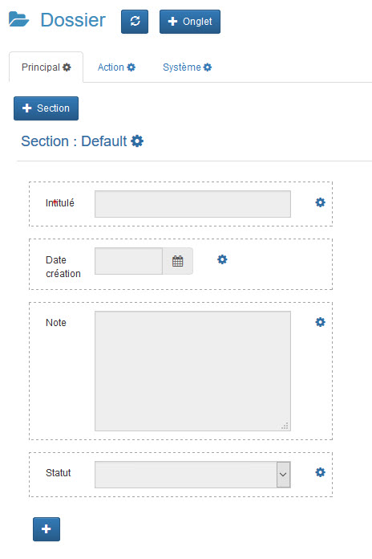
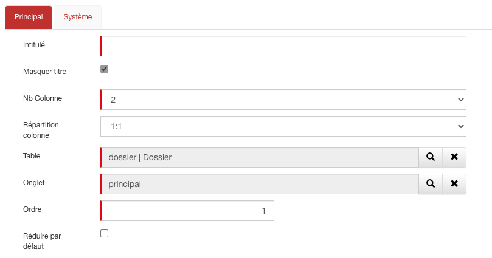

# Les formulaires

## Form Designer

Le Form Designer est de loin le moyen le plus simple et le plus rapide pour gérer vos formulaires. 

C'est une interface Drag & Drop sur laquelle vous ajoutez, modifiez et déplacez vos champs, sections et onglets selon vos besoins.
​​​​​
Il existe plusieurs manières d'y accéder :

Depuis le menu  d'une fiche, cliquez sur “FormDesigner”.

Depuis le menu de personnalisation  sélectionnez la table à modifier puis menu  -> FormDesigner.

Depuis cette interface graphique il est possible de déplacer les champs entre les sections et les colonnes par le biais d'un glisser déposer.

Le bouton  permet d'actualiser la page, à utiliser à chaque création de nouveaux éléments pour visualiser les modifications.

Le bouton  va permettre d'ajouter un nouvel onglet.

Cliquer sur le bouton  pour ajouter une nouvelle section.

Et enfin, il suffit de cliquer sur le bouton  pour créer un nouveau champ.

__NB__ : _Il est conseillé de rafraîchir la page et de vider le cache du navigateur à chaque modification ou création importante_.

## Les sections

Les sections vous permettent d'organiser vos formulaires et de regrouper vos champs. L'utilisation des sections vous offre une meilleure ergonomie et facilite la saisie de données.

L'accès aux sections se fait via la barre de personnalisation  -> Tables -> Onglets -> Section.

Après avoir sélectionné la table et l'onglet sur lequel la section doit être créée, cliquer sur .

Sur la fiche des sections il existe un certain nombre de champs à renseigner :

| Champ                | Valeur                                                                                     |
|----------------------|--------------------------------------------------------------------------------------------|
| Intitulé             | Le titre de l'onglet dans l'application.                                                   |
| Masquer titre        | Cocher l'option pour masquer le titre de la section dans le formulaire.                     |
| Nb de colonnes       | Définir le nombre de colonnes à afficher dans l'onglet de 1 à 3 maximum.                     |
| Répartition colonne  | Définir la largeur des colonnes (disponible pour les sections à 2 ou 3 colonnes).           |
| Table                | Sélectionner la table qui contient la section.                                              |
| Onglet               | L'onglet est renseigné par défaut à la création d'une nouvelle section.                     |
| Ordre                | Renseigner l'ordre de la section dans le masque (valeur numérique).                         |
| Réduire par défaut   | Permet de réduire la section lors de l'ouverture de la fiche.                                |

__NB__ : _Le moyen le plus rapide et le plus simple pour créer une section est de passer par le [Form Designer](http://www.gopaas.fr/aide.php?rubrique=Personnaliser%20les%20applications#41)._
