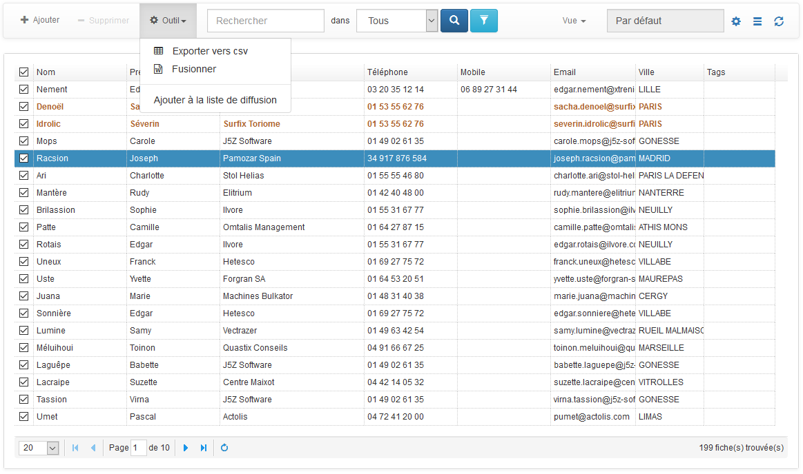
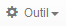
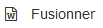
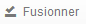
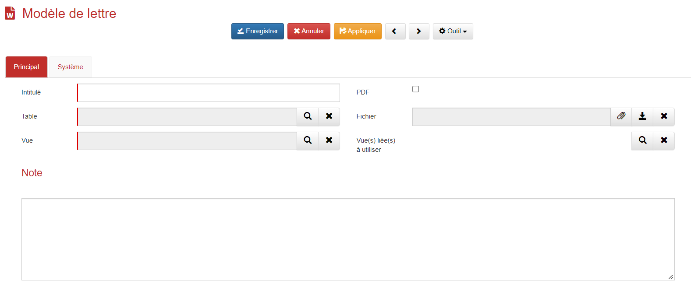
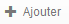
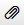
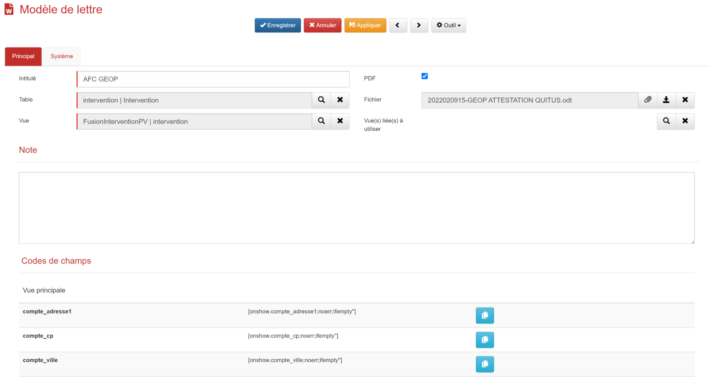

# Modèle de lettre

## Fusionner une lettre

La plateforme GoPaaS est équipée d'une fonctionnalité qui vous permet de fusionner vos données avec un modèle de lettre.

Cette fonctionnalité vous offre la possibilité de générer des documents Word personnalisés en quelques clics.

La fonction Publipostage est accessible de deux manières différentes :

Depuis une fiche contact, par exemple, cliquer sur le bouton  puis 

Il faut ensuite sélectionner le modèle de lettre à utiliser puis cliquer sur 

La deuxième méthode consiste à sélectionner une fiche depuis une vue de type multi sélection puis cliquer sur  puis . Sélectionner le modèle à utiliser puis cliquer sur .

Dans les deux cas l'outil va télécharger le fichier Word pré-rempli.

## Fusion publipostage word

La fonction de Publipostage Word vous permet de fusionner les données de plusieurs fiches avec un modèle de lettre.

Depuis une vue de type multi sélection, sélectionner le nombre de fiche à fusionner avec le modèle puis cliquez sur  puis .

Choisissez ensuite le modèle de lettre à utiliser puis cliquez sur .

L'outil va ensuite télécharger autant de fichier Word pré-rempli que de nombre de fiches sélectionnées dans la vue.

## Créer un modèle

Avant d'utiliser la fonction de fusionnage ou de publipostage vous devez impérativement créer un modèle de lettre word puis l'importer dans GoPaaS.

Rendez vous dans la barre de navigation >  > Modèle > Modèle de lettre.

​​​​​​​Cliquer sur  pour créer un nouveau modèle.

Afin d'enregistrer le modèle de lettre, il faut obligatoirement renseigner les champs suivants :

| Champ                   | Valeur                                                                           |
|-------------------------|----------------------------------------------------------------------------------|
| Intitulé                | Le nom du modèle dans l'application.                                             |
| Table                   | Sélectionner la table dans laquelle le modèle doit apparaître.                   |
| Vue                     | Choisir la vue créée pour le modèle de lettre.                                   |
| Note                    | Possibilité de mettre un commentaire.                                            |
| PDF                     | Possibilité de générer un PDF à la place du Word.                                |
| Fichier                 | Ajoutez le fichier Word au format .XML.                                          |
| Vue(s) liée(s) à utiliser | Choisir la vue liée nécessaire, dans le cas d'une fusion en dehors de la table principale. |

Pour ajouter le fichier Word cliquez sur , puis sélectionner le fichier.

### Insérer des champs

Lors de la création de votre modèle de lettre, vous devez insérer des champs dans le fichier Word pour que la fusion fonctionne correctement.

Ajouter dans votre vue de fusion l’ensemble des champs nécessaire à votre fusion.

Ensuite, rendez-vous dans votre modèle de lettre pour copier le champ de fusion et l’insérer dans votre document Word. 

