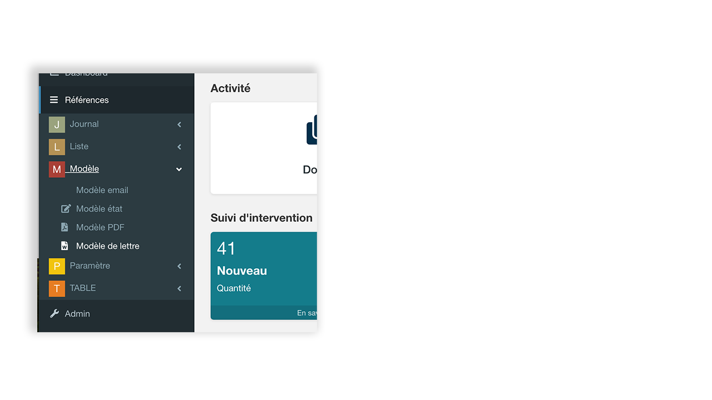

# Modèle de lettre

Les modèles de lettre simplifient le processus de fusion de données en permettant aux utilisateurs de créer rapidement des documents personnalisés à partir des données de leur application. En utilisant les modèles de lettre, les utilisateurs peuvent générer des documents professionnels et cohérents en un clin d'œil.

### Prérequis

Pour assurer une fusion de données correcte, les informations de l'application doivent être accessibles à partir d'une vue personnalisée. Lorsque l'architecture de l'application le permet, il est également envisageable d'intégrer les données provenant des tables enfants et/ou parents à la table principale pour une fusion complète et précise.

## Créer un modèle de lettre

Pour créer un modèle de lettre rendez vous dans dans la barre de navigation > Références > Modèle > Modèle de lettre.

Cliquer sur `ajouter`.

Ci-dessous, la description des champs de l’onglet principal.

| Intitulé              | Nom du modèle                                                     |
|-----------------------|-------------------------------------------------------------------|
| Table                 | Nom de la table principale pour la fusion du modèle               |
| Vue                   | Nom de la vue principale à utiliser pour la fusion du modèle      |
| PDF                   | Option qui permet la fusion du modèle en PDF. La fusion par défaut est au format Word |
| Fichier               | Modèle de lettre au format docx, odt, xlsx, pttx                 |
| Vue(s) liée(s) à utiliser | Nom des vues liées pour la fusion du modèle                   |
| Note                  | Description détaillée du modèle de lettre                         |

## Créer et paramétrer le modèle de fusion

Dans l’exemple ci dessous nous allons utiliser un modèle type odt.

La méthode implique l'insertion de balise GoPaaS aux emplacements où doivent figurer les données dans le modèle de fusion. Ces balises seront interprétées par l'application et fusionnées dans le document final.

Il existe deux types de balises: 

* Les champs
* Les blocs

Un champ GoPaaS est une balise GoPaaS qui doit être remplacée par une donnée simple. Il est possible de spécifier un format d'affichage ainsi que d'autres paramètres.

Un bloc GoPaaS est une section qui devra être répétée. Il est défini par une ou deux balises GoPaaS.

Le plus souvent il s'agit d'une ligne d'un tableau.

Il existe quatres formats d’affichage de balise.

* Texte
* Nombre
* Date
* Image

Les différents formats sont disponibles à la fusion pour tous les types de balise existants.

| Texte              | [onshow.NOM_ALIAS_DANS_LA_VUE;noerr;ifempty'']      |
|--------------------|------------------------------------------------------|
| Date               | [onshow.NOM_ALIAS_DANS_LA_VUE;frm=dd/mm/yyyy;noerr;ifempty''] |
| Nombre             | [onshow.NOM_ALIAS_DANS_LA_VUE;frm='0 000,00';noerr;ifempty] |
| Image              | [onshow.NOM_ALIAS_DANS_LA_VUE;ope=changepic;tagpos=inside;adjust;unique] |
| Image vue de Fusion| Dans la vue de fusion, il faut indiquer le chemin serveur vers le fichier : Exemple sur la table “fichier” et champ “pj1” Colonne SQL = if(fichier.pj1<>'',CONCAT('../../file/fichier/', fichier.pj1),'')  On peut remplir le else avec un fichier par défaut si nécessaire |

### Fusion d’un champ présent sur la vue principale

En choisissant la vue de fusion dans le modèle de lettre, GoPaaS offre une liste des champs disponibles à fusionner dans le modèle. Si un champ nécessaire à la fusion est absent, il doit être ajouté à la vue de fusion.

Cliquer sur l'icône  dans le tableau des champs pour copier le code de fusion puis coller dans le modèle de fusion.

Exemple dans le modèle de fusion : 
`Adresse client : [onshow.client_adresse;noerr;ifempty'']`

### Fusion d’une vue liée

En sélectionnant  les vues liées de fusion dans le modèle de lettre, GoPaaS offre une liste des champs disponibles à fusionner dans le modèle. Si un champ nécessaire à la fusion est absent, il doit être ajouté à la vue de fusion.

Remarque : Lors de la fusion d'une vue liée, le code de fusion du premier champ de la vue est légèrement modifié. Il est important de prendre en compte l'ordre des champs dans la vue.

Pour inclure le premier champ d'une vue liée cliquer sur l'icône   dans le tableau des champs, puis collez-le dans le modèle de fusion. Répéter l’opération pour les autres champs de la vue liée.

Exemple dans le modèle de fusion : 
| REF | Montant HT | Remise |
|---|---|---|
| `[facture_ligne.Pardéfaut.WLW4M.reference;block=tbs:row]` | `[facture_ligne.Pardéfaut.WLW4M.facture_ligne_montant_ht;frm='0 000,00']` | `[facture_ligne.Pardéfaut.WLW4M.remise_0;frm='0 000,00']` |

## Imprimer le modèle de lettre

Les modèles de lettre peuvent être imprimés depuis :

* Une fiche
* Une vue

Depuis une fiche  >  > choisir le modèle > 

Depuis une vue, sélectionner les fiches à fusionner > menu outil > Fusionner > choisir le modèle > Fusionner
