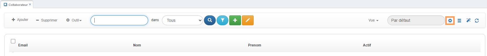
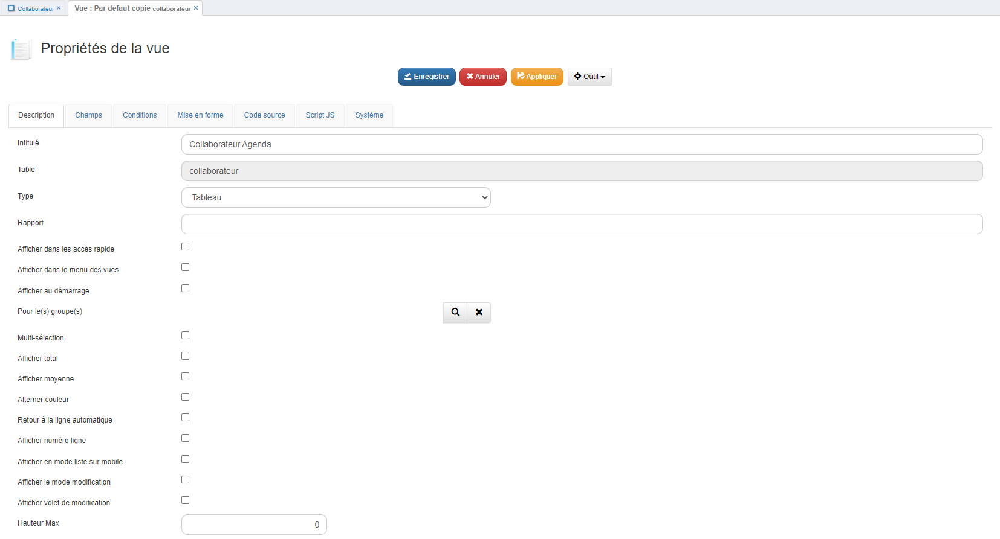
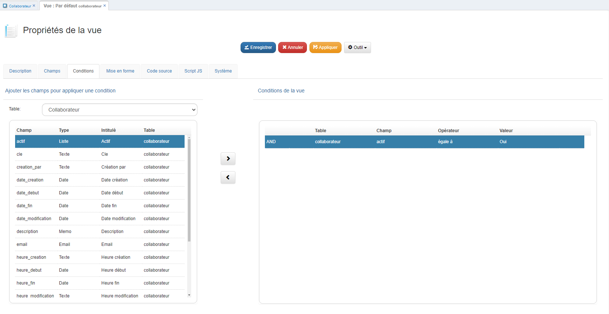
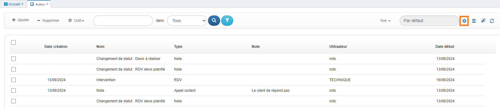
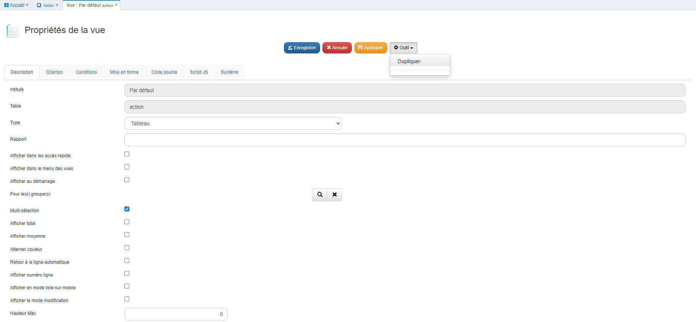
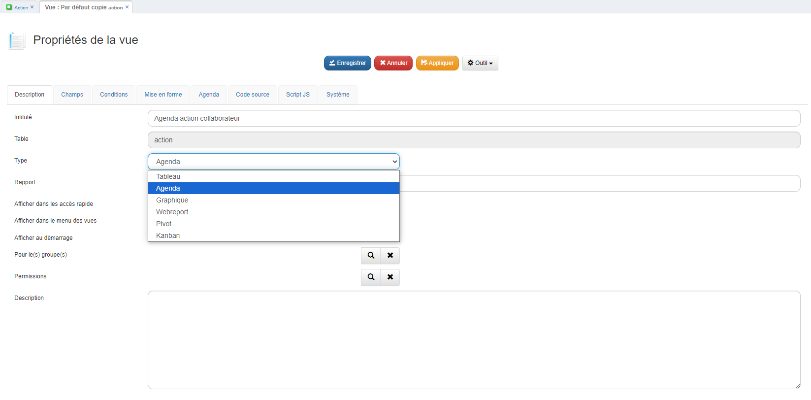
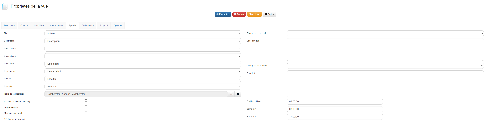
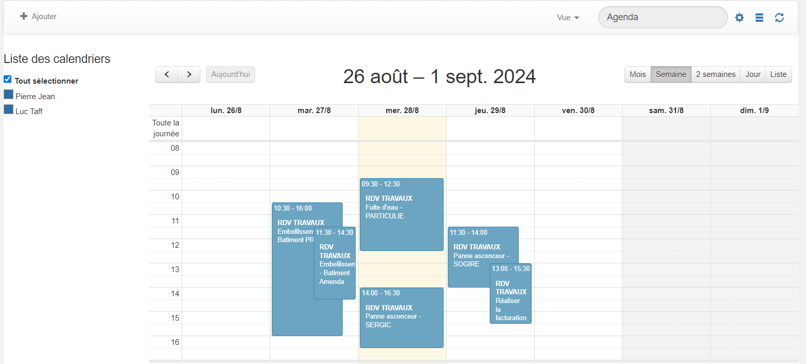

# Comment créer un agenda dans GoPaaS ?

## Description

La création d'un agenda permet de gérer et de visualiser des événements ou des tâches sous forme de calendrier pour différents collaborateurs. Cette fonctionnalité est utile pour organiser les actions des utilisateurs et suivre les événements au sein d'une équipe.

### Étape 1 : Création des tables

1. **Table Action** : Créez la table **Action** avec les champs suivants :
   - `Intitulé` (texte)
   - `Date début` (date)
   - `Date fin` (date)
   - `Heure début` (heure)
   - `Heure fin` (heure)
   - `Description` (mémo)
   - `Collaborateur` (connexion vers la table Collaborateur)

2. **Table Collaborateur** : Créez la table **Collaborateur** avec les champs suivants :
   - `Actif` (checkbox)
   - `Nom` (texte)
   - `Prénom` (texte)
   - `Email` (email)
   - `Téléphone` (texte)
   - `Utilisateur` (connexion vers la table utilisateur)

### Instructions détaillées

Pour commencer, il vous faut créer les deux tables avec les champs mentionnés. Assurez-vous que les champs **Collaborateur** et **Utilisateur** pointent correctement vers leurs tables respectives. Il est important que ces champs soient de type 'connexion' afin de créer les relations nécessaires entre les tables.

## Étape 2 : Création des vues

### Vue Collaborateur agenda (Table `Collaborateur`) :

- **Dupliquer la vue existante :**
  Dupliquez la vue par défaut de la table **Collaborateur**, qui contient les champs que vous avez créés précédemment. Cela vous permettra de conserver la structure tout en modifiant les paramètres nécessaires pour l'agenda.

  - Ouvrez votre vue par défaut et accédez aux paramètres de la vue en cliquant sur le bouton en forme d'engrenage  en haut à droite.
  
    

   - Une fois dans les paramètres de la vue, cliquez sur le menu **Outil** et sélectionnez **Dupliquer**.
      
      

- **Personnalisation de la vue :**
  Dans la vue dupliquée, personnalisez les colonnes à afficher et ajustez l'affichage en fonction de vos besoins. Vous pouvez ajouter des filtres ou des conditions pour mieux organiser l'affichage des collaborateurs.

   

### Vue Agenda action collaborateur :

- **Dupliquer la vue existante :**
  Dupliquez la vue par défaut de la table **Action**, qui contient les champs que vous avez créés. Cette vue sera utilisée pour un affichage sous forme de calendrier.

  - Ouvrez votre vue par défaut et accédez aux paramètres de la vue en cliquant sur le bouton en forme d'engrenage  en haut à droite.
  
    

   - Une fois dans les paramètres de la vue, cliquez sur le menu **Outil** et sélectionnez **Dupliquer**.
      
      

- **Changer le type de vue :**
  - Après avoir dupliqué la vue, nommez-la **Agenda action collaborateur** et changez son type pour **Agenda**. Cela permettra d'afficher les actions et événements sous forme de calendrier interactif.

      

- **Configuration des champs :**
  Accédez à l'onglet **Agenda** et configurez les champs comme suit :
    - **Titre** : Sélectionnez le champ **Intitulé**. Ce champ sera utilisé comme le titre de chaque événement dans l’agenda.
    - **Date début** : Sélectionnez le champ **Date début** pour définir quand chaque événement commence.
    - **Heure début** : Sélectionnez le champ **Heure début** pour préciser l'heure de début de chaque événement.
    - **Date fin** : Sélectionnez le champ **Date fin** pour indiquer quand chaque événement se termine.
    - **Heure fin** : Sélectionnez le champ **Heure fin** pour préciser l'heure de fin.
    - **Description** : Sélectionnez le champ **Description** pour afficher les détails supplémentaires de chaque événement.
    -  **Afficher comme un planning** : Cochez cette case si vous souhaitez afficher l’agenda sous forme de planning.
    - **Format vertical** : Cochez cette case si vous préférez un affichage vertical du calendrier.
    - **Masquer le week-end** : Cochez cette case si vous ne souhaitez pas afficher les événements durant le week-end.
    - **Afficher numéro de semaine** : Activez cette option si vous voulez que les numéros de semaine s'affichent sur l'agenda.

  - **Table de collaboration :**
  Sélectionnez **Collaborateur Agenda** pour lier chaque action ou événement à un collaborateur spécifique. Cela permet de visualiser quel collaborateur est impliqué dans chaque action sur l'agenda.
     
      

### Résultat

Ouvrez la vue que vous avez créée pour visualiser les actions sous forme d'agenda.
Vous devriez maintenant voir vos événements et tâches organisés de manière claire et intuitive, comme dans l'exemple ci-dessous.

### Conclusion

Une fois ces étapes réalisées, votre vue **Agenda** sera prête à afficher et gérer les actions de vos collaborateurs sous forme de calendrier.
