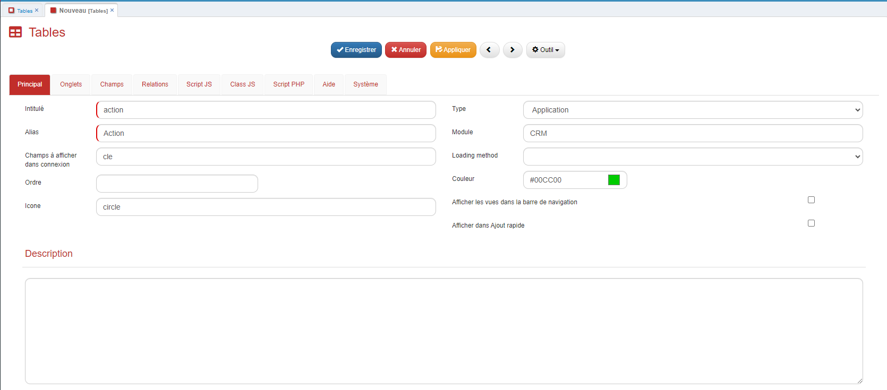

# Comment créer un agenda dans GoPaaS ?

## Description

La création d'un agenda permet de gérer et de visualiser des événements ou des tâches sous forme de calendrier pour différents collaborateurs. Cette fonctionnalité est utile pour organiser les actions des utilisateurs et suivre les événements au sein d'une équipe.

### Étape 1 : Création des tables

1. **Table Action** : Créez la table **Action** avec les champs suivants :
   - `Intitulé` (texte)
   - `Date début` (date)
   - `Date fin` (date)
   - `Heure début` (heure)
   - `Heure fin` (heure)
   - `Description` (mémo)
   - `Collaborateur` (connexion vers la table Collaborateur)

2. **Table Collaborateur** : Créez la table **Collaborateur** avec les champs suivants :
   - `Actif` (checkbox)
   - `Nom` (texte)
   - `Prénom` (texte)
   - `Email` (email)
   - `Téléphone` (texte)
   - `Utilisateur` (connexion vers la table utilisateur)

### Instructions détaillées

1. **Accéder au menu des Tables :**
   - Cliquez sur les **engrenages** situés en haut à droite de l'interface pour ouvrir le menu personnalisé.
   - Dans ce menu, sélectionnez l'option **Tables**.

      
      
2. **Créer une nouvelle Table :**
   - Appuyez sur le bouton **Ajouter** pour créer une nouvelle table.

      

   - Remplissez le champ **Intitulé** avec le nom de votre table (par exemple, **Action**).
   - Sélectionnez le **Type** approprié pour chaque champ.
   - Une fois terminé, cliquez sur **Enregistrer**.
         
      

3. **Déconnexion et reconnexion :**
   - Après avoir créé la table, déconnectez-vous et reconnectez-vous à l'application pour assurer que les modifications sont bien prises en compte.

      

4. **Ouvrir et configurer les champs de la Table :**
   - Accédez à nouveau à la liste de vos tables et recherchez la table que vous venez de créer.
   - Ouvrez cette table en *double cliquant* dessus.
           

   - Cliquez sur le menu **Outil** et sélectionnez **Form Designer** pour configurer les champs de la table.
            

   - Pour chaque champ que vous devez créer, cliquez sur le bouton **+** dans la section de votre choix, puis remplissez le formulaire avec les informations appropriées (type de champ, nom, etc.).

5. **Créer la table `Collaborateur` avant de créer le champ de connexion `Collaborateur` :**
   - Avant de créer le champ de connexion **Collaborateur** dans la table **Action**, vous devez d'abord créer la table **Collaborateur**.
   - Suivez le même processus décrit ci-dessus pour créer la table **Collaborateur** et ses champs.

6. **Configurer les champs dans `Collaborateur` :**
   - Dans la table **Collaborateur**, utilisez également le **Form Designer** pour ajouter les champs spécifiques (comme **Nom**, **Prénom**, **Email**, etc.).
   - Pour le champ **Utilisateur**, configurez-le en tant que champ de connexion vers la table **Utilisateur** déjà existante dans votre système.

### Étape 2 : Création des vues

1. **Vue Collaborateur Agenda** :
   - Créez une vue pour la table **Collaborateur** nommée **Collaborateur Agenda**.
   - Incluez tous les champs de la table **Collaborateur** dans cette vue.
   - Enregistrez la vue.

2. **Vue Agenda Collaborateur** :
   - Dupliquez la vue par défaut de la table **Action**, qui contient les champs précédemment créés.
   - Changez le type de la vue dupliquée en **Agenda**.
   - Dans l'onglet **Agenda**, réalisez les correspondances suivantes :
     - **Titre** : correspond au champ `Intitulé`
     - **Date début** : correspond au champ `Date début`
     - **Heure début** : correspond au champ `Heure début`
     - **Date fin** : correspond au champ `Date fin`
     - **Heure fin** : correspond au champ `Heure fin`
     - **Description** : correspond au champ `Description`
     - **Table de collaboration** : correspond à la vue `Collaborateur Agenda`

        Exemple de la configuration :
        

### Étape 3 : Configuration additionnelle

- Activez ou désactivez les options dans l'onglet **Agenda** selon vos besoins :
  - Affichage en planning
  - Format vertical
  - Masquer les week-ends
  - Afficher les numéros de semaine
- Configurez les bornes horaires (par exemple : de 08:00 à 17:00).
- Nommez et enregistrez la vue.

### Résultat

### Conclusion

Une fois ces étapes réalisées, votre vue **Agenda** sera prête à afficher et gérer les actions de vos collaborateurs sous forme de calendrier.
