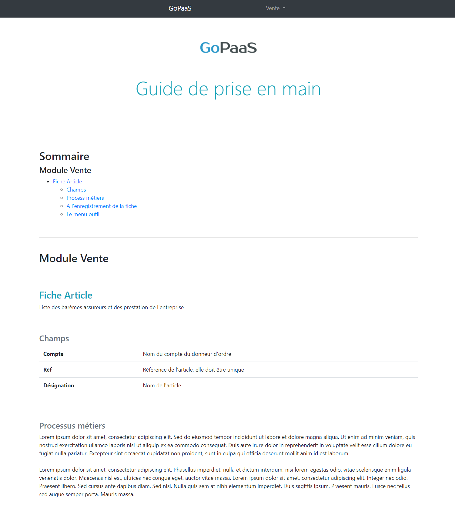
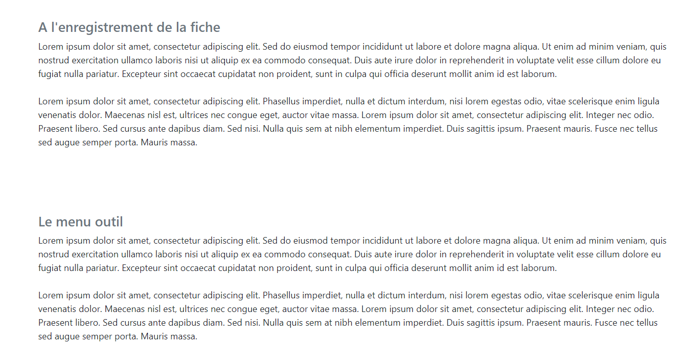

# Comment générer un guide de prise en main d'une application dans GoPaaS ?

## Description

GoPaaS propose une fonctionnalité permettant de générer un guide de prise en main personnalisé pour votre application. Cette documentation vous montre comment accéder à ce guide et comment personnaliser l'aide pour les utilisateurs directement dans l'application.

### Étape 1 : Accéder à la documentation de l'application

1. **Accéder à la documentation :**
   - Pour accéder à la documentation de votre application, modifiez l'URL de votre application en remplaçant `index.php` par `webservice/help`.

2. **Exemple d'URL :**
   - Si l'URL de votre application est : `https://votre-app.gopaas.net/index.php`
   - Remplacez-la par : `https://votre-app.gopaas.net/webservice/help/#`

   Cela vous permettra d'accéder à la page d'aide personnalisée de votre application.

### Étape 2 : Personnaliser l'aide sur chaque table

1. **Accéder à la personnalisation de l'aide :**
   - Rendez-vous sur une table spécifique dans votre application.
   - Cliquez sur le menu **Outil**, puis sélectionnez **Personnaliser**.
   - Allez dans l'onglet **Aide** pour configurer les différentes options d'aide.

2. **Configurer les champs d'aide :**
   - **À l'ouverture :** Saisissez ici l'aide ou les instructions à l'ouverture de la table.
   - **À l'enregistrement :** Ajoutez ici des informations ou des conseils lors de l'enregistrement d'une fiche.
   - **Menu Outil :** Décrivez les options spécifiques du menu **Outil** disponibles pour cette table. Cela peut inclure des conseils ou des explications sur les fonctionnalités.

### Étape 3 : Documenter les champs d'une table

1. **Accéder à l'onglet Champs :**
   - Dans la personnalisation de la table, allez dans l'onglet **Champs**, puis sélectionnez un champ.

2. **Documenter les champs :**
   - Vous pouvez ajouter de l'aide spécifique pour chaque champ de la table. Cela permet aux utilisateurs de mieux comprendre l'utilisation de chaque champ lors de la saisie de données.
   - Remplissez le champ **Aide** de chaque fiche champ avec des informations utiles.

### Résultat 

### Conclusion

En configurant la documentation et l'aide intégrée de GoPaaS, vous facilitez la prise en main de votre application par les utilisateurs. L'accès au guide personnalisé et la personnalisation des informations d'aide sur les tables et les champs permettent de fournir des explications claires et précises aux utilisateurs, améliorant ainsi leur expérience globale avec l'application.
