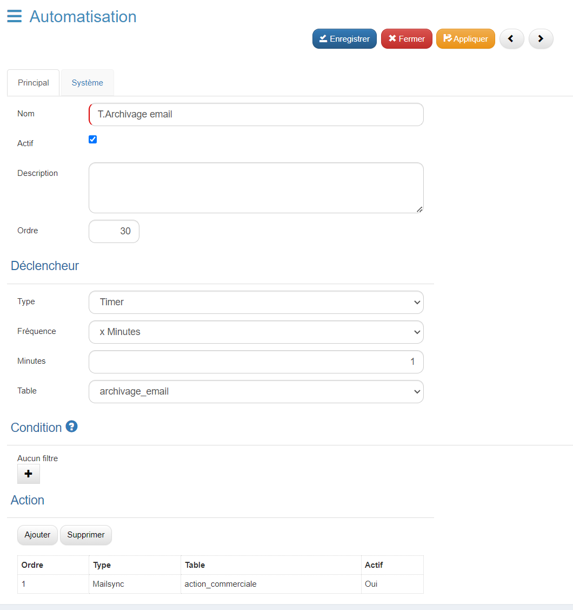
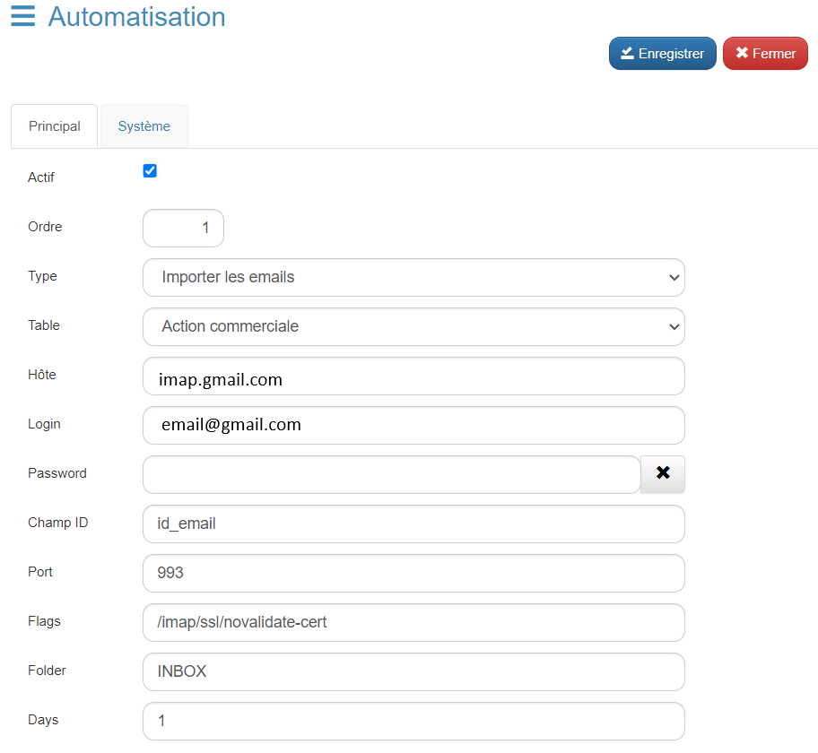
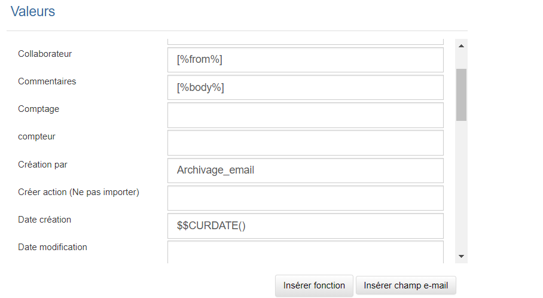

## Archivage des Emails sur GoPaaS

L'archivage des emails sur GoPaaS nécessite la création d'un automatisme dans l'application. Voici les étapes à suivre pour mettre en place cette fonctionnalité :

### Étape 1 : Créer un Automatisme

1. **Accéder au menu Automatisation :**
   - Depuis le menu de droite, cliquez sur **Automatisation**.
   - Cliquez sur le bouton **Ajouter** pour créer un nouvel automatisme.
   - Donnez-lui un nom, par exemple **T.Archivage email**, puis cliquez sur **Enregistrer**.

2. **Réouvrir l'automatisme :**
   - Une fois enregistré, rouvrez l'automatisme.
   - **Cochez la case** **Actif** pour activer l'automatisme.

### Étape 2 : Configurer le Déclencheur

Dans la section **Déclencheur** :
   - **Type** : Sélectionnez **Timer**.
   - **Fréquence** : Choisissez la fréquence d'exécution (par exemple **X minutes**).
   - **Minutes** : Indiquez la fréquence en minutes (par exemple **1 minute**).
   - **Table** : Sélectionnez la table qui recevra les emails archivés, nommée dans cet exemple **archivage_email**.
    Exemple :
    

### Étape 3 : Configuration de l'Action

1. **Appliquer les modifications :**
   - Avant de créer l'action, cliquez sur le bouton **Appliquer** en haut de la page pour sauvegarder la configuration.

2. **Ajouter une Action :**
   - Dans la section **Action**, cliquez sur **Ajouter** pour créer une nouvelle action.
   - Remplissez les champs suivants :
     - **Type** : Sélectionnez **Importer les emails**.
     - **Table** : Sélectionnez la table dans laquelle les emails seront archivés, par exemple **Action commerciale**.
     - **Hôte** : Indiquez l'hôte de votre serveur email (ex. : `imap.google.com` pour une adresse Gmail).
     - **Login** : Saisissez votre adresse email.
     - **Password** : Entrez votre mot de passe de messagerie (celui-ci sera masqué après saisie).
     - **Champ ID** : Saisissez un champ dans votre table pour contenir l'ID de l'email, par exemple **id_email**.
     - **Port** : Entrez le port utilisé, généralement **993**.
     - **Flags** : Indiquez les options, comme `/imap/ssl/novalidate-cert`.
     - **Folder** : Précisez le dossier de réception des emails, généralement **INBOX**.
     - **Days** : Définissez le nombre de jours à récupérer (ex. : **1 jour** pour récupérer les emails reçus ce jour).
    Exemple :
    

### Étape 4 : Mapper les Champs

Dans la section **Valeur**, mappez les champs suivants avec les fonctions correspondantes pour associer les données des emails aux bons emplacements dans la fiche d'archivage :

- `[%from%]` : Expéditeur
- `[%body%]` : Corps du message
- `[%attachment%]` : Pièce jointe
- `[%to%]` : Destinataire
- `[%date%]` : Date de réception de l'email
- `[%subject%]` : Sujet du mail
Exemple :

### Étape 5 : Utiliser des Fonctions Système

Utilisez les fonctions suivantes pour renseigner automatiquement la date et l'heure de création de l'enregistrement dans les champs système **Date création** et **Heure création** :
- **$$CURDATE()** : Renseigne la date de création.
- **$$CURTIME()** : Renseigne l'heure de création.

Ces champs système existent déjà sur la table, il n'est donc pas nécessaire de les créer, mais nécessaire de les renseigner dans la section valeur.

### Conclusion
Avec ces étapes, vous avez mis en place un système d'archivage automatisé des emails sur GoPaaS. Les emails reçus seront automatiquement enregistrés dans la table spécifiée avec les informations clés, telles que l'expéditeur, le corps du message, les pièces jointes, etc., facilitant ainsi leur gestion et leur consultation future.
