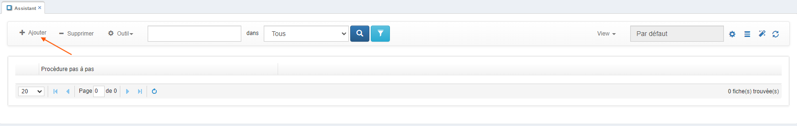

# Mise en place de l'assistant sur GoPaaS

L'assistant sur GoPaaS permet d'accompagner l'utilisateur à travers différentes étapes d'un processus. Nous allons diviser cela en deux points : la création et l'utilisation de l'assistant.

## 1. Création d'un assistant

### Étape 1 : Accéder à l'interface de création

1. **Accéder au menu** :
   - Dans le menu de gauche, allez dans **RÉFÉRENCES** puis dans le sous-menu **PARAMÈTRE** et enfin cliquez sur **ASSISTANT**.
   
      

2. **Ajouter un nouvel assistant** :
   - Cliquez sur le bouton **Ajouter** pour créer un nouvel assistant.

      

### Étape 2 : Configurer l'assistant

1. **Nommer l'assistant** :
   - Donnez un nom à votre assistant.

2. **Appliquer la configuration** :
   - Cliquez sur le bouton **Appliquer** pour enregistrer les paramètres de base.

   

### Étape 3 : Ajouter des étapes à l'assistant

1. **Ajouter une étape** :
   - Dans la vue des étapes, cliquez sur le bouton **Ajouter** pour configurer la première étape.

2. **Remplir les champs nécessaires** :
   - **Action** : Sélectionnez l'action à réaliser (Cliquer, Ouvrir, Rechercher, Renseigner).
   - **Description** : Ajoutez une description pour guider l'utilisateur.
   - **Ordre** : Définissez l'ordre des étapes (commence à 1, puis augmente).
   - **Élément** : Indiquez l'élément sur lequel l'étape doit se focaliser (utilisez des ID avec un `#` ou des classes avec un `.`).
   - **Mettre en évidence** : Grise l'écran pour focaliser l'attention sur l'élément sélectionné.
   - **Mode réflexe** : Ajoute un style spécial lors de l'affichage de l'étape.

3. **Enregistrer l'étape** :
   - Après avoir configuré votre première étape, enregistrez-la. Répétez cette opération pour toutes les étapes nécessaires.

      

## 2. Utilisation d'un assistant

### Étape 1 : Accéder à l'interface d'assistance

1. **Accéder au menu** :
   - Dans le menu de gauche, allez dans **RÉFÉRENCES**, puis dans le sous-menu **PARAMÈTRE** et cliquez sur **ASSISTANT**.

2. **Lancer l'assistant** :
   - Pour démarrer l'assistant, cliquez sur l'icône **baguette magique**. L'assistant commencera alors à guider l'utilisateur étape par étape à travers le processus défini.
      
      

      

### Conclusion

L'assistant sur GoPaaS est un outil puissant pour guider les utilisateurs à travers des processus complexes. En suivant ces étapes, vous pouvez créer et utiliser des assistants pour faciliter l'expérience utilisateur.
