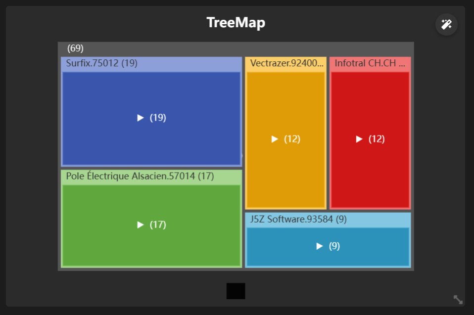

# Documentation de Cockpit

## Introduction
Bienvenue dans la documentation de Cockpit. Ce document fournit des informations détaillées sur l'utilisation et les fonctionnalités de Cockpit.

## Table des matières
1. [Introduction](#introduction)
2. [Module PieChart](#module-piechart)
3. [Module Card](#module-card)
4. [Module LineCHart](#module-linechart)
5. [Module BarChart](#module-barchart)
6. [Module TreeChart](#module-treechart)
7. [Module GaugeChart](#module-gaugechart)

## Module PieChart
Le module PieChart propose un affichage sous forme de graphique camembert, comme ceci :

<br>


<br>
<br>

### Configuration :

<br>


<br>

- Créer un nouveau KPI, et remplissez les champs suivants : 

| Champ         | Description                                                                   |
|---------------|-------------------------------------------------------------------------------|
| Titre         | Nom du KPI                                                                    |
| ID            | Identifiant du KPI                                                            |
| Symbol        | Entête du module                                                              |
| Type          | PieChart                                                                      |


- Cliquer sur 'Appliquer'
- Dans la section 'Séries', ajouter une nouvelle Série

<br>
<br>


<br>

#### Remplir les champs suivants :

| Champ       | Description                                                                 |
|-------------|-----------------------------------------------------------------------------|
| Name        | Nom de la série                                                             |
| Operation   | Opération à effectuer (Somme, moyenne, comptage, plus haut, plus bas)       |
| Value       | Champ concerné par l'opération                                              |
| Category    | Champ catégorisé par l'opération                                            |
| Filters     | Condition souhaitée pour filtrer les données                                |

<br>
<br>
<br>
<br>

## Module Card

Le module Card propose un affichage sous simple carte, comme ceci :

<br>


<br>
<br>

### Configuration :


<br>

- Créer un nouveau KPI, et remplissez les champs suivants : 

| Champ         | Description                                                                   |
|---------------|-------------------------------------------------------------------------------|
| Titre         | Nom du KPI                                                                    |
| ID            | Identifiant du KPI                                                            |
| Symbol        | Entête du module                                                              |
| Type          | Card                                                                          |


- Cliquer sur 'Appliquer'
- Dans la section 'Séries', ajouter une nouvelle Série

<br>
<br>


<br>

#### Remplir les champs suivants :

| Champ       | Description                                                                 |
|-------------|-----------------------------------------------------------------------------|
| Name        | Nom de la série                                                             |
| Operation   | Opération à effectuer (Somme, moyenne, comptage, plus haut, plus bas)       |
| Value       | Champ concerné par l'opération                                              |
| Filters     | Condition souhaitée pour filtrer les données                                |

<br>

Exemple de filtre :
```json
{"statut": "Réglée"}
```

<br>
<br>

## Module LineChart

<br>

Le module LineChart propose un affichage comme ceci :

<br>


<br>
<br>

### Configuration :

<br>


<br>

- Créer un nouveau KPI, et remplissez les champs suivants : 

| Champ         | Description                                                                   |
|---------------|-------------------------------------------------------------------------------|
| Titre         | Nom du KPI                                                                    |
| ID            | Identifiant du KPI                                                            |
| Symbol        | Entête du module                                                              |
| Type          | LineChart                                                                     |


- Cliquer sur 'Appliquer'
- Dans la section 'Séries', ajouter une nouvelle Série

<br>
<br>


<br>

#### Remplir les champs suivants :

| Champ       | Description                                                                 |
|-------------|-----------------------------------------------------------------------------|
| Name        | Nom de la série                                                             |
| Operation   | Opération à effectuer (Somme, moyenne, comptage, plus haut, plus bas)       |
| Value       | Champ concerné par l'opération                                              |
| Category    | Champ catégorisé par l'opération                                            |
| Filters     | Condition souhaitée pour filtrer les données                                |

<br>
<br>

## Module BarChart

Le module BarChart propose un affichage sous forme d'histogramme, comme ceci :

<br>


<br>
<br>

### Configuration :


<br>

- Créer un nouveau KPI, et remplissez les champs suivants : 

| Champ         | Description                                                                   |
|---------------|-------------------------------------------------------------------------------|
| Titre         | Nom du KPI                                                                    |
| ID            | Identifiant du KPI                                                            |
| Symbol        | Entête du module                                                              |
| Type          | BarChart                                                                      |


- Cliquer sur 'Appliquer'
- Dans la section 'Séries', ajouter une nouvelle Série

<br>
<br>


<br>

#### Remplir les champs suivants :

| Champ       | Description                                                                 |
|-------------|-----------------------------------------------------------------------------|
| Name        | Nom de la série                                                             |
| Operation   | Opération à effectuer (Somme, moyenne, comptage, plus haut, plus bas)       |
| Value       | Champ concerné par l'opération                                              |
| Category    | Champ catégorisé par l'opération                                            |
| Filters     | Condition souhaitée pour filtrer les données                                |

<br>
<br>

## Module TreeChart

Le module TreeChart propose un affichage comme ceci :

<br>



<br>
<br>

### Configuration :


<br>

- Créer un nouveau KPI, et remplissez les champs suivants : 

| Champ         | Description                                                                   |
|---------------|-------------------------------------------------------------------------------|
| Titre         | Nom du KPI                                                                    |
| ID            | Identifiant du KPI                                                            |
| Symbol        | Entête du module                                                              |
| Type          | TreeMap                                                                       |


- Cliquer sur 'Appliquer'
- Dans la section 'Séries', ajouter une nouvelle Série

<br>
<br>


<br>

#### Remplir les champs suivants :

| Champ       | Description                                                                 |
|-------------|-----------------------------------------------------------------------------|
| Name        | Nom de la série                                                             |
| Operation   | Opération à effectuer (Somme, moyenne, comptage, plus haut, plus bas)       |
| Value       | Champ concerné par l'opération                                              |
| Category    | Champ catégorisé par l'opération                                            |
| Filters     | Condition souhaitée pour filtrer les données                                |

<br>
<br>

## Module GaugeChart

Le module GaugeChart propose un affichage sous forme d'histogramme, comme ceci :

<br>


<br>
<br>

### Configuration :


<br>

- Créer un nouveau KPI, et remplissez les champs suivants : 

| Champ         | Description                                                                   |
|---------------|-------------------------------------------------------------------------------|
| Titre         | Nom du KPI                                                                    |
| ID            | Identifiant du KPI                                                            |
| Symbol        | Entête du module                                                              |
| Type          | TreeGaugeChartMap                                                             |
| KeyValue      | Valeur de référence maximale de la jauge                                      |


- Cliquer sur 'Appliquer'
- Dans la section 'Séries', ajouter une nouvelle Série

<br>
<br>


<br>

#### Remplir les champs suivants :

| Champ       | Description                                                                 |
|-------------|-----------------------------------------------------------------------------|
| Name        | Nom de la série                                                             |
| Operation   | Opération à effectuer (Somme, moyenne, comptage, plus haut, plus bas)       |
| Value       | Champ concerné par l'opération                                              |
| Category    | Champ catégorisé par l'opération                                            |
| Filters     | Condition souhaitée pour filtrer les données                                |