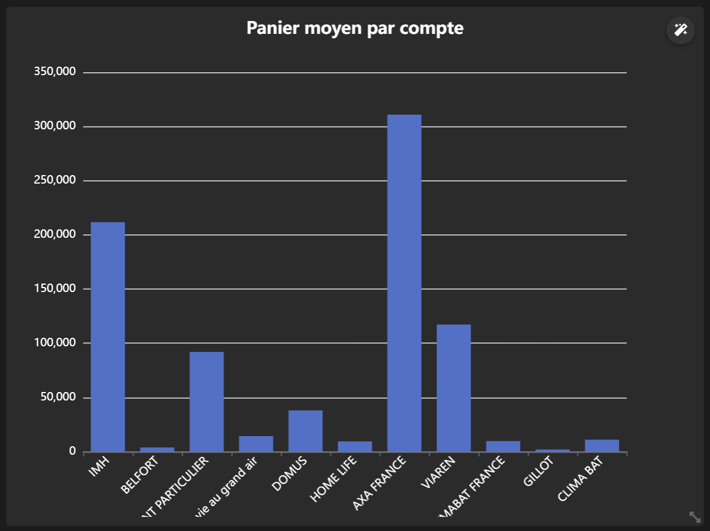

# Documentation de Cockpit

## Introduction
Bienvenue dans la documentation de Cockpit. 
 
Ce document fournit des informations détaillées sur l'utilisation et les fonctionnalités de Cockpit.
 
Cockpit est un outil intélligent permettant de réaliser des dashboards de monitoring simplement et rapidement.

 

## Table des matières
1. [Introduction](#introduction)
2. [Création d'un KPI](#création-dun-kpi)
3. [Création d'une Série](#création-dune-série)
4. [Module PieChart](#module-piechart)
5. [Module Card](#module-card)
6. [Module LineChart](#module-linechart)
7. [Module BarChart](#module-barchart)
8. [Module FunnelChart](#module-funnelchart)
9. [Module TreeMap](#module-treemap)
10. [Module GaugeChart](#module-gaugechart)

 

## Création d'un KPI
Pour créer un nouveau KPI, suivez les étapes suivantes :

1. Créer un nouveau KPI, et remplissez les champs suivants : 

| Champ         | Description                                                                   |
|---------------|-------------------------------------------------------------------------------|
| Titre         | Nom du KPI                                                                    |
| ID            | Identifiant du KPI                                                            |
| Type          | Type de graphique (PieChart, Card, LineChart, BarChart, FunnelChart, TreeMap, GaugeChart) |
| Compact       | Permet de passer d'un affichage 1 000 000 à 1 000k par exemple                |
| Symbol        | Entête du module                                                              |
| CustomOptions | Options personnalisées retrouvables sur la doc d'eCharts                      |

2. Cliquer sur 'Appliquer'
3. Dans la section 'Séries', ajouter une nouvelle Série

 

## Création d'une Série
Pour créer une nouvelle Série, remplissez les champs suivants :

| Champ          | Description                                                                 |
|----------------|-----------------------------------------------------------------------------|
| Name           | Nom de la série                                                             |
| Operation      | Opération à effectuer (Somme, moyenne, comptage, plus haut, plus bas)       |
| Value          | Champ concerné par l'opération                                              |
| Filters        | Condition souhaitée pour filtrer les données                                |
| Category       | Champ catégorisé par l'opération                                            |
| Sub-category   | ...                                                                         |
| Détails        | ...                                                                         |
| Color          | Couleur du module                                                           |
| CustomOptions  | Options personnalisées retrouvables sur la doc d'eCharts                    |

 

## Module PieChart

Le module PieChart propose un affichage sous forme de graphique camembert, comme ceci :

 

### Configuration :

Suivez les étapes de la section [Création d'un KPI](#création-dun-kpi) en sélectionnant "PieChart" comme type.

 

## Module Card

Le module Card propose un affichage sous simple carte, comme ceci :

 

### Configuration :

Suivez les étapes de la section [Création d'un KPI](#création-dun-kpi) en sélectionnant "Card" comme type.

 

## Module LineChart

Le module LineChart propose un affichage sous forme de courbe, comme ceci :

 

### Configuration :

Suivez les étapes de la section [Création d'un KPI](#création-dun-kpi) en sélectionnant "LineChart" comme type.

 

## Module BarChart

Le module BarChart propose un affichage sous forme d'histogramme, comme ceci :

 

### Configuration :

Suivez les étapes de la section [Création d'un KPI](#création-dun-kpi) en sélectionnant "BarChart" comme type.

 

## Module FunnelChart

Le module FunnelChart propose un affichage en entonnoir, comme ceci :

 

### Configuration :

Suivez les étapes de la section [Création d'un KPI](#création-dun-kpi) en sélectionnant "FunnelChart" comme type.

 

## Module TreeMap

Le module TreeMap propose un affichage comme ceci :

 

### Configuration :

Suivez les étapes de la section [Création d'un KPI](#création-dun-kpi) en sélectionnant "TreeMap" comme type.

 

## Module GaugeChart

Le module GaugeChart propose un affichage sous forme de compteur / horloge, comme ceci :

 

### Configuration :

Suivez les étapes de la section [Création d'un KPI](#création-dun-kpi) en sélectionnant "GaugeChart" comme type. Ajoutez également le champ suivant :

| Champ         | Description                                                                   |
|---------------|-------------------------------------------------------------------------------|
| KeyValue      | Valeur de référence maximale de la jauge                                      |

 

## Module TreeMap

Le module TreeMap propose un affichage comme ceci :

 

### Configuration :

Suivez les étapes de la section [Création d'un KPI](#création-dun-kpi) en sélectionnant "TreeMap" comme type.

 

## Module Calculate

Le module Calculate propose un affichage sous forme de carte mais avec une valeur calculée, comme ceci :

 

### Configuration :

Suivez les étapes de la section [Création d'un KPI](#création-dun-kpi) en sélectionnant "Calculate" comme type. Ajoutez également le champ suivant :

| Champ         | Description                                                                   |
|---------------|-------------------------------------------------------------------------------|
| Calculate     | {{ID_KPI_1}} - {{ID_KPI_2}}, ex : {{SOMME_FACTURES}} - {{SOMME_FACTURES_NON_REGLEES}}                                                   |

 

Pas besoin de Série pour ce module.

## Module Title

Le module Title propose l'affichage d'un simple titre, comme ceci :

 

### Configuration :

Suivez les étapes de la section [Création d'un KPI](#création-dun-kpi) en sélectionnant "Title" comme type. Attention au champ suivant :

| Champ         | Description                                                                   |
|---------------|-------------------------------------------------------------------------------|
| Titre         | Titre à afficher                                                              |

 

Pas besoin de Série pour ce module.