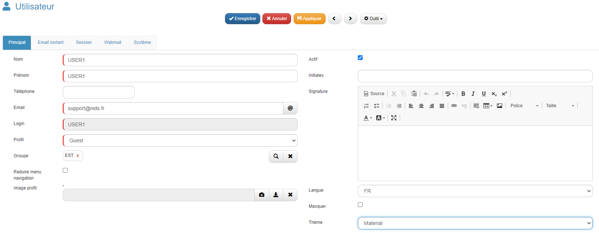

# Création d'un utilisateur et envoie de des accès.

## Description

Créer un utilisateur sur GoPaaS permet de gérer les accès et les autorisations au sein de la plateforme, en attribuant des rôles spécifiques pour interagir avec les services et applications hébergés.

### Instructions pour créer un utilisateur

1. **Accéder au menu Admin :**
   - Allez dans **Admin** (menu de gauche).
   - Cliquez sur **Utilisateur**.

2. **Créer un utilisateur :**

   - Cliquez sur "Ajouter".

    | **Champ**             | **Valeur**                                             |
    |-----------------------|--------------------------------------------------------|
    | **Nom**               | Saisir le nom                                          |
    | **Prénom**            | Saisir le prénom                                       |
    | **Téléphone**         | Saisir le numéro de téléphone                          |
    | **Email**             | Saisir l'adresse email de la personne concernée        |
    | **Login**             | Saisir un login                                        |
    | **Profil**            | Choisir le bon type de profil (Admin, User ou Guest)   |
    | **Groupe**            | Ajouter le bon groupe                                  |
    | **Actif**             | Cocher                                                 |
    | **Langue**            | FR                                                     |
    | **Thème**             | Material                                               |

    - Puis cliquez sur "Enregistrer".

### Résultat

### Instructions pour envoyer les accès par email.

- Depuis la vue des utilisateurs, sélectionnez l'utilisateur concerné avec la case à cocher.
- Enfin cliquez sur "Outil", puis sur "Regénérer mot de passe".