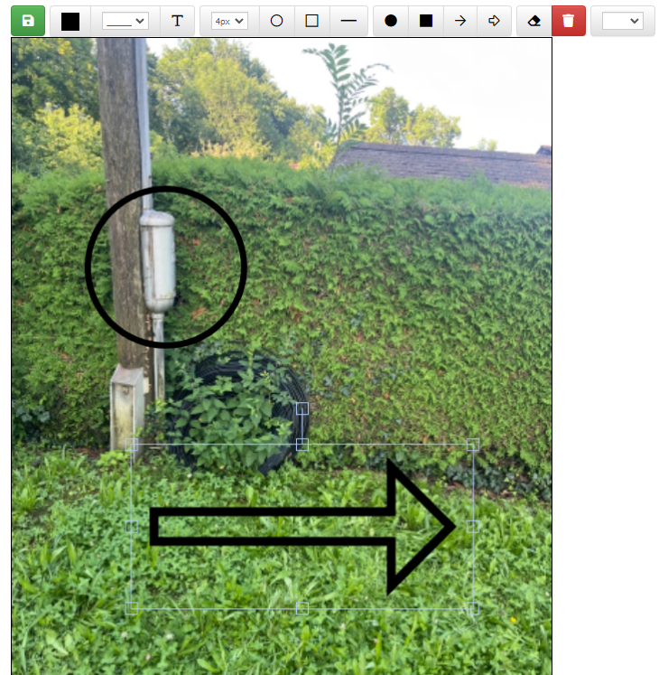

# Extension DrawJS

## Description

L'extension DrawJS permet de dessiner des formes, des lignes et des éléments colorés sur un champ image dans votre application. Cette extension utilise la bibliothèque Fabric.js pour offrir des fonctionnalités avancées d'édition graphique directement dans l'interface utilisateur.

### Bénéfices attendus
- ***Édition Graphique Avancée :*** Permet aux utilisateurs de dessiner et de manipuler des éléments graphiques sur une image.
- ***Intégration Simple :*** Facile à intégrer avec des champs d'image existants.
- ***Personnalisation :*** Offre une variété d'options pour personnaliser les dessins et les annotations.

### Instructions pour l'Intégration

1. **Création de l'Extension**
   - Pour ajouter une nouvelle extension, accédez au menu **Admin** dans le menu de gauche.
   - Sélectionnez **Extension**.
   - Créez une nouvelle extension nommée **DrawJS**.

2. **Activation de l'Extension**
   - Activez l'extension.

3. **Insertion du Script JS**
   - Dans l'onglet **Script JS** de votre extension, insérez le script suivant pour charger la bibliothèque Fabric.js :

     ```javascript
     $.ajax({
         type: "GET",
         url: "https://unpkg.com/fabric@4.3.1/dist/fabric.min.js",
         dataType: "script",
         async: false
     });
     ```

4. **Configuration de la Table**
   - Assurez-vous que votre table contient les éléments suivants :
     - Un champ photo, nommé : **NOM_CHAMP_PHOTO**
     - Un champ mémo, nommé : **NOM_CHAMP_PHOTO_json**

5. **Ajout du Script d'Initialisation**
   - Insérez le script suivant dans le script `onLoad` de la fiche concernée :

     ```javascript
     // Permet de vider le champ JSON lors du changement de la photo.
     thisComponent.ui.find("#NOM_CHAMP_PHOTO").on("change", function() {
         thisComponent.setValue("NOM_CHAMP_PHOTO_json", "");
     });

     // Ajouter un bouton d'édition en dessous du champ photo.
     thisComponent.ui.find("[name=NOM_CHAMP_PHOTO]").closest(".form-group")
         .append("<label class='col-sm-3 control-label '></label><div class='col-sm-9'><button id='btnEditPhoto' type='button' class='btn btn-info btn-sm' style='float: left; margin-top: 5px;' title='Scanner'> <i class='fas fa-pencil'></i>&nbsp;<span class='hidden-xs trn'>Edit</span></button></div>");

     thisComponent.ui.find("#btnEditPhoto").on('click', function () {
         var formID = thisComponent.ui.find("#NOM_CHAMP_PHOTO").closest('form').attr('id');
         Draw.open("NOM_TABLE", "#" + formID, "#NOM_CHAMP_PHOTO");
     });
     ```

### Résultat

Voici un exemple de l'interface utilisateur après avoir ajouté l'extension et configuré les champs :



### Conclusion

Une fois l'extension DrawJS correctement configurée, vos utilisateurs pourront éditer des images directement sur le champ photo spécifié, avec la possibilité de dessiner des formes et des annotations. Assurez-vous que tous les éléments et scripts sont correctement configurés pour garantir une fonctionnalité optimale.
