# 📆 Synchronisation de Google Agenda avec GoPaaS

Cette documentation explique comment connecter et synchroniser Google Agenda avec la plateforme GoPaaS afin d'automatiser la gestion des événements, des rendez-vous ou toute autre donnée liée au calendrier.

## Récupération de l'ID client et du Code secret du client

Accéder à l'URL suivante : [Google Cloud Console](https://console.cloud.google.com/)

Cliquer sur **identifiants**.

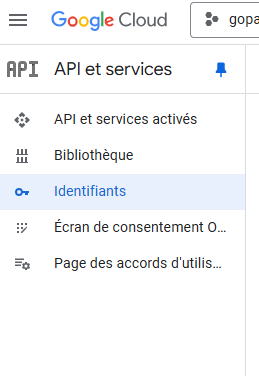

Cliquer sur le bouton **Configurer l'écran de consentement**.

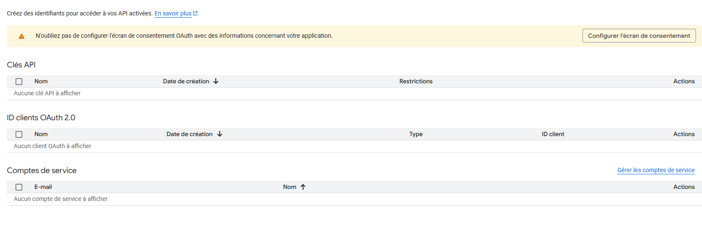

Renseigner le nom de votre application ainsi qu'une adresse e-mail d'assistance utilisateur.

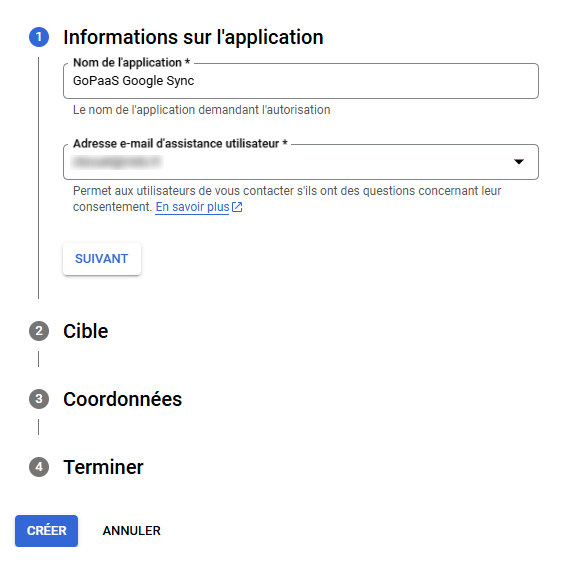

Sélectionner **Externe** pour la partie concernant la cible.

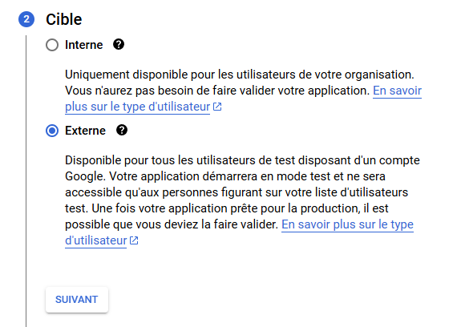

Renseigner votre adresse e-mail.

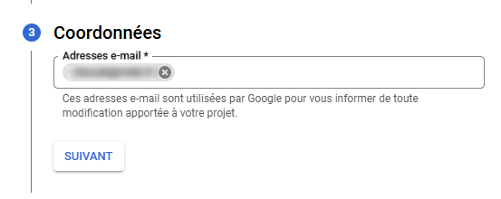

Accepter les conditions et cliquer sur le bouton **CRÉER**.

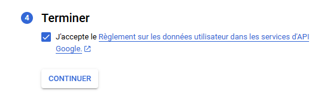

Maintenant que la configuration de l'écran de consentement est terminée nous allons créer un **ID clients OAuth 2.0**.

Accéder à l'onglet **Clients** dans le menu de gauche et cliquer sur **CRÉER UN CLIENT**.

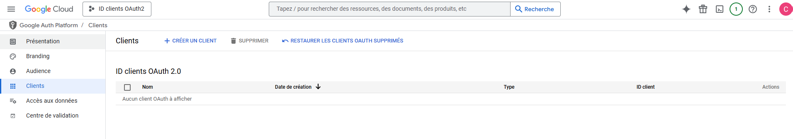

Renseigner les informations correspondantes :

- **Type d'application** : Application Web.
- **Nom** : Nom du client OAuth 2.0.
- **URI de redirection autorisés** : [adresse de votre application]/webservice/google-sync/getAccessToken.php.

Une fois les informations renseignées, cliquer sur le bouton **CRÉER**.

Récupérer l'**ID client** et le **Code secret du client** nécessaire à la configuration du Google Sync dans GoPaaS.

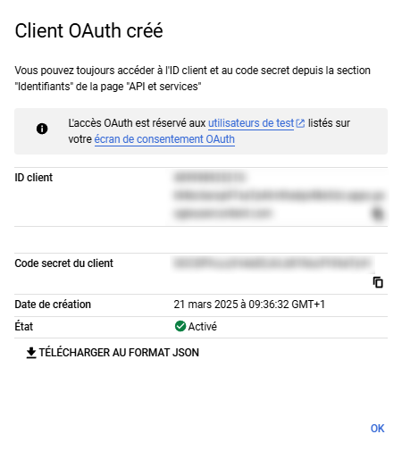

## Récupération de l'ID de l'agenda Google

Accéder à Google Agenda puis cliquer sur le bouton **+** à côté de la section **Autres agendas** et sélectionner **Créer un agenda**.

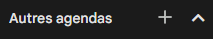

Renseigner le nom de votre agenda et cliquer sur le bouton **Créer l'agenda**.

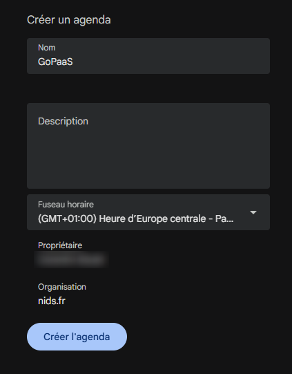

Cliquer sur le bouton **Configurer** de la pop-up apparue en bas de page à la fin de la création de l'agenda.

Récupérer l'**ID de l'agenda** en accédant à la section **Intégrer l'agenda**.

## Configuration Google Sync dans l'application GoPaaS

Maintenant que nous avons toutes les informations nécessaires nous pouvons procéder à la configuration dans GoPaaS.

Créer le champ **Event ID** dans la table **Action**.

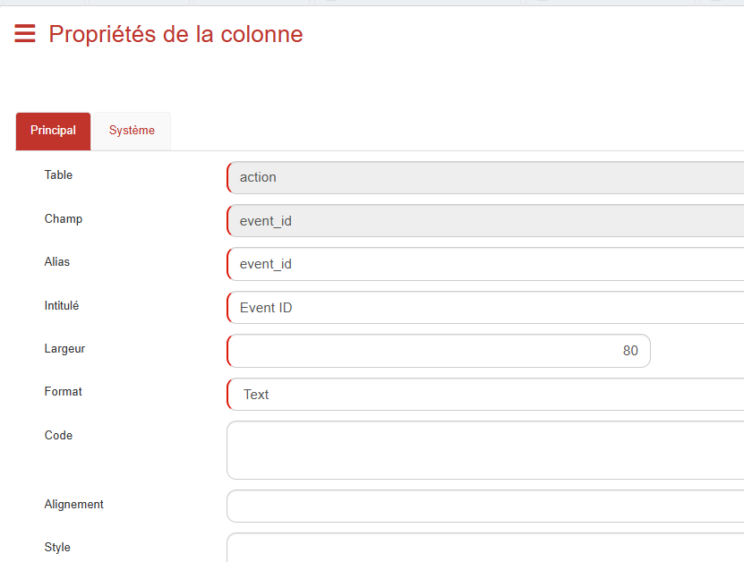

Créer une vue **Tableau** de la table **Action** nommée **Google Agenda Synchronisation** avec les colonnes suivantes :

- Objet
- Heure début
- Heure fin
- Date début
- Date fin
- Event ID
- Détails
- Nom
- Type
- Statut
- Utilisateur

Dans la section **Conditions** des propriétés de la vue Ajouter la condition utilisateur égal à (-me-).

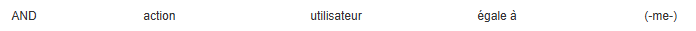

Enregistrer la vue.

Accéder aux paramètres de votre profil en haut à droite en cliquant sur **Mon profil**.

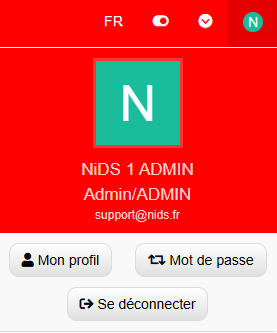

Accéder à l'onglet **Autres applications** et cliquer sur le bouton **Ajouter** dans la section **Google Sync**.

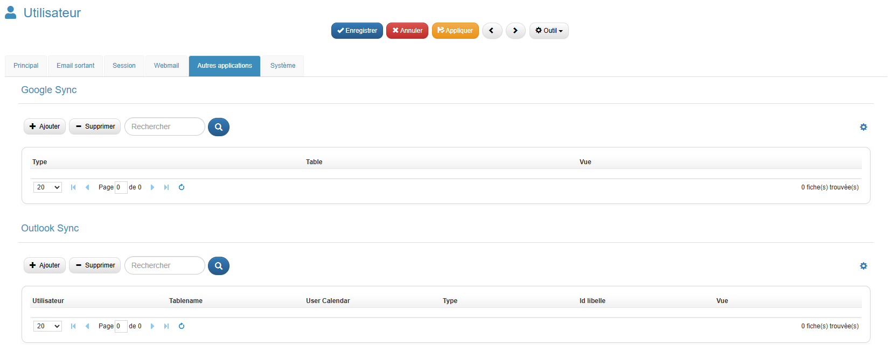

Renseigner les valeurs suivantes dans les différents champs :

- **ID client** : L'ID client récupéré auparavant
- **Code secret du client** : Le code secret duc lient récupéré auparavant
- **Type** : Calendar
- **Calendar Name** : L'ID de l'agenda récupéré auparavant
- **User calendar field** : Le champ utilisateur de la vue Google Agenda Synchronisation
- **Tablename** : action
- **Vue** : Vue Google Agenda Synchronisation

Pour renseigner le champ **Map** cliquer sur le bouton **Paramétrage Synchronisation** et renseigner les champs correspondants dans le formulaire et cliquer sur **Sync**.

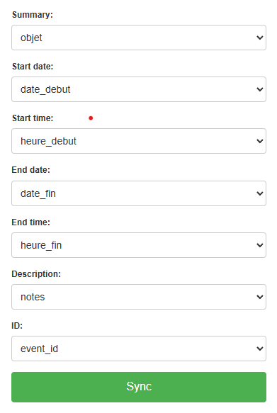

Enregistrer votre configuration Google Sync ainsi que votre profil.

## Conclusion

La configuration du Google Sync est terminée, afin de pouvoir l'utiliser, l'utilisateur doit se déconnecter de l'application et se reconnecter puis cliquer sur le bouton google en haut à droite afin de synchroniser son agenda. 

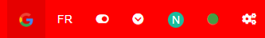

Une fois la synchronisation réalisée, ouvrer la vue créée auparavant (Google Agenda Synchronisation) pour accéder aux informations de l'agenda Google synchronisé.