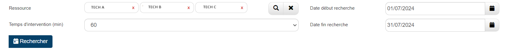

# Extension ItemDisponibilities - Optimiser les Rendez-vous

## Description

L'extension ItemDisponibilities permet d'optimiser la gestion des rendez-vous en ajoutant des fonctionnalités avancées de planification et de gestion des ressources. Ce guide décrit les étapes nécessaires pour configurer cette extension, y compris la création de champs spécifiques dans la table maître et l'insertion de code personnalisé.

### Bénéfices attendus
- **Optimisation des RDV :** Amélioration de la gestion des plages horaires et des ressources disponibles.
- **Gain de temps :** Automatisation de la planification des rendez-vous selon des critères prédéfinis.
- **Efficacité :** Meilleure utilisation des ressources grâce à une planification plus précise et adaptée.
- **Optimisation des Trajets :** Réduction des déplacements inutiles des techniciens, permettant ainsi des économies de temps et de carburant.

### Instructions pour le Paramétrage

#### 1. Création de la Section RDV

Pour ajouter les champs nécessaires à la table maître :

1. **Configurer la fiche**
   - Allez dans le menu **outil** de la fiche.
   - Sélectionnez **FORMDESIGNER**.

2. **Ajouter les Champs RDV**
   - **Ressource** : Multi-connexion vers la table ressource.
   - **Plage horaire** : Liste avec les options "Matin", "Après-midi", "Toute la journée".
   - **Temps d'intervention (min)** : Liste avec les options "30", "60", "90", "120", "150", "180", "210".
   - **Rayon (max)** : Champ nombre.
   - **Date début** : Champ date.
   - **Date fin** : Champ date.

#### 2. Insertion du Code

Pour personnaliser la fiche avec du code JavaScript :

1. **Accéder au Menu Personnalisation**
   - Allez dans le menu **outil** de la fiche.
   - Sélectionnez **Personnaliser** puis l'onglet **Script**.
   - Insérez le code suivant :

      ```javascript
      thisComponent.ui.find("[name=[CHAMP_POSITIONNEMENT_BOUTTON]]").closest(".form-group").after("<span class='input-group-btn'><button id='btnSearchPlanning' type='button' style='float:left; background-color:#064169;color:white;' role='button' class='btn btn-md' title='Rechercher'><span class='fas fa-calendar-day'></span>  Rechercher</button></span>");

      thisComponent.ui.find("#btnSearchPlanning").on("click", async function(){

      if(!thisComponent.getValue("[CHAMP_MULTI_CONNEXION_RESSOURCE]")){
         gopaas.dialog.warning("Merci de renseigner les ressources");
         return false;
      }

      let horaire = {heure_debut : {"Matin" : "07:00:00", "Après-midi" : "13:00:00", "Toute la journée" : "07:00:00"},
                     heure_fin : {"Matin" : "12:00:00", "Après-midi" : "18:00:00", "Toute la journée" : "18:00:00"}};

      let users = thisComponent.getValue("[CHAMP_MULTI_CONNEXION_RESSOURCE]").split(",");

      let startPoint = {};

      for(let i = 0; i < users.length; i++){
         let getAddress = await  gopaas.webservice.getItem("[NON_TABLE_RESSOURCE]", users[i]);
         startPoint[users[i]] = getAddress.adresse + ", " + getAddress.cp + ", " + getAddress.ville;
      }

      let disponibilities = {
         tableName : "[NON_TABLE_ACTION]",
         fieldsName : {adresse : "[ADRESSE]", cp : "[CP]", ville : "[VILLE]"},
         viewKey : "[CLE_VUE_ACTION]",
         search : {
            startPoint : startPoint,
            date_fin : gopaas.date.toSql(thisComponent.getValue("date_fin")),
            heure_fin : horaire.heure_fin[thisComponent.getValue("plage_horaire")],
            heure_debut : horaire.heure_debut[thisComponent.getValue("plage_horaire")],
            timeRange : thisComponent.getValue("temps_intervention"),
            radius : thisComponent.getValue("rayon_max"),
            user : {tableName : "[NON_TABLE_RESSOURCE]", usersKey : thisComponent.getValue("[CHAMP_MULTI_CONNEXION_RESSOURCE]")},
            date_debut : gopaas.date.toSql(thisComponent.getValue("date_debut")),
            adresse : thisComponent.getValue("adresse").replace(/'/g, ' '),
            cp : thisComponent.getValue("cp"),
            ville : thisComponent.getValue("ville").replace(/'/g, ' ')
         },
         create : {tableName : "", fields : {adresse : {name : ""}, cp : {name : ""}, ville : {name : ""}}, data : {}},
         update : {tableName : "", id : "", fields : {user : {name : ""}}, data : {}}
      };

      let viewFilter =  "AND action.type = 'RDV' AND action.statut <> 'Annulée'";

      itemDisponibilities(disponibilities, viewFilter);
      });
      ```

#### 3. Installation de l'Extension

Pour importer l'extension ItemDisponibilities :

1. **Télécharger et Importer l'extension**
   - [Télécharger l'extension](https://www.gopaas.fr/help/Extension/)
   - Rendez-vous dans le menu **admin** (menu de gauche).
   - Cliquez sur **Transfer in**.
   - Sélectionnez et importez l'extension ItemDisponibilities.

#### 4. Vider le Cache du Navigateur

Pour finaliser l'installation :

- **Vider le Cache** : Assurez-vous de vider le cache de votre navigateur.
- **Se Reconnecter** : Reconnectez-vous à votre application pour appliquer les modifications.

#### Résultat attendu :
- Affichage de la section permettant de rechercher le meilleur intervenant :



- Interface de la sélection du meilleur créneau :


### Conclusion

Une fois ces étapes complétées, votre application sera optimisée pour la gestion des prises de rendez-vous.
