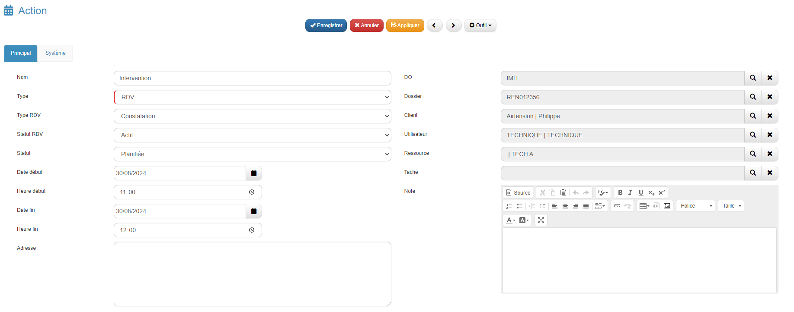

# Guide d'Utilisation de l'Extension ItemDisponibilities

## Introduction

L'extension **ItemDisponibilities** permet d'optimiser la gestion des rendez-vous en facilitant la planification et la gestion des ressources disponibles. Ce guide décrit comment utiliser cette extension pour trouver les meilleurs créneaux horaires et ressources disponibles.

### Prérequis
- L'extension **ItemDisponibilities** doit être installée et configurée conformément aux instructions du [guide d'installation](lien_vers_la_doc_d'installation).
- Les droits d'accès à la fiche des rendez-vous et aux fonctionnalités de planification sont requis.

## Accès à la Fonctionnalité de Planification

### 1. Ouvrir le RDV

1. Accéder à une fiche **Intervention** puis se rendre dans la section **RDV**.

### 2. Renseigner les Informations Nécessaires

1. **Ressource** : Sélectionner les ressources (un ou plusieurs techniciens) à assigner au rendez-vous.
2. **Temps d'intervention (min)** : Indiquer la durée estimée de l'intervention.
3. **Date début** et **Date fin** : Définir la période pendant laquelle le rendez-vous doit avoir lieu.

### 3. Rechercher un Créneau Disponible

1. Cliquer sur le bouton **Rechercher** qui apparaît sous les champs renseignés.

2. L'extension calcule les créneaux disponibles en fonction des critères définis (ressources, plage horaire, durée de l'intervention).

3. Les résultats s'affichent sous forme de calendrier, permettant de choisir le créneau optimal.

### 4. Sélectionner et Valider un Créneau

1. Parcourir les créneaux proposés et sélectionner celui qui convient le mieux. L'extension propose par défaut un créneau recommandé, affiché en vert et représenté par une étoile. 
Chaque ligne de créneau affiches les disponibilités des techniciens préalablement sélectionnés.
2. Cliquer sur un des créneaux pour finaliser la planification du rendez-vous avec la ressource associée.

### 5. Enregistrer le RDV

1. Une fois le créneau sélectionné, enregistrer la fiche **Action** pour sauvegarder le rendez-vous.

Le rendez-vous choisi apparait désormais en rouge pour signifier que le technicien est attribué à cette intervention.
Un créneau orange signifie que le technicien est attribué à une autre intervention sur cet horaire.

### 6. Modification des Créneaux

1. Pour ajuster un rendez-vous après l'avoir planifié, retourner sur la section **RDV** et cliquer à nouveau sur **Rechercher** pour trouver un autre créneau.
2. Il suffit alors de sélectionner un autre créneau. Une pop-up apparait demandant une confirmation pour remplacer l'ancien rendez-vous.
   

3. A la confirmation, une fiche **Action** s'ouvre affichant le récapitulatif du rendez-vous. Enregistrer cette fiche pour valider la modification de créneau.

## Conclusion

Ce guide permet d'exploiter pleinement les capacités de l'extension **ItemDisponibilities** pour optimiser la gestion des rendez-vous. Une bonne utilisation de cette fonctionnalité aide à maximiser l'efficacité des équipes et à offrir un service de qualité aux clients.
