# Comment créer un modèle d'email avec fusion dans GoPaaS ?

## Description

Les modèles d'email avec fusion dans GoPaaS permettent de personnaliser les messages envoyés en remplaçant les champs de fusion par les données spécifiques des destinataires. Cela est particulièrement utile pour envoyer des emails personnalisés à partir des données contenues dans vos tables.

### Étape 1 : Accéder à la section Modèles d'Email

1. **Accéder aux modèles d'email :**
   - Dans le menu de gauche, cliquez sur **Référence**.
   - Sélectionnez **Modèle** puis **Modèle email**.

      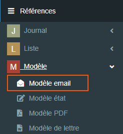
2. **Ajouter un nouveau modèle :**
   - Cliquez sur le bouton **Ajouter** pour créer un nouveau modèle d'email.

      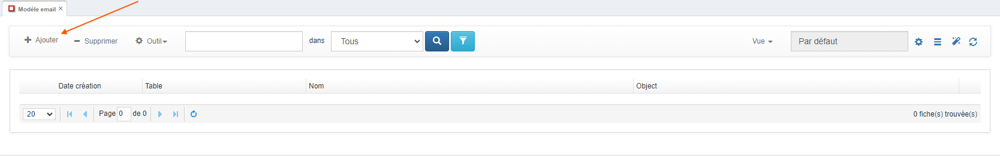


### Étape 2 : Remplir les informations du modèle d'email

1. **Nom du modèle :**
   - Dans le champ **Name**, saisissez le nom du modèle d'email. Ce nom sera utilisé pour identifier le modèle.

2. **Table :**
   - Sélectionnez la table liée au modèle d'email dans le champ **Table**.

3. **Vue :**
   - Dans le champ **view**, choisissez la vue qui contient les champs à fusionner. Cette vue doit inclure les champs que vous souhaitez utiliser dans l'email.

4. **Format :**
   - Sélectionnez **HTML** dans le champ **format** pour utiliser le format HTML pour votre email.

5. **Expéditeur :**
   - Saisissez l'adresse de l'expéditeur dans le champ **from** (non obligatoire). Si vous laissez ce champ vide, l'expéditeur par défaut sera utilisé.

6. **Destinataire :**
   - Saisissez l'adresse du destinataire dans le champ **To** (non obligatoire). Si vous laissez ce champ vide, le destinataire sera déterminé par les données de la table.

   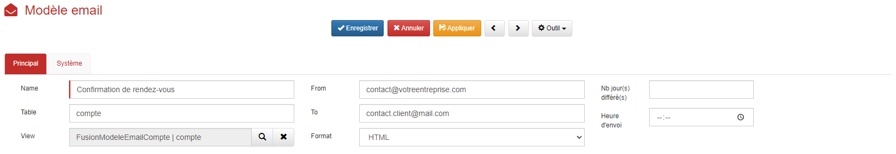

### Étape 3 : Rédiger le message

1. **Objet du mail :**
   - Dans la section **Message**, saisissez l'objet du mail.

2. **Contenu du mail :**
   - Sous l'objet, rédigez le contenu du mail en utilisant des champs de fusion pour personnaliser le message.

3. **Joindre un fichier :**
   - Il est également possible de joindre un fichier en utilisant le champ **file**. Notez que ce fichier ne sera pas fusionné avec les données.

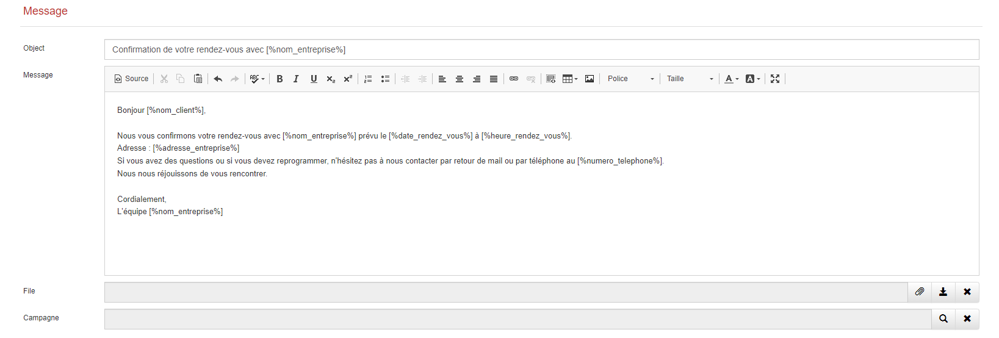

### Étape 4 : Utiliser des champs de fusion

1. **Champs de fusion :**
   - Pour utiliser les champs de fusion dans l'objet ou le contenu du message, insérez l'alias du champ entre les symboles `[%%]`. Par exemple, pour fusionner un champ de nom, utilisez `[%nom%]`.

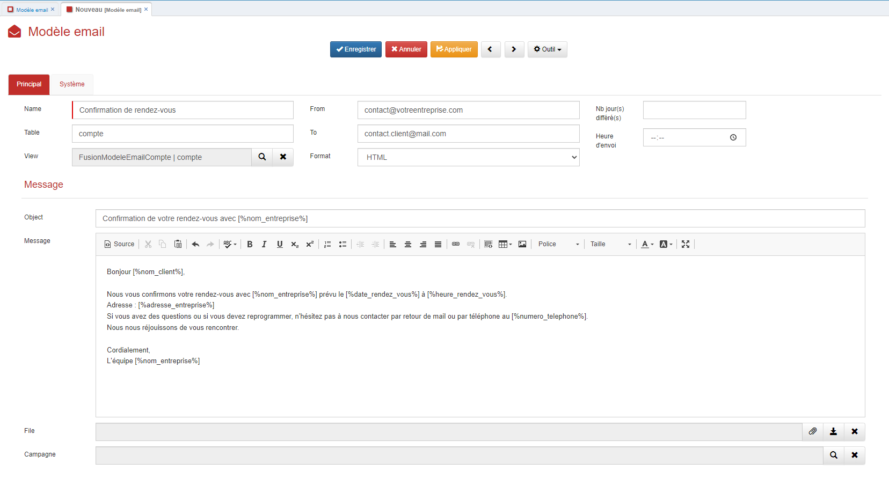

### Étape 5 : Fusionner le modèle d'email en JavaScript

Après avoir créé le modèle d'email, vous pouvez l'utiliser dans une fiche action pour fusionner les données et envoyer l'email. Voici un exemple de code JavaScript pour réaliser cette opération :

```javascript
// Récupération de la clef du modèle d'email depuis une connexion située sur la fiche action.
var cleTemplate = thisComponent.getValue('CHAMP_CONNEXION_EMAIL_TEMPLATE');

$.get("webservice/item/get-item.php", {
  tableName: "email_template",
  itemKey: cleTemplate
}).done(function (result) {

  // Récupération de la pièce jointe contenue dans le modèle d'email.
  if (result.file) {
    thisComponent.setValue('pj', '../email_template/' + result.file);
  }

  var tableName = result.table;
  var itemId = thisComponent.ui.find('#ID_' + tableName).val();

  $.getJSON("webservice/emailing/merge-template.php", {
    cle: cleTemplate,
    itemId: itemId
  }).done(function (data) {
    // Dans le cas d'un champ texte.
    thisComponent.setValue("CHAMP_OBJET", data.object);
    // Dans le cas d'un champ mémo avec ckEditor.
    thisComponent.ui.find('#cke_CHAMP_MEMEO .cke_wysiwyg_frame').contents().find("html >body").html(data.message);
  });
  // On vide le champ connexion après avoir fusioné le modèle.
  thisComponent.setConnectionValue('CHAMP_CONNEXION_EMAIL_TEMPLATE', 'email_template', "");
});
```

#### Instructions pour utiliser le modèle d'email dans une fiche action :

1. **Création du champ `Template email` :** : 
   - Direction la liste des tables de votre application et recherché la table "action".
      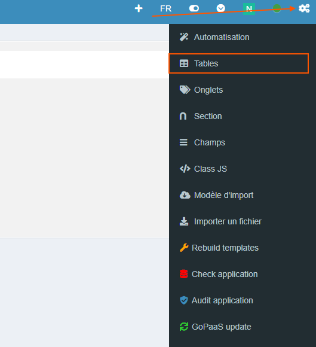

   - Cliquez sur le **Form Designer** en utilisant le menu **Outil**.
      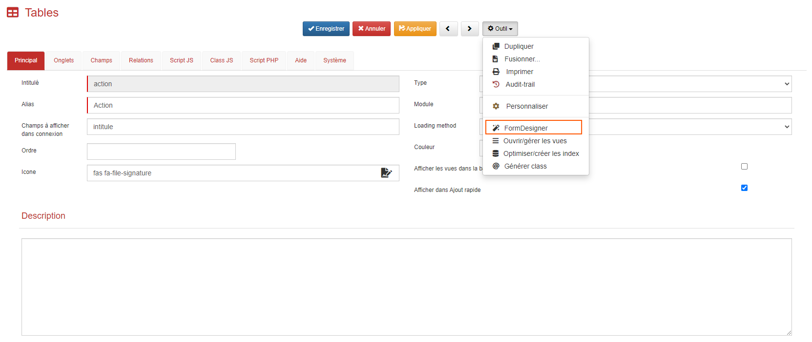
   
   - Après avoir ouvert le Form Designer, cliquez sur le bouton **+** dans la section de votre choix.
      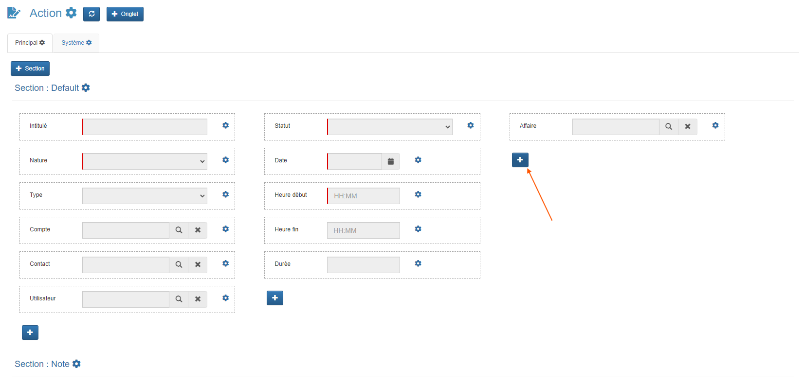
   
   - Configurez ce champ avec le **Type** "Connexion" (avec affichage en mode liste ou pas, selon votre préférence).
   
   - Enregistrez votre fiche.
     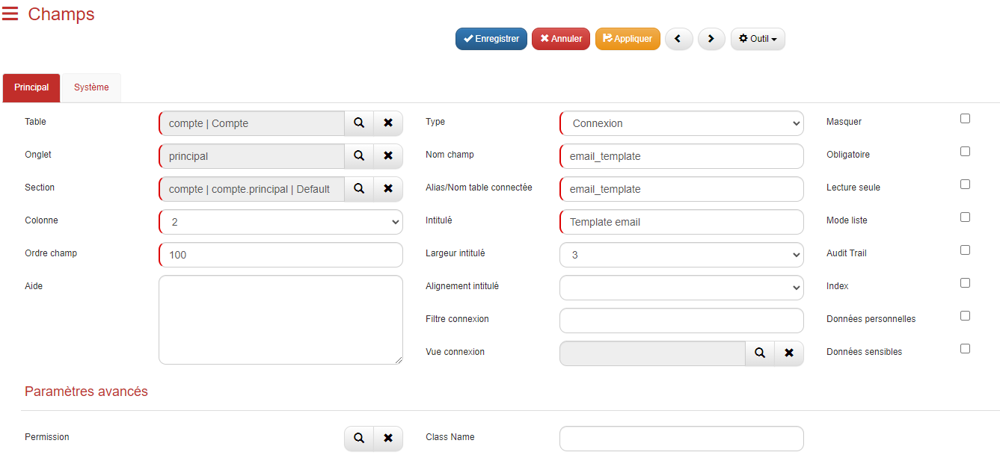

2. **Ajout de champs supplémentaires :**
   - **Champ Objet** : Créez un champ de type `Texte` pour stocker l'objet du modèle à fusionner.
      
      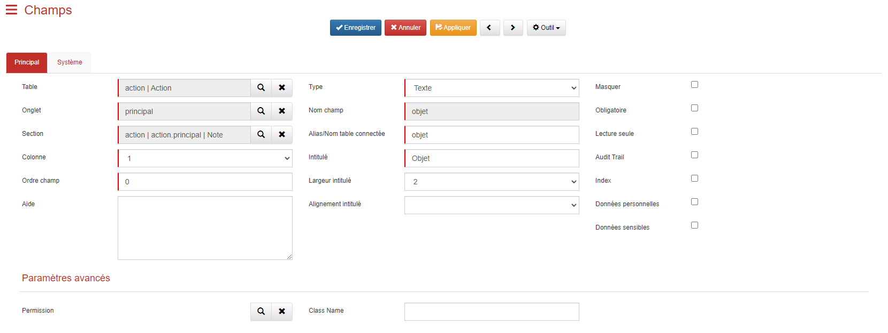
   
   - **Champ Note** : Créez un champ de type `Mémo` pour stocker le contenu fusionné de l'email.
      
      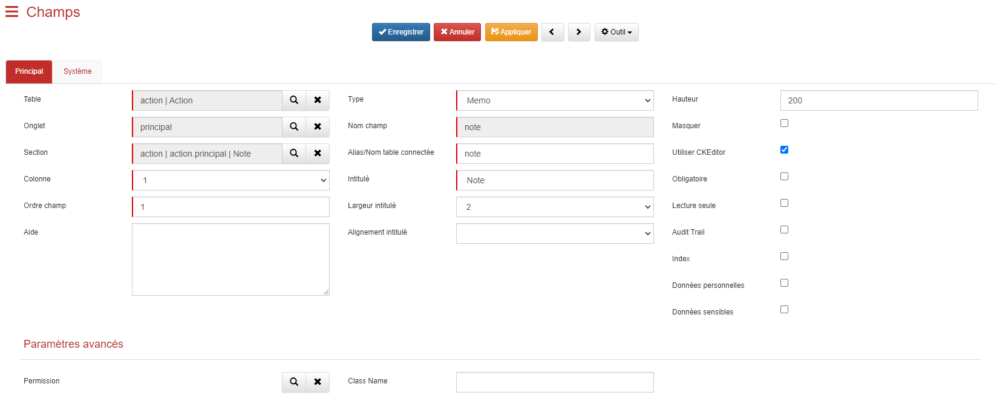
   
   - **Champ Fichier (PJ)** : Créez un champ de type `Fichier` pour stocker le fichier du modèle d'email dans la fiche action.

      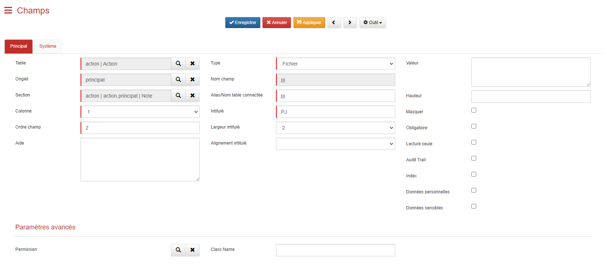

3. **Rafraîchissement du Form Designer :**
   - Après avoir enregistré, cliquez sur le bouton   pour rafraîchir le Form Designer.

      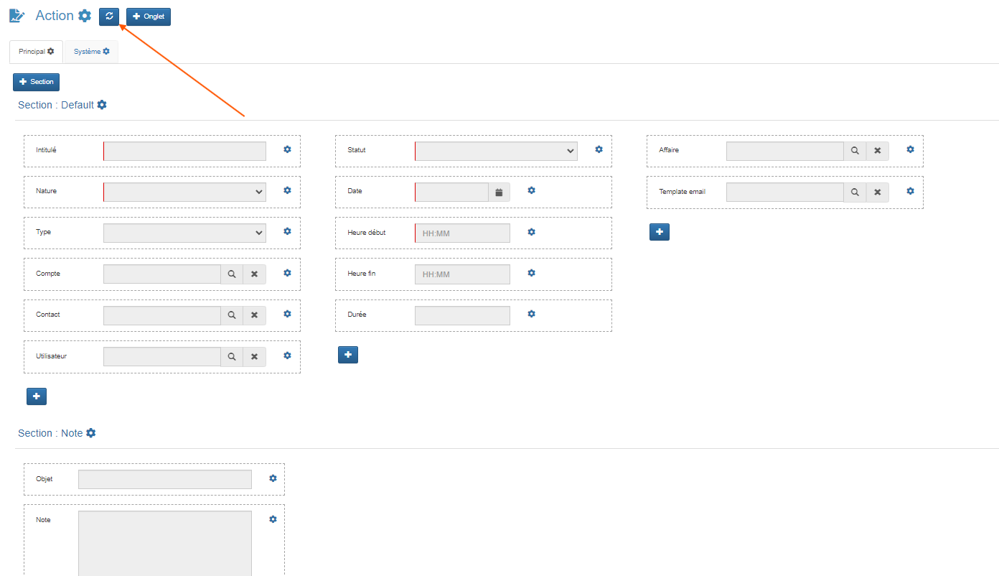

   - Ensuite, sélectionnez **Rebuild templates** dans le menu pour reconstruire les templates.
   
      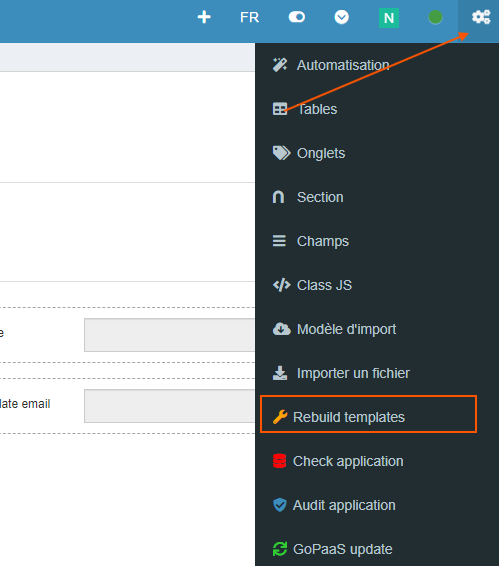

4. **Personnalisation du Script JS :**
   - Fermez le Form Designer et rouvrez la fiche de votre table action.
   - Accédez à l'onglet **Script JS** pour insérer le script JavaScript précédemment fourni.
   - **Important** : Ce script doit être adapté selon que vous avez coché ou non l'affichage en mode liste pour le champ `template_email`.

      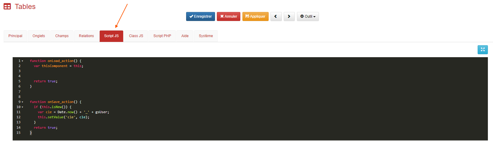

5. **Script pour détection du changement (mode liste activé) :**
   - Si vous avez coché l'affichage en **mode liste**, ajoutez ce script pour détecter les changements dans le champ `template_email` :

   ```javascript
   function onLoad_action() {
     var thisComponent = this;
     thisComponent.ui.find('#select_template_email').on('change', function() {
       // Récupération de la clef du modèle d'email depuis une connexion située sur la fiche action.
       var cleTemplate = $(this).val();

       $.get("webservice/item/get-item.php", {
         tableName: "email_template",
         itemKey: cleTemplate
       }).done(function (result) {

         // Récupération de la pièce jointe contenue dans le modèle d'email.
         if (result.file) {
           thisComponent.setValue('pj', '../email_template/' + result.file);
         }

         var tableName = result.table;
         var itemId = thisComponent.ui.find('#ID_' + tableName).val();

         $.getJSON("webservice/emailing/merge-template.php", {
           cle: cleTemplate,
           itemId: itemId
         }).done(function (data) {
           // Dans le cas d'un champ texte.
           thisComponent.setValue("CHAMP_OBJET", data.object);
           // Dans le cas d'un champ mémo avec ckEditor.
           thisComponent.ui.find('#cke_note .cke_wysiwyg_frame').contents().find("html >body").html(data.message);
         });
         // On vide le champ connexion après avoir fusioné le modèle.
         thisComponent.setConnectionValue('template_email', 'email_template', "");
       });

     }); 

     return true;
   }
   ```

6. **Script pour détection du changement (mode liste non activé) :**
   - Si vous n'avez pas coché l'affichage en mode liste, utilisez le script suivant :

   ```javascript
   function onLoad_action() {
     var thisComponent = this;
     thisComponent.ui.find('#template_email').on('change', function() {
       // Récupération de la clef du modèle d'email depuis une connexion située sur la fiche action.
       var cleTemplate = thisComponent.getValue('template_email');

       $.get("webservice/item/get-item.php", {
         tableName: "email_template",
         itemKey: cleTemplate
       }).done(function (result) {

         // Récupération de la pièce jointe contenue dans le modèle d'email.
         if (result.file) {
           thisComponent.setValue('pj', '../email_template/' + result.file);
         }

         var tableName = result.table;
         var itemId = thisComponent.ui.find('#ID_' + tableName).val();
	     console.log(tableName);

         $.getJSON("webservice/emailing/merge-template.php", {
           cle: cleTemplate,
           itemId: itemId
         }).done(function (data) {
           // Dans le cas d'un champ texte.
           thisComponent.setValue("CHAMP_OBJET", data.object);
           // Dans le cas d'un champ mémo avec ckEditor.
           thisComponent.ui.find('#cke_note .cke_wysiwyg_frame').contents().find("html >body").html(data.message);
         });
         // On vide le champ connexion après avoir fusioné le modèle.
         thisComponent.setConnectionValue('template_email', 'email_template', "");
       });

     }); 

     return true;
   }
   ```

### Conclusion

La création et l'utilisation de modèles d'email avec fusion dans GoPaaS permettent de personnaliser efficacement vos communications par email en intégrant des données dynamiques. En suivant les étapes ci-dessus, vous pouvez configurer, personnaliser et envoyer des emails de manière automatisée et ciblée.
