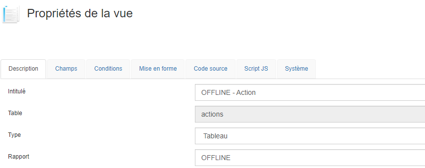
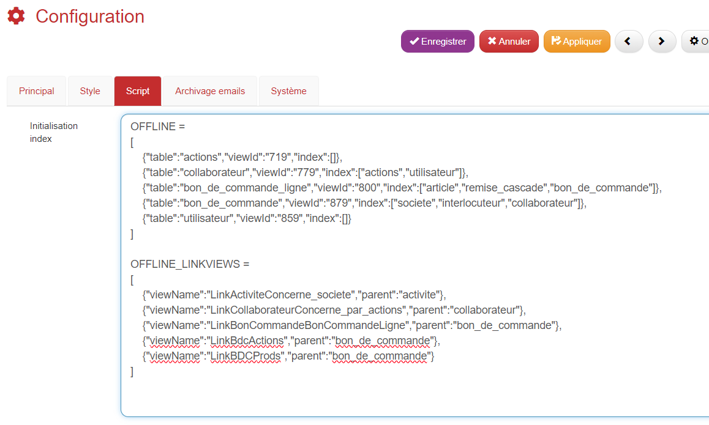
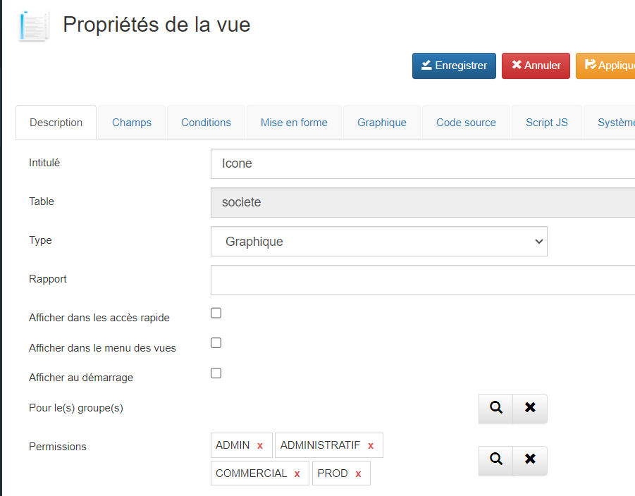
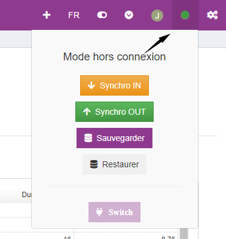
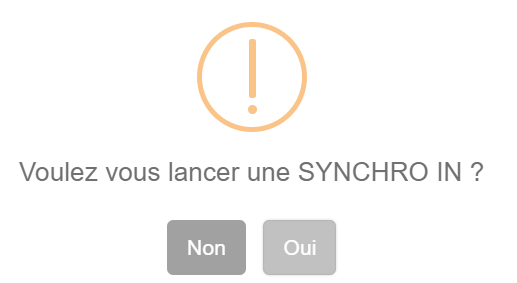
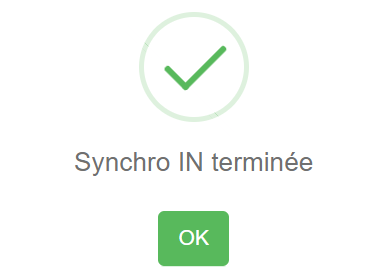
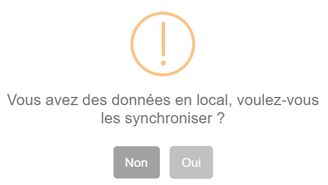

# OFFLINE
## Définir les données à synchroniser

La synchronisation des données requiert la création de vues filtrées.




| Champ | Valeur |
|-----------|-----------|
| Intitulé | Commencez toujours par `OFFLINE -` suivi d'une brève description. |
| rapport | indiquez `OFFLINE` pour permettre ultérieurement la génération de la configuration JSON. |

En suivant ces étapes, vous pouvez définir efficacement les données à synchroniser pour une utilisation hors ligne

## Configuration

### JSON

Dans votre navigateur, saisissez l'URL de votre application suivi de `webservice/offline/config-json.php`. Par exemple : `https://nids.gopaas.net/crm/webservice/offline/config-json.php`

```json
OFFLINE = 
[
    {"table":"actions","viewId":"719","index":[]},
    {"table":"collaborateur","viewId":"779","index":["actions","utilisateur"]},
    {"table":"bon_de_commande_ligne","viewId":"800","index":["article","remise_cascade","bon_de_commande"]},
    {"table":"bon_de_commande","viewId":"879","index":["societe","interlocuteur","collaborateur"]},
    {"table":"utilisateur","viewId":"859","index":[]}
]

OFFLINE_LINKVIEWS = 
[
    {"viewName":"LinkActiviteConcerne_societe","parent":"activite"},
    {"viewName":"LinkCollaborateurConcerne_par_actions","parent":"collaborateur"},
    {"viewName":"LinkBonCommandeBonCommandeLigne","parent":"bon_de_commande"},
    {"viewName":"LinkBdcActions","parent":"bon_de_commande"},
    {"viewName":"LinkBDCProds","parent":"bon_de_commande"}
]
```

**Description de la configuration**

| Objet            | Description                                                                                                                                                     |
|------------------|-----------------------------------------------------------------------------------------------------------------------------------------------------------------|
| OFFLINE          | Liste des données à importer, avec les paramètres :<br> - `table` : nom de la table<br> - `viewId` : ID de la vue<br> - `index` : liste des connexions sur la fiche de cette table |
| OFFLINE_LINKVIEWS | Liste des vues liées à embarquer en mode hors ligne :<br> - `viewName` : nom de la vue liée<br> - `parent` : nom de la table parent                                      |

Vous pouvez ajouter des vues système au JSON si nécessaire, telles que la vue des Utilisateurs actifs (Profil utilisateur).

### Fiche Configuration
Une fois le JSON prêt, insérez-le dans le champ "script" de la fiche configuration.



### Permissions

Assurez-vous que l'utilisateur dispose des permissions nécessaires sur chacune des vues (tableaux, widgets, icônes, vues liées, etc.) qui doivent fonctionner en mode hors ligne.



## Synchronisation

En haut à droite de GoPaaS vous trouverez cet icone , qui permet de vérifier le statut de la connexion :
* vert = en ligne
* orange = connexion lente
* rouge : hors ligne

Au clic sur ce bouton un menu apparait
<br>


| Intitulé      | Description                               |
|--------------|-------------------------------------------|
| Synchro IN   | Lance la synchronisation sur la base de données locale du navigateur. |
| Synchro OUT  | Lance la synchronisation de la base de données locale vers GoPaaS. |
| Sauvegarder  | Crée une sauvegarde de la base de données locale au format JSON. |
| Restaurer    | Permet de restaurer un backup JSON sur la base de données locale. |
| Switch       | Permet de permuter de la base de données locale à la base connectée. |

## Utilisation
Avant chaque utilisation du mode `OFFLINE` il faut faire une `Synchro IN`.
* Confirmer la demande de synchro :



* Ce message indique que la synchronisation est terminée :


* Ensuite vous pouvez travailler normalement, si la connexion est perdu GoPaaS fonctionnera automatiquement en mode `OFFLINE`.

* Une fois la connexion retrouvé un message vous propose de synchroniser vos données local vers GoPaaS (Synchro OUT), répondez `Oui` pour lancer la synchro.

