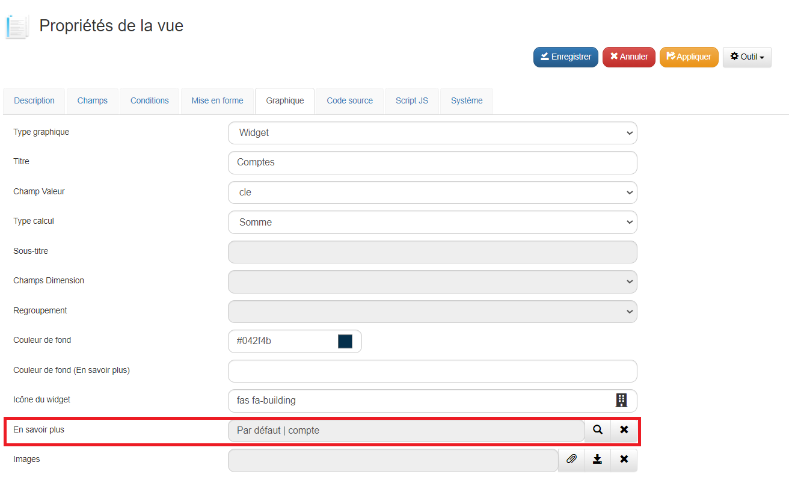

## Optimisation d'un Widget sur un Dashboard

### Objectif
L'optimisation d'un widget a pour but de charger rapidement son affichage sur le dashboard. Par exemple, un widget peut afficher le nombre de compte ouverts, même si la vue liée à ces comptes est complexe et contient de nombreuses jointures SQL.

### Étapes de Création d'un Widget Optimisé

1. **Duplication de la Vue** :
   - Dupliquez la vue par défaut que vous souhaitez utiliser, par exemple, la vue des comptes.
   - Modifiez le **type** de la vue en sélectionnant **Graphique**.

2. **Configuration des Champs** :
   - Dans l'onglet **Champs**, ne sélectionnez que l'`id` et la `clé`. Cela limite les données chargées, accélérant ainsi l'affichage du widget.

3. **Configuration du Graphique** :
   - Passez à l'onglet **Graphique** pour configurer les paramètres du widget.
   - Remplissez les champs comme suit (voir la capture d'écran ci-dessous pour référence) :
     - **Type graphique** : Sélectionnez **Widget**.
     - **Titre** : Donnez un titre à votre widget, par exemple **Comptes**.
     - **Champ Valeur** : Sélectionnez le champ `clé`.
     - **Type de Calcul** : Choisissez **Somme**.
     - **Icône du Widget** : Vous pouvez sélectionner une icône pour le widget.
     - **Couleur de fond** : Choisissez une couleur de fond adaptée au widget.

      

4. **Connexion à une Vue Complète** :
   - Dans le champ **En savoir plus**, renseignez la vue complète qui possède l'ensemble des informations détaillées que vous souhaitez afficher. Cela permet de charger les détails plus tard, uniquement si l'utilisateur en a besoin.

### Conclusion
En limitant les champs à afficher dans le widget et en séparant la vue détaillée pour un affichage ultérieur, le temps de chargement du dashboard est considérablement réduit.
