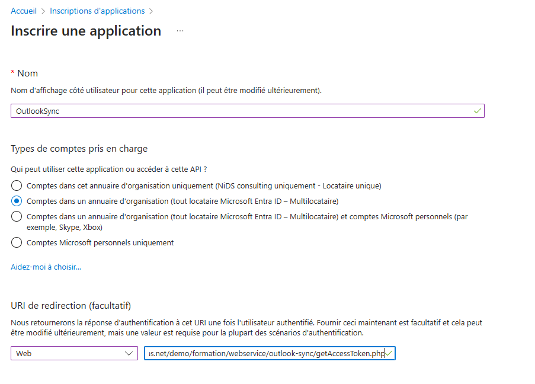
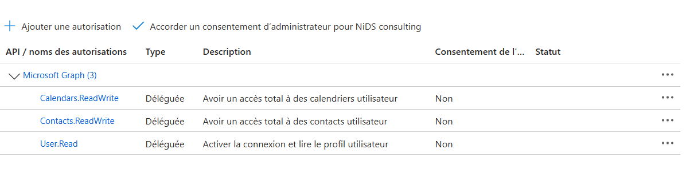

# Synchronisation des Contacts et du Calendrier Outlook avec GoPaaS

## Pré-requis :

- Posséder un compte Microsoft
- Inscrire l'application sur le portail Azure
- Configurer la fiche de synchronisation Outlook sur GoPaaS

### Inscription de l'application sur Azure

Se rendre sur la page d'accueil du portail Azure (https://portal.azure.com), puis cliquer sur **Inscriptions d'application** : 

Cliquer ensuite sur **Nouvelle inscription**

 - Choisir un nom, ici **OutlookSync**.
 - Dans **Type de comptes pris en charge**, sélectionner **Comptes dans un annuaire d'organisation (tout locataire Microsoft Entra ID - Multilocataire)**.
  -  Paramétrer l'URI de redirection en sélectionnait dans la liste **Web** et en inscrivant l'URI de redirection : **urlgopaas/webservice/outlook-sync/getAccessToken.php**. Ici **https://nids-qualif.gopaas.net/crm/webservice/outlook-sync/getAccessToken.php**.

En arrivant sur la vue d'ensemble de l'application inscrite, récupérer l'ID d'application client qui sera utile plus tard:

Se rendre dans le menu **Certificats & secrets** puis cliquer sur **Nouveau secret client** :

Entrer une description dans le volet qui s'ouvre à droite puis cliquer sur **Ajouter**.

Un nouveau secret client est créé. Comme pour l'ID d'application client, récupérer la valeur généré et non l'ID de secret : 

La dernière étape de cette configuration consiste à ajouter les différents autorisations d'accès aux données utilisateurs afin de synchroniser les contatcs et / ou le calendrier GoPaaS - Outlook. Pour cela, il faut se rendre dans le menu **API autorisées** puis cliquer sur **Ajouter une autorisation** : 

Un volet apparait sur la droite de l'écran.

Sélectionner **Microsoft Graph** : 

Puis **Autorisations déléguées** :

En utilisant la barre de recherche, ajouter les autorisations suivantes : 

### Configuration sur GoPaaS

Sur GoPaaS, se rendre dans le menu **Admin** puis **Outlook Sync** 

