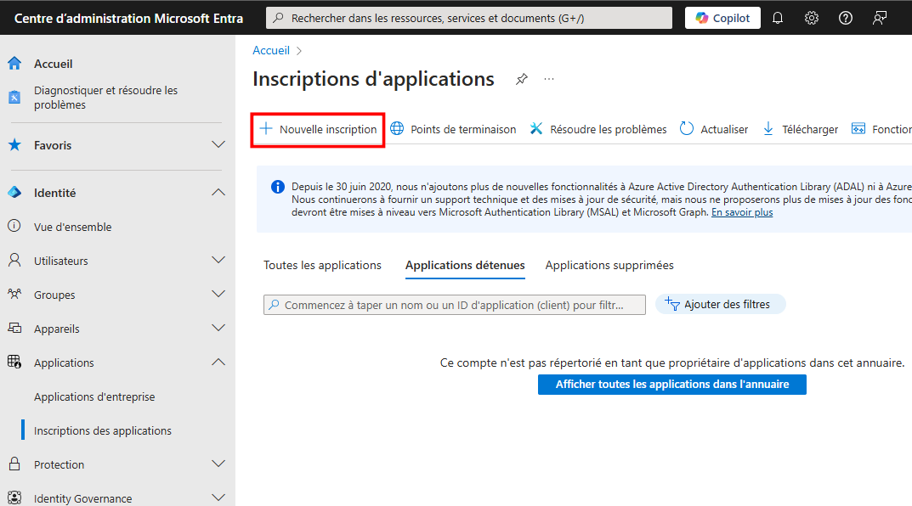
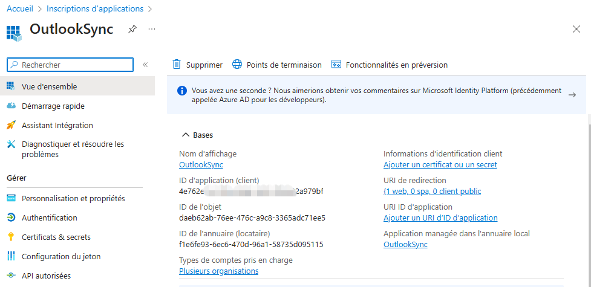

# Synchronisation des Contacts et du Calendrier Outlook avec GoPaaS

## Pré-requis :

- Posséder un compte Microsoft
- Inscrire l'application sur le portail Microsoft Entra
- Configurer la fiche de synchronisation Outlook sur GoPaaS

### Inscription de l'application sur Entra

Se rendre sur la page d'accueil du portail Entra (https://entra.microsoft.com/), puis cliquer sur **Inscriptions d'application** : 

Cliquer ensuite sur **Nouvelle inscription**

 - Choisir un nom, ici **OutlookSync**.
 - Dans **Type de comptes pris en charge**, sélectionner **Comptes dans un annuaire d'organisation (tout locataire Microsoft Entra ID - Multilocataire)**.
  -  Paramétrer l'URI de redirection en sélectionnait dans la liste **Web** et en inscrivant l'URI de redirection : **urlgopaas/webservice/outlook-sync/getAccessToken.php**. Ici **https://nids-qualif.gopaas.net/crm/webservice/outlook-sync/getAccessToken.php**.

En arrivant sur la vue d'ensemble de l'application inscrite, récupérer l'ID d'application client qui sera utile plus tard:

Se rendre dans le menu **Certificats & secrets** puis cliquer sur **Nouveau secret client** :

Entrer une description dans le volet qui s'ouvre à droite puis cliquer sur **Ajouter**.

Un nouveau secret client est créé. Comme pour l'**ID d'application client**, récupérer la **valeur** généré et non l'ID de secret : 

La dernière étape de cette configuration consiste à ajouter les différents autorisations d'accès aux données utilisateurs afin de synchroniser les contatcs et / ou le calendrier GoPaaS - Outlook. Pour cela, il faut se rendre dans le menu **API autorisées** cliquer sur **Ajouter une autorisation** :

Un volet apparait sur la droite de l'écran.

Sélectionner **Microsoft Graph** : 

Puis **Autorisations déléguées** :

En utilisant la barre de recherche, ajouter les autorisations suivantes : 
* Rechercher **Calendars.ReadWrite** puis le valider avec le bouton **Ajouter des autorisations**.
* Rechercher **Contacts.ReadWrite** puis le valider avec le bouton **Ajouter des autorisations**.

* Cliquer sur **Accorder un consentement d'administrateur pour [Nom de la Société]**
* Sur la popup confirmer **Oui**

* les statuts se mettrons à jour

## Configurer la fiche de synchronisation Outlook sur GoPaaS

### Créer une vue des **Contacts** à synchroniser
Créer une vue avec les colonnes suivante :

| Colonne         | Description         |
|--------------------|-------------------|
| Date création     |  *Obligatoire*  |
| Date modification     |  *Obligatoire*  |
| Prénom  |  *Obligatoire*  |
| Nom     |  *Obligatoire*  |
| Email     |   |
| Téléphone     |    |
| Date de naissance     |  *Optionnel*  |
| Société     |  *Optionnel*  |
| Fonction     |  *Optionnel*  |
| Rue     |  *Optionnel*  |
| Code postale     |  *Optionnel*  |
| Ville     |  *Optionnel*  |

*Appliquer les conditions nécessaires sur la vue*

### Créer une vue des **Agendas** à synchroniser
Créer une vue avec les colonnes suivante :

| Colonne         | Description         |
|--------------------|-------------------|
| Date modification     |  *Obligatoire*  |
| Heure modification     |  *Obligatoire*  |
| Outlook id     |  *Obligatoire* est un identifiant unique récupéré d'outlook  |
| Sujet  |  Intitulé du RDV  |
| Description  | *Optionnel* Note du RDV  |
| Date début    |  *Obligatoire* |
| Date fin    |  *Obligatoire* |
| Heure début     |  *Obligatoire*  |
| Heure fin     |  *Obligatoire*  |

*Appliquer une condition pour limiter les fiches à synchroniser exemple : datant de 2 mois à 1 an.*

Se rendre sur la fiche **Utilisateur**, onglet **Autres applications** et Section **Outlook Sync**.

Ajouter une fiche de paramétrage pour la synchronisation des contacts.

| Champ         | Description         |
|--------------------|-------------------|
| Client ID     |  Correspond à l'**ID d'application (client)** de Microsoft Entra  |
| ID de secret     |  Correspond à la **Valeur du secrect client** de Microsoft Entra  |
| Type     |  **Contact** |
| ID Libellé  |  Nom du dossier **Contact** qui sera créé sur Outlook, exemple : **GoPaaS**  |
| TableName  | Nom de la table qui contient les contacts  |
| Vue     |  Vue des contacts à synchroniser  |
| map     |  json pour la correspondance des champs GoPaaS <> Outlook  |

* Pour le champ **map** utiliser le bouton **Paramétrage synchronisation**.

Faire correspondre les champs dans ce formulaire et cliquer sur **Sync**, et enregistrer la fiche GoPaaS.

Ajouter une fiche de paramétrage pour la synchronisation des Agendas.

| Champ         | Description         |
|--------------------|-------------------|
| Client ID     |  Correspond à l'**ID d'application (client)** de Microsoft Entra  |
| ID de secret     |  Correspond à la **Valeur du secrect client** de Microsoft Entra  |
| Type     |  **Calendar** |
| TableName  | Nom de la table qui contient les fiches Agenda à synchroniser |
| User Calendar  | Permet lors de la synchro vesr GoPaaS de connecter l'utilisateur |
| Vue     |  Vue des Agendas à synchroniser  |
| map     |  json pour la correspondance des champs GoPaaS <> Outlook  |

* Pour le champ **map** utiliser le bouton **Paramétrage synchronisation**.

Faire correspondre les champs dans ce formulaire et cliquer sur **Sync**, et enregistrer la fiche GoPaaS.

Se déconnecter puis reconnecter à GoPaaS, et cliquer sur l'icone Outlook.

Une nouvelle page s'ouvre. Si vous n'êtes pas déjà connecté, une page d'authentification pour votre compte Microsoft s'affichera. Connectez-vous pour continuer la procédure.

Une fois authentifié la page de synchronisation apparait.

Cliquer maintenant sur **Start Synchronization** pour synchroniser les RDV et **Start Exportation** pour les contacts.