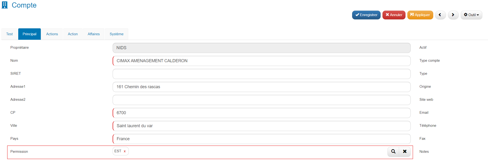
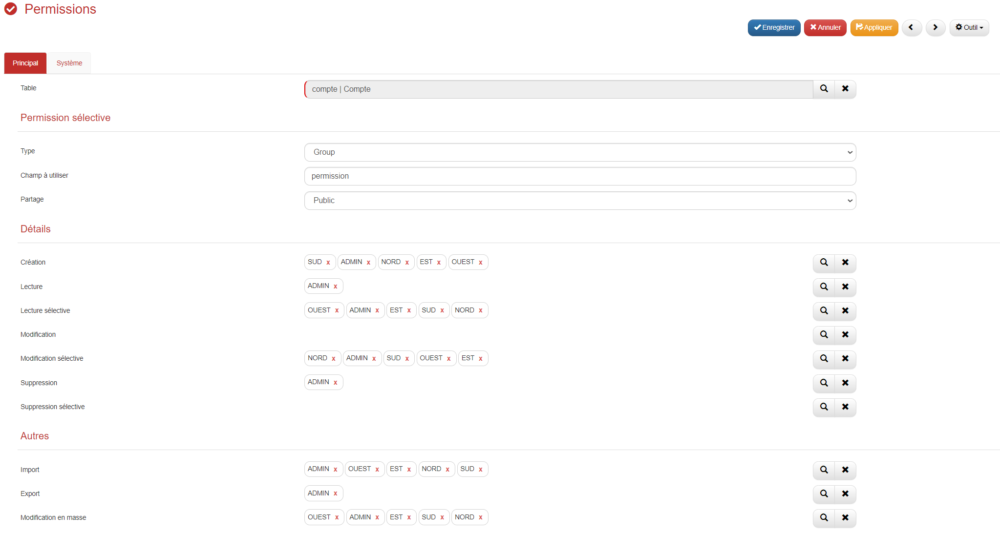

# Comment gérer des permissions dans GoPaaS ?

## Description

La gestion des permissions permet de définir et de contrôler les droits d'accès en fonction des attributs des utilisateurs. Cette approche assure que les utilisateurs ont accès uniquement aux informations spécifiques à leur rôle, ce qui améliore la sécurité et la pertinence des données traitées.

### Bénéfices attendus
- ***Sécurité Accrue :*** Limite l'accès aux informations sensibles, réduisant les risques de divulgation non autorisée.
- ***Gestion Simplifiée :*** Facilite la gestion des droits d'accès en regroupant les permissions.
- ***Pertinence des Informations :*** Assure que les utilisateurs accèdent uniquement aux données qui leur sont pertinentes.
- ***Adaptabilité :*** Permet d'ajuster les droits d'accès selon les besoins spécifiques.

### Exemple de Configuration des Permissions sur la table compte

Vous disposez de commerciaux dont les clients sont répartis par région, et vous souhaitez que chaque commercial puisse uniquement consulter et modifier les fiches comptes situés dans sa propre région.

### Étape 1 : Création des groupes

1. **Accéder au menu Admin :**
   - Allez dans **Admin** (menu de gauche).
   - Cliquez sur **Groupes**.

2. **Créer les groupes :**
   - Cliquez sur **Ajouter**.
   - Remplissez le champ **Intitulé** avec les noms des groupes : **EST**, **OUEST**, **NORD**, **SUD**.
   - Dans la section **Permissions** :

        - **Module(s)** : Sélectionnez le(s) module(s) disponible(s) pour le groupe, par exemple : CRM.
        - **Accès rapide** : Cochez la case si le groupe peut y accéder.
        - **Dashboard** : Cochez la case si le groupe peut y accéder.
        - **Référence** : Cochez la case si le groupe peut y accéder.
        - **Ajout rapide** : Cochez la case si le groupe peut y accéder.

   - Cliquez sur **Enregistrer**.

   - Répétez cette opération pour les quatre groupes.

   

### Étape 2 : Attribution des groupes aux utilisateurs

1. **Accéder au menu Utilisateur :**
   - Allez dans **Admin** (menu de gauche).
   - Cliquez sur **Utilisateur**.

2. **Associer les utilisateurs aux groupes :**
   - Pour chaque utilisateur concerné, double-cliquez sur l'utilisateur.
   - Dans la section **Groupe** (multi-connexion), associez le groupe approprié (NORD, SUD, EST, OUEST).

   

   - Enregistrez la fiche utilisateur.
   - Assurez-vous d'avoir au moins quatre utilisateurs, chacun associé à un groupe différent.

### Étape 3 : Modification des fiches comptes

1. **Accéder aux comptes :**
   - Allez dans **Applications** (menu de gauche), puis dans le sous-menu **CRM** puis cliquer sur **Comptes**.
   - Double-cliquez sur chaque fiche compte à modifier (au minimum quatre fiches comptes).

2. **Associer les permissions :**
   - Sur les fiches **Comptes**, vous devez posséder un champ, permettant de gérer les permissions, dans notre cas nous le nomerons **Permission** et pointera vers la table **Groupe** et de type multi-connexion.
   - Renseignez le champ **Permission** (multi-connexion), en sélectionnant le groupe approprié (NORD, EST, OUEST, SUD).

   

   - Enregistrez chaque fiche compte.

### Étape 4 : Création des permissions pour la fiche compte

1. **Accéder au menu Permissions :**
   - Allez dans **Admin** (menu de gauche).
   - Cliquez sur **Permissions**.

2. **Ajouter les permissions :**
   - Cliquez sur **Ajouter**.
   - Remplissez les champs comme suit :

| **Champ**             | **Valeur**                        |
|-----------------------|-----------------------------------|
| **Table**             | compte                            |
| **Type**              | Group                             |
| **Champ à utiliser**  | permission                        |
| **Partage**           | Public                            |
| **Création**          | SUD, ADMIN, NORD, EST, OUEST      |
| **Lecture**           | ADMIN                             |
| **Lecture sélective** | SUD, ADMIN, NORD, EST, OUEST      |
| **Modification sélective** | SUD, ADMIN, NORD, EST, OUEST |
| **Suppression sélective** | ADMIN                         |
| **Import**            | SUD, ADMIN, NORD, EST, OUEST      |
| **Export**            | ADMIN                             |
| **Modification en masse** | SUD, ADMIN, NORD, EST, OUEST  |

3. **Enregistrer les permissions :**
   - Cliquez sur **Enregistrer**.

### Étape 5 : Se déconnecter et se reconnecter

1. **Actualisation des permissions :**
   - Déconnectez-vous de votre session.
   - Demandez aux utilisateurs concernés de se déconnecter et de se reconnecter pour que les nouvelles permissions soient prises en compte.

### Résultat

- Depuis une session région **SUD** :

- Depuis une session **ADMIN** :

### Conclusion

La gestion des permissions basée sur la région permet une distribution précise et sécurisée des droits d'accès. En adaptant les permissions en fonction des régions, vous assurez que les informations sont accessibles et modifiables uniquement par les groupes concernés, ce qui optimise la sécurité et la pertinence des données traitées.