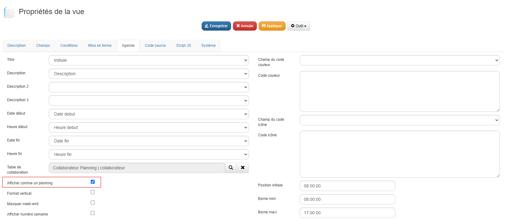
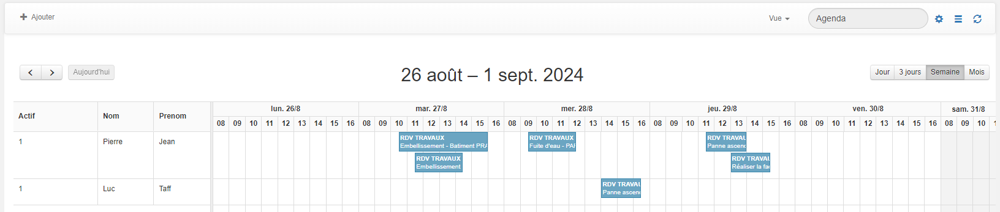

# Comment créer un planning dans GoPaaS ?

## Description

La création d'un planning permet de gérer et de visualiser des événements ou des tâches sous forme de planning pour différents collaborateurs. Cette fonctionnalité est utile pour organiser les actions des utilisateurs et suivre les événements au sein d'une équipe.

### Étape 1 : Création des tables

1. **Table Action** : Créez la table **Action** avec les champs suivants :
   - `Intitulé` (texte)
   - `Date début` (date)
   - `Date fin` (date)
   - `Heure début` (heure)
   - `Heure fin` (heure)
   - `Description` (mémo)
   - `Collaborateur` (connexion vers la table Collaborateur)

2. **Table Collaborateur** : Créez la table **Collaborateur** avec les champs suivants :
   - `Actif` (checkbox)
   - `Nom` (texte)
   - `Prénom` (texte)
   - `Email` (email)
   - `Téléphone` (texte)
   - `Utilisateur` (connexion vers la table utilisateur)

### Étape 2 : Création des vues

1. **Vue Collaborateur Planning :** :
   - Créez une vue pour la table Collaborateur et nommez-la Collaborateur Planning.
   - Ajoutez les champs Actif, Nom, et Prénom de la table Collaborateur dans cette vue.
   - Enregistrez la vue.

2. **Vue Planning** :
   - Dupliquez la vue par défaut de la table **Action**, qui contient les champs précédemment créés.
   - Changez le type de la vue dupliquée en **Agenda**.
   - Dans l'onglet **Agenda**, réalisez les correspondances suivantes :
     - **Titre** : correspond au champ `Intitulé`
     - **Date début** : correspond au champ `Date début`
     - **Heure début** : correspond au champ `Heure début`
     - **Date fin** : correspond au champ `Date fin`
     - **Heure fin** : correspond au champ `Heure fin`
     - **Description** : correspond au champ `Description`
     - **Table de collaboration** : correspond à la vue `Collaborateur Planning`
     - **Afficher comme un planning** : A cocher.

        Exemple de la configuration :
        

### Étape 3 : Configuration additionnelle

- Activez ou désactivez les options dans l'onglet **Agenda** selon vos besoins :
  - Format vertical
  - Masquer les week-ends
  - Afficher les numéros de semaine
- Configurez les bornes horaires (par exemple : de 08:00 à 17:00).
- Nommez et enregistrez la vue.

### Résultat

### Conclusion

Une fois ces étapes réalisées, votre vue **Planning** sera prête à afficher et gérer les actions de vos collaborateurs sous forme de planning.
