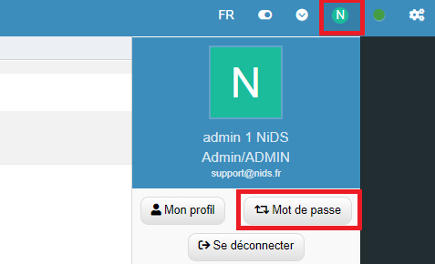
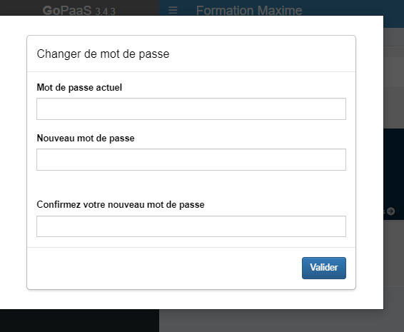

## Modification de votre Mot de Passe

Changer votre mot de passe sur GoPaaS est une étape simple mais essentielle pour assurer la sécurité de votre compte. Voici comment vous pouvez modifier votre mot de passe en quelques clics.

### Étape 1 : Accéder à la Section Profil

1. **Accéder à votre profil :**
   - Cliquez sur votre profil en haut à droite de l'interface.
   - Dans le menu déroulant, sélectionnez l'option **Mot de passe**.

        

### Étape 2 : Modifier votre Mot de Passe

1. **Saisir votre mot de passe actuel :**
   - Avant de définir un nouveau mot de passe, vous devrez entrer votre mot de passe actuel pour des raisons de sécurité.
   
2. **Entrer votre nouveau mot de passe :**
   - Saisissez ensuite votre nouveau mot de passe dans le champ prévu à cet effet.
   - **Confirmez** le nouveau mot de passe en le saisissant une seconde fois.

        

### Conclusion
En suivant ces étapes, vous pourrez facilement mettre à jour votre mot de passe sur GoPaaS et ainsi renforcer la sécurité de votre compte. Assurez-vous de choisir un mot de passe fort et unique pour protéger vos informations personnelles et professionnelles.
