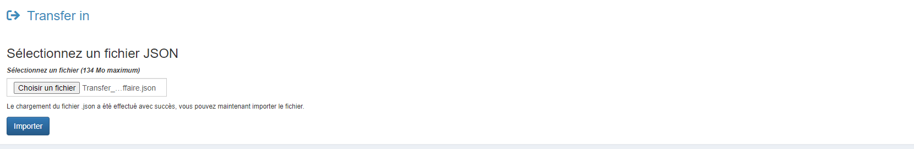
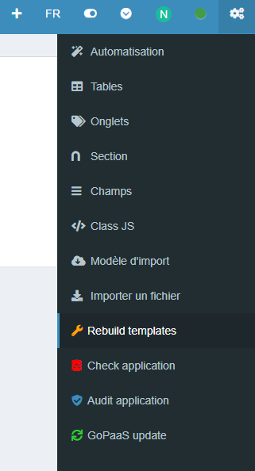
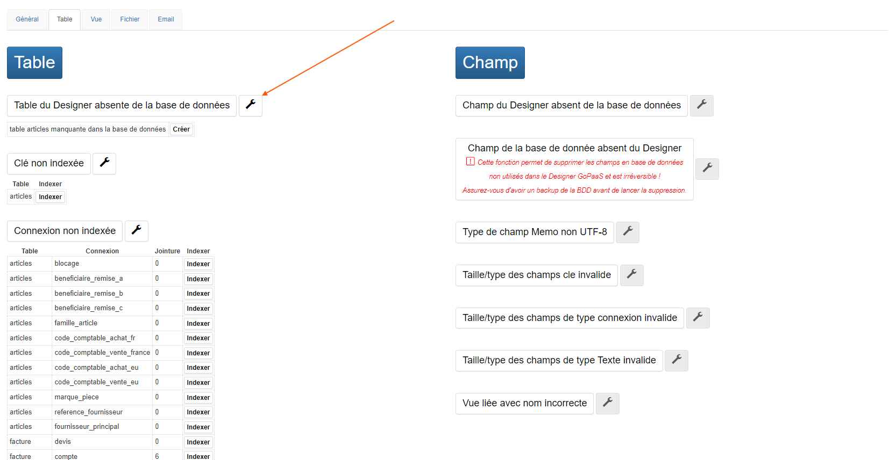
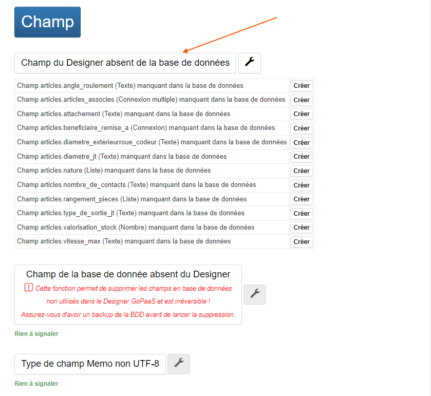
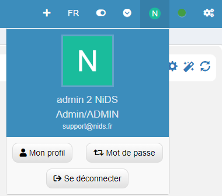

# Comment utiliser la fonctionnalité "Transfer In" dans GoPaaS ?

## Description

La fonctionnalité **Transfer In** permet d'importer des configurations au format JSON dans GoPaaS. Cette méthode est utile pour répliquer des configurations existantes dans un nouvel environnement, comme des tables, des vues, des dashboards, ou d'autres éléments.

### Étape 1 : Importation d'un fichier JSON

1. **Accéder à Transfer In :**
   - Allez dans le menu **Transfer In** (accessible depuis le menu de gauche, sous "Admin").

2. **Sélectionner un fichier JSON :**
   - Cliquez sur **Choisir un fichier** pour sélectionner le fichier JSON contenant les configurations à importer.

3. **Lancer le transfert :**
   - Cliquez sur le bouton **Importer** pour lancer l'importation des configurations.

     

### Étape 2 : Rebuild des Templates

1. **Accéder au menu Rebuild Templates :**
   - Une fois le fichier importé, allez dans le menu de droite et cliquez sur **Rebuild Templates** pour rafraîchir les modèles utilisés par le système.
   
    

### Étape 3 : Vérification des Tables et des Champs

1. **Accéder à Check Application :**
   - Si vous avez importé une nouvelle table ou ajouté de nouveaux champs, vous devez vérifier l'intégration correcte des éléments en allant dans **Check Application**.

2. **Vérification des Tables :**
   - Cliquez sur l'onglet **Tables**.
   - Si des tables sont absentes de la base de données, cliquez sur l'icône de la clé à molette correspondant à la table manquante pour la créer.

    

3. **Vérification des Champs :**
   - Si vous avez ajouté des champs à une table, allez dans l'onglet **Champs du designer absents de la base de données**.
   - Cliquez sur l'icône de la clé à molette pour ajouter les champs manquants à la base de données.

    

### Étape 4 : Déconnexion et Reconnexion

1. **Actualisation des configurations :**
   - Déconnectez-vous de votre session.
   - Demandez aux utilisateurs concernés de se déconnecter et de se reconnecter pour que les nouvelles configurations soient prises en compte.

    

### Conclusion

La fonctionnalité **Transfer In** de GoPaaS est un outil puissant pour importer des configurations JSON dans votre environnement. En suivant ces étapes, vous assurez une intégration correcte des tables, champs, et autres éléments dans votre application, ce qui permet une transition fluide et efficace entre différents environnements de travail.
