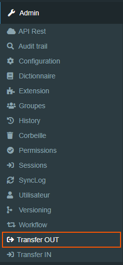
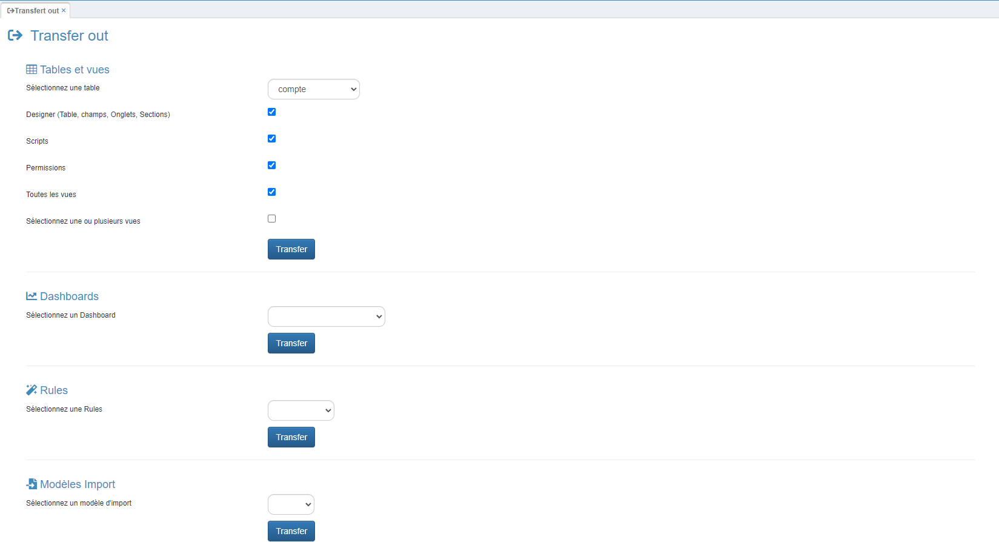

# Comment utiliser la fonctionnalité "Transfer Out" dans GoPaaS ?

## Description

La fonctionnalité **Transfer Out** dans GoPaaS permet d'extraire les configurations de tables, de vues, de dashboards, de règles (rules), de modèles d'import, de workflows et d'extensions au format JSON. Cette approche facilite le transfert rapide de configurations entre différents environnements ou projets, sans inclure les données elles-mêmes.

### Bénéfices attendus
- **Transfert Rapide :** Simplifie l'exportation des configurations pour les reproduire facilement dans un autre environnement.
- **Flexibilité :** Permet de choisir précisément quels éléments (tables, vues, dashboards, etc.) exporter.
- **Gestion Simplifiée :** Centralise les processus d'exportation de configurations pour une meilleure organisation.

### Étape 1 : Exportation des Tables et Vues

1. **Accéder à Transfer Out :**
   - Allez dans le menu **Transfer Out** (accessible depuis le menu de gauche, sous "Admin").
   
    

2. **Sélection des éléments à exporter :**
   - **Tables et Vues** : Sélectionnez une table spécifique et cochez "Toutes les vues" pour exporter l'ensemble des vues disponibles.
   - **Designer (Tables, Champs, Onglets, Sections)** : Cochez cette option pour inclure les informations liées à la conception des tables et des vues.
   - **Scripts** : Si des scripts sont associés aux vues ou tables, cochez cette option pour les inclure dans l'exportation.
   - **Permissions** : Cochez cette case pour inclure les configurations de permissions associées aux tables et vues.

3. **Lancer le transfert :**
   - Cliquez sur le bouton **Transfer** pour générer et télécharger le fichier JSON contenant les configurations sélectionnées.

 

### Étape 2 : Exportation des Dashboards

1. **Sélectionner un Dashboard :**
   - Dans la section **Dashboards**, choisissez un dashboard à exporter depuis le menu déroulant.

2. **Lancer le transfert :**
   - Cliquez sur **Transfer** pour exporter le dashboard au format JSON.

### Étape 3 : Exportation des Règles (Rules)

1. **Sélectionner une règle :**
   - Dans la section **Rules**, choisissez une règle à exporter.

2. **Lancer le transfert :**
   - Cliquez sur **Transfer** pour obtenir le fichier JSON de la règle sélectionnée.

### Étape 4 : Exportation des Modèles d'Import

1. **Sélectionner un modèle d'import :**
   - Dans la section **Modèles Import**, choisissez un modèle d'import à exporter.

2. **Lancer le transfert :**
   - Cliquez sur **Transfer** pour générer le fichier JSON du modèle d'import.

### Étape 5 : Exportation des Workflows

1. **Sélectionner un workflow :**
   - Dans la section **Workflows**, choisissez un workflow à exporter.

2. **Lancer le transfert :**
   - Cliquez sur **Transfer** pour obtenir le fichier JSON du workflow sélectionné.

### Étape 6 : Exportation des Extensions

1. **Sélectionner une extension :**
   - Dans la section **Extensions**, choisissez une extension à exporter.

2. **Lancer le transfert :**
   - Cliquez sur **Transfer** pour exporter l'extension au format JSON.

### Conclusion

La fonctionnalité **Transfer Out** de GoPaaS est un outil puissant pour transférer les configurations de votre environnement de travail de manière rapide et efficace. En générant des fichiers JSON pour les tables, vues, dashboards, règles, modèles d'import, workflows et extensions, vous pouvez facilement répliquer ces configurations dans un autre environnement ou pour des projets similaires, tout en conservant une gestion centralisée et organisée des éléments essentiels à vos applications.
