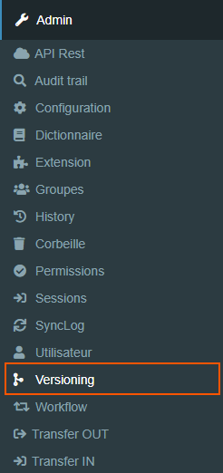
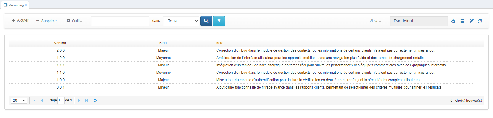
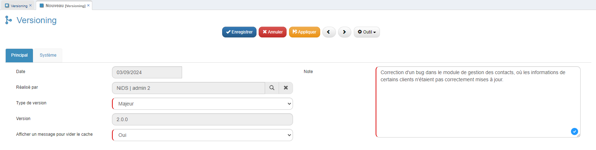

# Comment gérer le versionning dans GoPaaS ?

## Description

La fonctionnalité **Versionning** dans GoPaaS permet de gérer les versions de l'application et d'afficher un message aux utilisateurs pour leur demander de vider leur cache. Cela garantit que les utilisateurs récupèrent la dernière version de l'application après une mise à jour importante.

### Étape 1 : Accéder au menu Versionning

1. **Accéder à l'Admin :**
   - Allez dans le menu **Admin** (menu de gauche).
   - Cliquez sur **Versionning**.

   
   
2. **Vue des Versions :**
   - Vous verrez un historique des versions précédentes, avec des informations sur les mises à jour passées.

   

### Étape 2 : Déclarer une nouvelle version

1. **Ajouter une nouvelle version :**
   - Cliquez sur **Ajouter** pour déclarer une nouvelle version.

2. **Remplir les champs requis :**
   - **Type de version** : Sélectionnez le type de version (Mineur, Moyenne, Majeur).
   - **Afficher un message pour vider le cache** : Sélectionnez **Oui** si vous souhaitez afficher un message aux utilisateurs pour vider leur cache. Cela est utile après une mise à jour majeure.
   - **Note** : Ajoutez une description de la nouvelle version pour fournir des détails sur les changements apportés.

3. **Enregistrer la nouvelle version :**
   - Cliquez sur **Enregistrer** pour valider la création de la nouvelle version.

   

### Étape 3 : Message pour les utilisateurs

1. **Affichage du message :**
   - Si vous avez sélectionné **Oui** pour l'option "Afficher un message pour vider le cache", les utilisateurs verront un message lors de leur prochaine connexion, s'ils n'ont pas actualisé leur cache.
   - Cela leur permettra de vider leur cache pour s'assurer qu'ils utilisent la dernière version de l'application.

### Conclusion

Le **versionning** dans GoPaaS est essentiel pour gérer les mises à jour de l'application tout en garantissant que les utilisateurs disposent de la dernière version. En suivant ces étapes, vous assurez une gestion efficace des versions et une communication fluide avec les utilisateurs concernant la nécessité de vider leur cache après des mises à jour importantes.