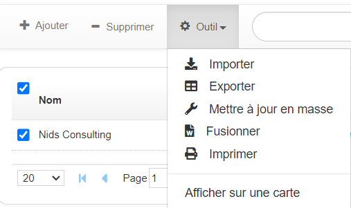
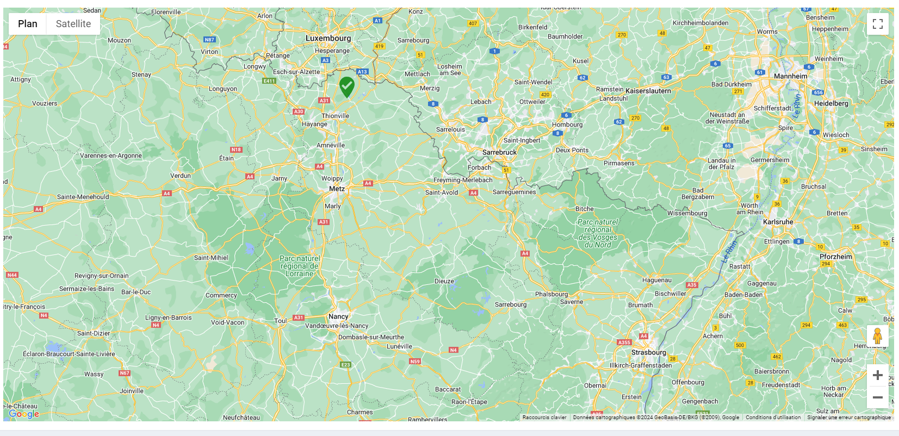

# Paramétrage de l'affichage de ViewMap

## Description

Le paramétrage de l'affichage de ViewMap permet de visualiser les adresses sur une carte en utilisant les coordonnées géographiques (latitude et longitude).

### Bénéfices attendus
- ***Visualisation Géographique :*** Permet de visualiser les adresses sur une carte, facilitant ainsi l'analyse géographique.
- ***Accessibilité :*** Ajoute une option pratique dans le menu outil pour afficher rapidement les données sur une carte.
- ***Interaction Simplifiée :*** Facilite l'interaction avec les données en utilisant des coordonnées géographiques précises.

### Instructions pour le Paramétrage

1. **Ouvrir votre vue**
   - Sélectionnez à une vue des comptes ou contacts.

2. **Configurer les Champs de la Vue**
   - Activer la multi-sélection sur la vue.
   - Ajoutez les champs suivants à la vue :

   | **Champ**           | **Description**                                      |
   |---------------------|------------------------------------------------------|
   | **Adresse**         | Adresse.                         |
   | **cp**              | Code postal.                     |
   | **Ville**           | Ville.                           |
   | **Latitude**        | Latitude (coordonnée géographique). |
   | **Longitude**       | Longitude (coordonnée géographique). |

   - Récupérer le nom de la vue ainsi que le nom de la table (compte ou contact, par exemple) pour l'insérer dans le code ci-dessous à la place de **"NOM_TABLE"** & **"NOM_VUE_FILTRE"**.

4. **Intégrer le Script JavaScript**
   - Ajoutez le code suivant dans le script de la vue :

```javascript
async function onLoad_view[ID_VUE](datagrid){
  var thisComponent = this;

  var viewbar = Component.find("Viewbar", this);
  viewbar.addTool('Afficher sur une carte', await openMap);

  async function openMap() {
    var destinations = [];
    var rows = thisComponent.getAllSelectedRow();

    if (Number(rows.length) !== 1) {
      gopaas.dialog.notifyWarning("Merci de sélectionner une fiche");
    } else {
      destinations = [];
      let coord = [rows[0].latitude, rows[0].longitude];
      let dpt = rows[0].cp.substr(0, 2);
      let pays = rows[0].pays;

      if (dpt === '' || pays === '') {
        gopaas.dialog.warning("Code postal ou Pays non renseigné, merci de vérifier votre fiche Compte");
        return false;
      }

      let items = await $.get('webservice/view/list-item.php', {
        tableName: "NOM_TABLE",
        viewName: "NOM_VUE_FILTRE",
        advancedSearch: "cp|start|" + dpt + "|;pays|equal|" + pays + "|AND"
      });

      var nbLigne = items.rows.length;

      for (let i = 0; i < nbLigne; i++) {
        destinations.push({
          adresse: items.rows[i].adresse,
          cp: items.rows[i].cp,
          ville: items.rows[i].ville,
          cle: items.rows[i].cle,
          latitude: items.rows[i].latitude,
          longitude: items.rows[i].longitude,
        });
      }
      ViewMap.open("NOM_TABLE", "NOM_VUE_FILTRE", destinations, coord);
    }
  }
}
```
### Résultat




### Conclusion

Une fois les champs configurés et le script ajouté, votre application sera capable d'afficher les adresses sur une carte.