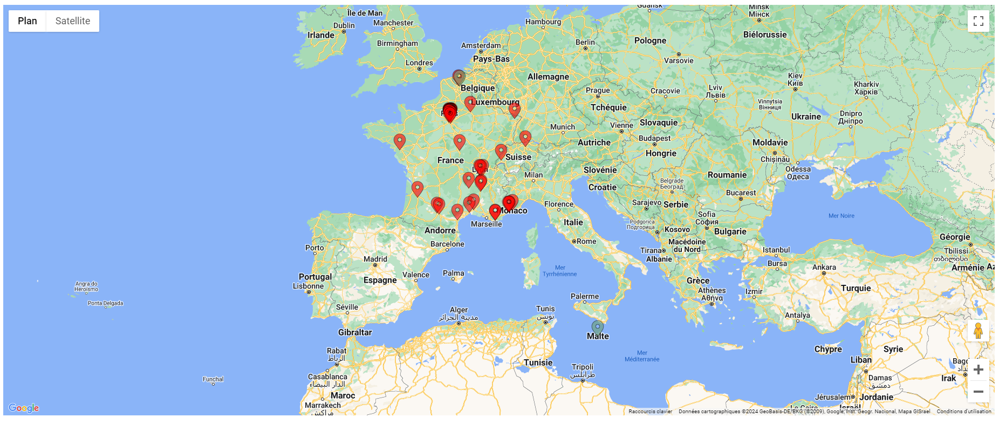

# Paramétrage de l'affichage de ViewMap

## Description

Le paramétrage de ViewMap permet de visualiser les adresses sur une carte en utilisant les coordonnées géographiques (latitude et longitude).

### Bénéfices attendus
- ***Visualisation Géographique :*** Permet de visualiser les adresses sur une carte, facilitant ainsi l'analyse géographique.
- ***Accessibilité :*** Ajoute une option pratique dans le menu outil de la vue pour afficher rapidement les données sur une carte.

### Instructions pour le Paramétrage

1. **Paramétrer la vue**
   - Dans votre vue, ajouter les champs suivants :

   | **Champ**           | **Description**                                      |
   |---------------------|------------------------------------------------------|
   | **Adresse**         | Adresse. (Avec l'alias **adresse**)                  |
   | **Cp**              | Code postal. (Avec l'alias **cp**)                   |
   | **Ville**           | Ville.          (Avec l'alias **ville**)             |
   | **Latitude**        | Latitude (coordonnée géographique).      (Avec l'alias **latitude**)  |
   | **Longitude**       | Longitude (coordonnée géographique).     (Avec l'alias **longitude**) |

2. **Intégrer le JavaScript**
   - Ajoutez le code suivant dans le script de la vue :
      ```javascript
      function onLoad_view[ID_VIEW](datagrid){
          var viewbar = Component.find("Viewbar", this);
          viewbar.addTool("<i class='fas fa-map'></i>   <span class='trn'>Afficher la carte</span>", openMap);
      }

      function openMap(){
          ViewMap.open("[TABLE_NAME]", "[VIEW_NAME]");
      }
      ```
    - Remplacer **"TABLE_NAME"** & **"VIEW_NAME"** par le nom de votre table et le nom de votre vue où est situé votre code.

### Résultat attendu



### Conclusion

Une fois les champs configurés et le script ajouté, votre application sera capable d'afficher les adresses sur une carte.