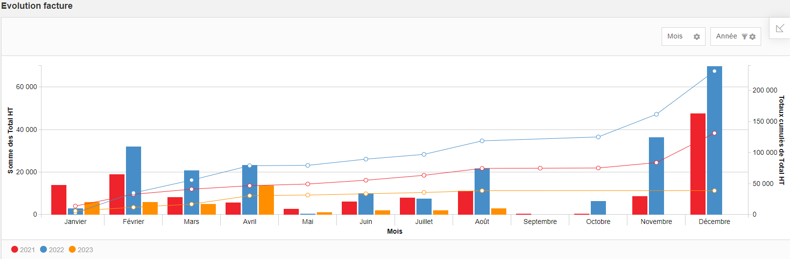

# Comment créer un WebReport pour l'analyse de la facturation dans GoPaaS ?

## Description

Les WebReports dans GoPaaS sont des tableaux croisés dynamiques permettant d'analyser des données sur plusieurs années. Ce guide vous explique comment créer un WebReport pour obtenir une vue analytique de la facturation.

### Étape 1 : Dupliquer la vue des factures

1. **Dupliquer la vue des factures :**
   - Rendez-vous sur la vue par défaut des factures.
   - Dupliquez cette vue et nommez-la : **WR - Analyse Facture**.

2. **Changer le type de la vue :**
   - Pour cela, sélectionnez **WebReport** dans le champ **Type** de la vue.

### Étape 2 : Configurer la vue WebReport

1. **Accéder à la vue WebReport :**
   - Depuis le menu de gauche, allez dans **Référence > Paramètre > Vue**.
   - Recherchez le nom de votre vue WebReport (ex. **WR - Analyse Facture**).

2. **Configurer l'affichage :**
   - Une fois que vous avez ouvert la vue WebReport, cliquez sur **Champs** pour modifier l'affichage des données.

   - Exemple de configuration dans le cas d'une analyse de la facturation :
    

   - Assurez-vous que les champs nécessaires sont déjà présents dans la vue. Si vous avez besoin d'ajouter ou de modifier des champs, cliquez sur **Edit**.
   - Après avoir configuré l'affichage selon vos besoins, cliquez sur **Save** pour sauvegarder votre configuration.
### Résultat

Une fois le WebReport configuré, vous obtiendrez une analyse visuelle des factures avec un aperçu global sur plusieurs années. Voici un exemple de résultat :

### Conclusion

Les WebReports dans GoPaaS vous permettent de créer des tableaux croisés dynamiques pour analyser efficacement vos données. En suivant les étapes ci-dessus, vous pouvez créer un WebReport pour visualiser et analyser les tendances de facturation sur plusieurs années.
