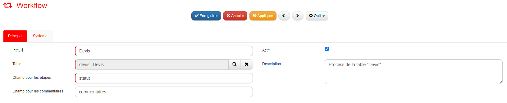
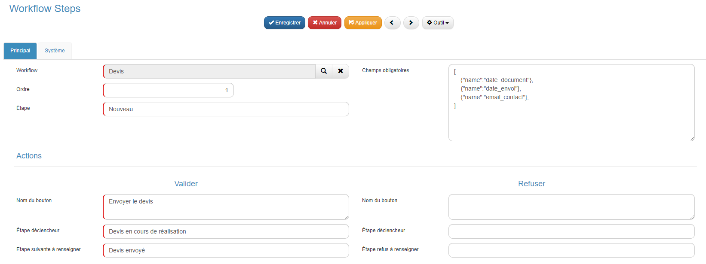
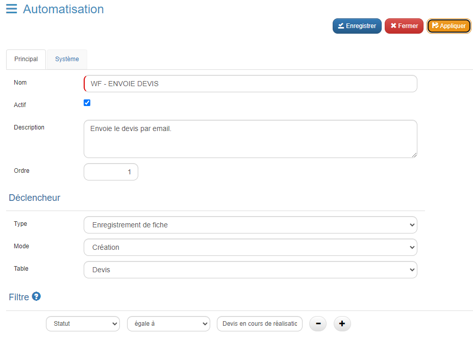
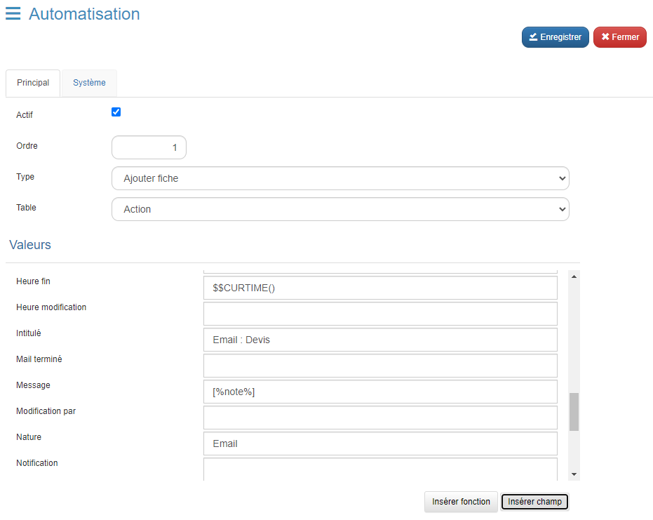

# Paramétrage du Workflow

## Description

Le paramétrage du workflow permet de définir et de gérer les processus automatisés au sein de l'application.

### Bénéfices attendus
- **Automatisation des Processus :** Permet l'automatisation des tâches répétitives.
- **Efficacité Améliorée :** Améliore l'efficacité en assurant que les étapes du processus sont suivies de manière cohérente.
- **Personnalisation :** Offre la possibilité de créer des workflows sur mesure adaptés aux besoins spécifiques de l'organisation.

### Instructions pour le Paramétrage

1. **Accéder au Menu de Configuration**
   - Rendez-vous dans la barre de navigation > Admin > Workflow.
   - Cliquez sur **Workflow**.

2. **Ajouter un Nouveau Workflow**
   - Cliquez sur **Ajouter**.

3. **Configurer les Champs du Workflow**

   | **Champ**                | **Description**                                                                                       |
   |--------------------------|-------------------------------------------------------------------------------------------------------|
   | **Intitulé**             | Nom du workflow.                                                                                      |
   | **Table**                | Table sur laquelle le workflow sera appliqué.                                                         |
   | **Champ pour les étapes**| Champ qui définira les différentes étapes du workflow.                                                |
   | **Champ pour les commentaires** | Champ permettant d'ajouter des commentaires à chaque étape du workflow.                        |
   | **Actif**                | Indiquer si le workflow est actif ou non.                                                             |
   | **Description**          | Description détaillée du workflow et de son objectif.                                                 |

   #### Exemple :
   

4. **Appliquer les Modifications**
   - Cliquez sur le bouton **Appliquer** pour enregistrer les modifications.

5. **Ajouter des Étapes au Workflow**
   - Dans la section **Étapes**, cliquez sur le bouton **Ajouter**.

6. **Configurer les Champs d'une Étape**

   | **Champ**                         | **Description**                                                                                       |
   |-----------------------------------|-------------------------------------------------------------------------------------------------------|
   | **Ordre**                         | Ordre de l'étape au sein du workflow.                                                                 |
   | **Étape**                         | Statut sur lequel le bouton doit s'afficher.                                                          |
   | **Champs obligatoires**           | Champs qui doivent être obligatoirement remplis lors du clic sur le bouton **Validation**.            |
   | **Nom du bouton**                 | Nom du bouton pour cette étape.                                                                       |
   | **Étape déclencheur**             | Statut intermédiaire qui se met en place au clic sur le bouton.                                       |
   | **Étape suivante à renseigner**   | Statut suivant à renseigner.                                                                          |

   - Le champ **Champs obligatoires** doit être rempli avec la structure suivante :

     ```json
     [
         {"name":"CHAMP_UN"},
         {"name":"CHAMP_DEUX"},
         {"name":"CHAMP_TROIS"},
         ...
     ]
     ```
     #### Exemple :
     

7. **Intégrer le Workflow avec le Script JavaScript**
   - Une fois le workflow terminé, accédez au script JavaScript de la table concernée.
   - Insérez la ligne suivante dans le script JS :

     ```javascript
     gopaas.util.loadWorkflow(thisComponent, "TABLE_NAME");
     ```

     - Remplacez `"TABLE_NAME"` par le nom de la table appropriée.

8. **Création de l'Automatisme lié à l'Étape**
   - Accédez au menu de droite et sélectionnez **Automatisation**.
   - Cliquez sur **Ajouter**.

   | **Champ**     | **Description**                                                    |
   |---------------|--------------------------------------------------------------------|
   | **Nom**       | WF - ACTION_NAME                                                   |
   | **Actif**     | Indiquez si l'automatisme est actif ou non.                        |
   | **Description** | Fournissez une description de l'automatisme.                     |
   | **Ordre**     | Indiquez l'ordre dans lequel l'automatisme doit être exécuté.      |
   | **Type**      | Enregistrement de fiche                                            |
   | **Mode**      | Modification                                                       |
   | **Table**     | Nom de votre table ou vous exécutez le workflow (exemple: devis)   |
   | **Section Filtre** | Témoin ou se déclenche l'étape, dans notre cas l'étape se déclenche au statut "Devis en cours de réalisation"   |

   #### Exemple :
    

   - Enfin après avoir configuré l'automatisme, Cliquer sur **Appliquer**.

9. **Configurer les Actions de l'automatisme**
   - Cliquer sur le bouton **Ajouter** dans la section **Actions**.

   | **Champ**     | **Description**                                          |
   |---------------|----------------------------------------------------------|
   | **Actif**     | 1                                                        |
   | **Ordre**     | Indiquez l'ordre dans lequel l'action doit être exécuté. |
   | **Type**      | Modifier fiche                                           |

   - Dans les champs de la section "Valeurs" :
      - Trouver votre champ **"Statut"**, et entrer la nouvelle valeur pour le champ statut.
   - Enregistrez la fiche.

   - En parallèle, il est également possible d'ajouter une fiche action pour historiser l'événement. Pour ce faire, cliquez à nouveau sur **Ajouter** et sélectionnez **Ajouter fiche** dans le type.

     | **Champ**      | **Description**                                                            |
     |----------------|----------------------------------------------------------------------------|
     | **Type**       | Ajouter fiche                                                              |
     | **Table**      | Sélectionnez la table cible, dans notre cas, ce sera la table **Action**.  |
     | **Valeur**     | Remplissez les champs souhaités dans la section **Valeur**.                |

     #### Exemple :
     

     - **PS :** Assurez-vous de connecter cette fiche enfant à la fiche parent, en remplissant le champ connexion avec :
     ```json
     [%cle%]
     ```

### Conclusion

Une fois le workflow, leurs étapes, les automatismes et les actions correctement configurés, ainsi que les fiches d'action ajoutées pour l'historisation, votre application sera capable de gérer des processus automatisés de manière fluide et efficace.
