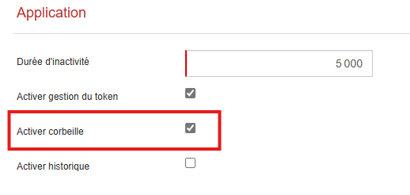
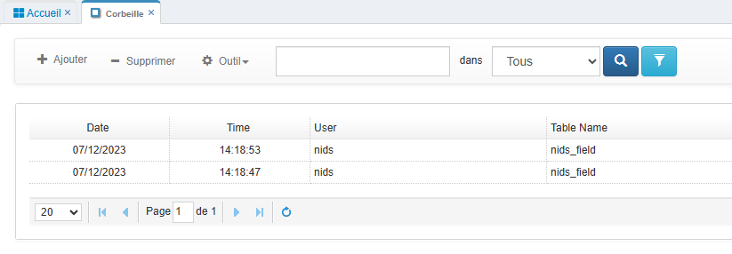
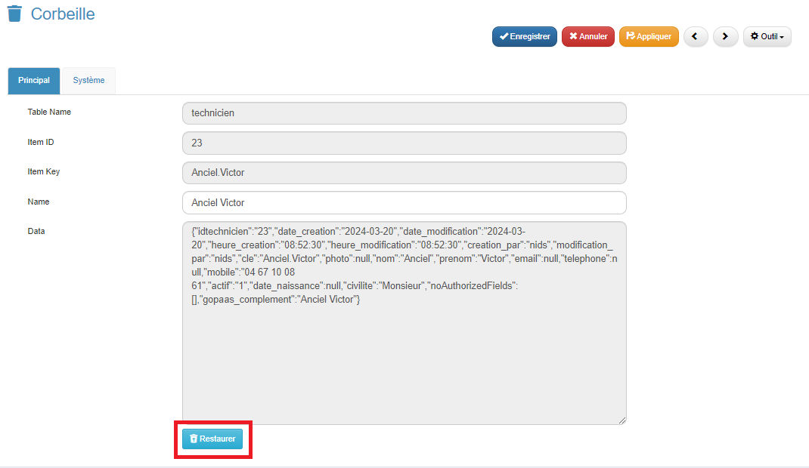

## Restauration d'une Fiche Supprimée

Il est possible de restaurer une fiche qui a été supprimée par erreur dans GoPaaS. Voici les étapes pour la récupérer.

### Étape 1 : Activer à la Corbeille

1. **Acitver la Corbeille GoPaaS :**
   - Rendez-vous dans la barre de navigation > Admin > Configuration.
   - Cocher "Activer corbeille".

      
### Étape 2 : Sélectionner la Fiche à Restaurer

1. **Rechercher votre fiche supprimée :**
   - Rendez-vous dans la barre de navigation > Admin > Corbeille.
   - Parcourez la liste des fiches dans la corbeille et trouvez celle que vous souhaitez restaurer.
   - Double-cliquez sur la fiche pour l'ouvrir.

       
### Étape 3 : Restaurer la Fiche

1. **Restaurer la fiche :**
   - Une fois la fiche sélectionnée, cliquez sur le bouton **Restaurer**.

        
### Conclusion
Votre fiche est maintenant restaurée et se retrouve à l'endroit exact où elle était avant sa suppression. Cette fonctionnalité permet de récupérer rapidement des données importantes supprimées par inadvertance.
