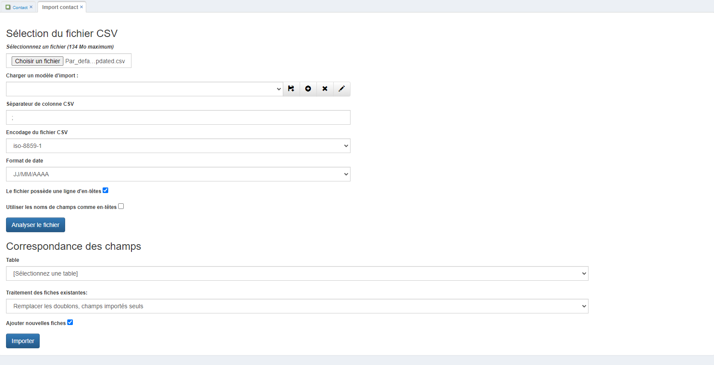

# Comment effectuer un import de données dans GoPaaS ?

## Description

L'import des données permet de gagner du temps en important rapidement des données depuis un fichier Excel au format CSV. Cela est particulièrement utile pour des modifications ou ajouts importants dans une table existante, par exemple la table **contact**.

### Étape 1 : Accéder à la vue par défaut de la table

1. **Accéder à la vue de la table :**
   - Rendez-vous sur la vue par défaut de la table, par exemple la table **contact**.

      
2. **Importer un fichier CSV :**
   - Cliquez sur **Outil** dans le menu, puis sélectionnez **Importer**.

      
### Étape 2 : Sélectionner le fichier CSV

1. **Choisir le fichier :**
   - Sélectionnez le fichier CSV que vous souhaitez importer. Le fichier doit être au format **.csv** avec un séparateur de colonnes **";"**.

2. **Paramétrer l'import :**
   - **Séparateur de colonne CSV** : Choisissez **;**.
   - **Encodage du fichier CSV** : Sélectionnez l'encodage **iso-8859-1**.
   - **Format de date** : Sélectionnez le format de date **JJ/MM/AAAA**.

3. **Analyser le fichier :**
   - Cliquez sur **Analyser le fichier** pour vérifier la compatibilité des données.

### Étape 3 : Correspondance des champs

1. **Correspondre les champs :**
   - Une fois le fichier analysé, un tableau de correspondance apparaît avec les champs présents sur la table. Il est nécessaire de faire correspondre les champs du CSV avec ceux de la table.

      

### Astuces : Sauvegarder et réutiliser un modèle d'import

1. **Sauvegarder le modèle d'import :**
   - Après avoir configuré la correspondance des champs, vous pouvez sauvegarder ce modèle en cliquant sur l'icône **"+"** à droite de **Charger un modèle d'import**. Ce modèle sera réutilisable uniquement sur la table où il a été créé.

      

2. **Réutiliser un modèle d'import :**
   - Pour réutiliser un modèle d'import, sélectionnez-le dans la liste déroulante **Charger un modèle d'import** avant de cliquer sur **Analyser le fichier**.

      

3. **Mettre à jour un modèle d'import :**
   - Pour mettre à jour un modèle existant, cliquez sur l'icône **disquette** à côté de **Charger un modèle d'import**.

      

### Étape 4 : Importer les données

1. **Lancer l'import :**
   - Après avoir fait la correspondance des champs, cliquez sur **Importer** en bas de la page pour lancer la mise à jour des données.

      

### Conclusion

L'import des données dans GoPaaS permet d'automatiser et d'accélérer les processus d'importation de données, en particulier pour des modifications à grande échelle. Grâce à la possibilité de sauvegarder des modèles d'import, vous pouvez réutiliser et ajuster vos configurations pour de futurs imports.