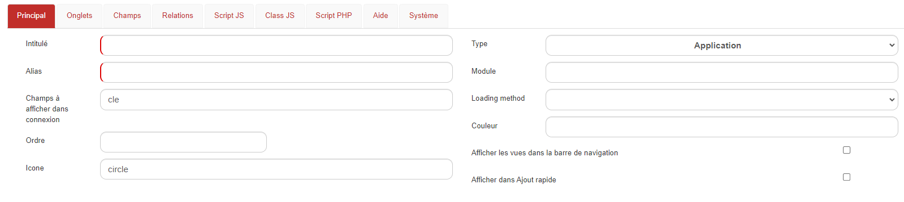
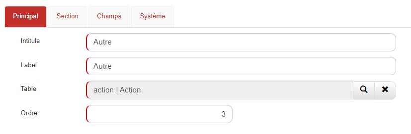
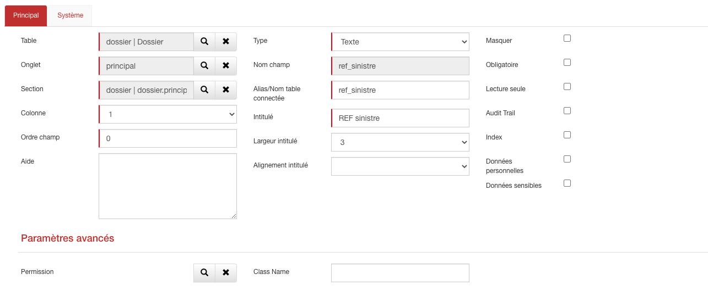

# Personnalisation

Un des atouts majeurs de GoPaaS réside dans ses nombreuses fonctions de personnalisation. Cela confère une souplesse au produit, qui peut ainsi se prêter aux utilisations et applications les plus variées. Selon vos besoins, vous pouvez ajouter et modifier des tables, des connexions, des vues, des formulaires, des automatisations, et tous les éléments (ou définitions) qui constituent la structure de votre application.

Dans cette rubrique, nous passons en revue l’ensemble des possibilités de personnalisation de GoPaaS.

## Ajouter une table

La plateforme GoPaaS vous permet d'ajouter de nouvelles tables afin de créer de nouvelles fonctionnalités liées à vos besoins et à l’'évolution de votre utilisation.

Pour cela, rendez vous dans le menu personnalisation  -> Tables -> cliquer sur Ajouter.



Afin d'enregistrer la table en base de donnée, il faut obligatoirement renseigner deux champs :

| Champ   | Valeur                              |
|---------|-------------------------------------|
| Intitulé | Le nom de la table en base de donnée |
| Alias   | Le nom de la table dans l'application |

Pour une meilleure utilisation d'autres champs sont à renseigner également :

| Champ                                     | Valeur                                                                                                                                                                                                                                                                                           |
|-------------------------------------------|--------------------------------------------------------------------------------------------------------------------------------------------------------------------------------------------------------------------------------------------------------------------------------------------------|
| Champs à afficher dans connexion         | Définir les champs à afficher dans un champ de type connexion sur une autre table. Séparer les champs par une virgule pour en afficher plusieurs lors de la connexion.                                                                                                                        |
| Ordre                                     | Ordre de la table dans la barre de navigation.                                                                                                                                                                                                                                                 |
| Icône                                     | Icône de la table dans la barre de navigation, aller à l'URL suivante pour avoir accès à la bibliothèque d'icônes. (https://fontawesome.com/v5/search).                                                                                                                                    |
| Type                                      | Choisir l'onglet de la barre de navigation dans lequel afficher la table.                                                                                                                                                                                                                      |
| Module                                    | Choisir le module de la barre de navigation dans lequel afficher la table.                                                                                                                                                                                                                     |
| Loading method                            | Choisir l’option de chargement des données des fiches de la table. <br> - **Synchronous**: Les données se chargent en arrière-plan et l’utilisateur peut interagir avec l’interface. <br> - **Asynchronous**: Toutes les données et les interfaces sont pré-chargées et prêtes à être consultées immédiatement. <br> - **Lazy**: Seul les données de l’onglet principal se chargent et l’utilisateur peut interagir avec l’interface. <br> - **SmartLoad**: Les données de l’onglet principal et toutes les interfaces sont pré-chargées, prêtes à être consultées immédiatement et l’utilisateur peut interagir avec l’interface. |
| Couleur                                   | Choisir la couleur en anglais (green) ou au format hexadécimal (#095A35) pour modifier la couleur des onglets et des intitulés des sections.                                                                                                                                                 |
| Afficher les vues dans la barre de navigation | Cocher cette option permet d'afficher le menu des vues en sous-menu dans la barre de navigation.                                                                                                                                                                                               |
| Afficher dans Ajout rapide               | Cocher cette option permet d'afficher une option de création rapide.                                                                                                                                                    |
## Les onglets

Chaque table est associée à un seul formulaire de saisie et de visualisation de données.

Ces masques sont organisés sous forme d'onglets, chaque onglet contenant lui-même des sections et dans chaque section, des champs.

A la création d'une nouvelle table, GoPaaS ajoute automatiquement 2 onglets, l'onglet **Principal** et l'onglet **Système**. Pour ajouter un nouvel onglet, passer par le FormDesigner puis cliquer sur le bouton . 

Afin d'enregistrer un onglet en base de données, il faut renseigner obligatoirement certains champs :

| Champ   | Valeur                                          |
|---------|-------------------------------------------------|
| Intitulé | Nom du champ en base.                          |
| Table   | Nom de la table dans laquelle l'onglet se trouve. |
| Ordre   | Ordre de l'onglet sur la table.                |

Le champ **Label** correspond au nom du champ dans l'application.

**NB**: _Le moyen le plus simple et le plus rapide pour créer des onglets est de passer par le [Form Designer](http://www.gopaas.fr/aide.php?rubrique=Personnaliser%20les%20applications#41)_.

## Les champs

Cliquez sur l'onglet **Champs **pour pouvoir ajouter des champs à cette nouvelle table.

Par défaut, à la création d'une nouvelle table, l'application crée un certain nombre de champs système ainsi qu'un champ **Intitulé.**

C'est le premier champ de la table, vous pouvez le modifier ou le supprimer.

Pour ajouter un nouveau champ cliquez sur Ajouter.

Afin d'enregistrer le champ en base de donnée, il faut renseigner obligatoirement les champs suivants :

**Détails :**

| Champs                   | Valeur                                                                                             |
|--------------------------|----------------------------------------------------------------------------------------------------|
| Table                    | C'est la table sur laquelle le champ va être créé.                                                  |
| Onglet                   | L'onglet de la table sur lequel le champ va être créé.                                              |
| Section                  | La section de l'onglet sur laquelle le champ va être créé.                                           |
| Colonne                  | Définir le numéro de colonne, une section peut contenir au maximum 3 colonnes.                      |
| Ordre du champ           | Ordre du champ dans la colonne.                                                                    |
| Type                     | Plusieurs types de champs sont mis à disposition.                                                    |
| Nom du champ             | C'est le nom du champ en base de données.                                                           |
| Alias/Nom table connectée| L'alias du champ doit être unique dans toute l'application. Dans le cas où le champ créé est de type *connexion*, il faut renseigner le nom de la table à connecter.|
| Intitulé                 | C'est le nom du champ dans l'application.                                                           |

**NB** : _Les valeurs de nom du champ ne doivent pas contenir de majuscule, d'espace ou de caractères spéciaux_

Pour optimiser le paramétrage de l'application, renseigner également les champs suivants :

| Champs                  | Valeur                                                                                                                                     |
|-------------------------|--------------------------------------------------------------------------------------------------------------------------------------------|
| Aide                    | Permet d'ajouter une aide pour l'utilisateur au survole du champ.                                                                        |
| Largeur intitulé        | C'est l'espacement entre le titre du champ et le champ, il existe des valeurs prédéfinies allant de 1 à 12.                             |
| Alignement intitulé     | Permet de régler le positionnement de l'intitulé.                                                                                        |
| Filtre de connexion     | A utiliser dans les champs de type Connexion pour filtrer la liste des valeurs disponibles. Par exemple, dans une connexion entre Client et Devis, pour afficher les Devis créés par la personne qui gère le Client : <br> ``` [ {"field":"creation_par", "source_field":"gestion_par"} ]``` <br> Vous pouvez cumuler plusieurs filtres en les séparant par une virgule : <br> ```[ {"field":"groupe", "value":"Admin"}, {"field":"annee", "value":"2016"} ]``` <br> |
| Valeur                  | A utiliser dans les champs de type liste, les valeurs correspondent aux choix de la liste. Toutes les valeurs doivent être séparées par un retour à la ligne. |
| Hauteur (memo)          | Définir la hauteur par défaut d'un champ de type mémo.                                                                                   |
| Masquer                 | Option permettant de masquer le champ.                                                                                                   |
| Obligatoire             | Option permettant de rendre obligatoire le champ.                                                                                        |
| Lecture seule           | Option permettant de rendre le champ insaisissable.                                                                                      |
| Audit Trail             | Permet d'obtenir un historique sur les modifications apportées à ce champ.                                                                |
| index                   | Permet d'indexer le champ en base de données.                                                                                             |
| Données personnelles    | Permet de catégoriser ce champ au niveau RGPD.                                                                                            |
| Données sensibles       | Permet de catégoriser ce champ au niveau RGPD.                                                                                            |

**_NB : Le moyen le plus rapide et le plus simple pour créer des champs est de passer par le [Form Designer](http://www.gopaas.fr/aide.php?rubrique=Personnaliser%20les%20applications#41)._**